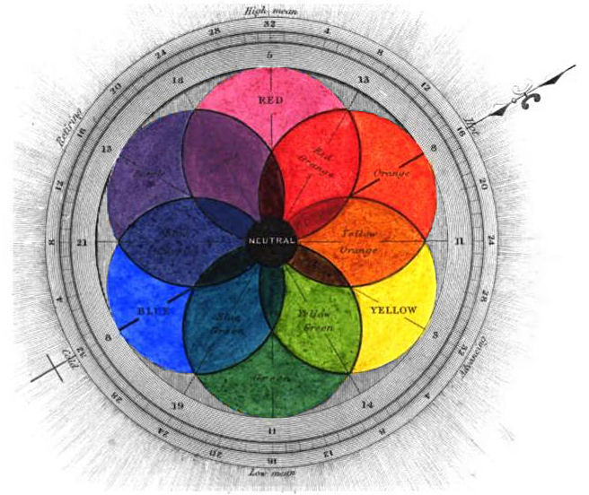

Subtractive means that color is produced by absorbing some parts of white light spectrum by the material. Subtractive models are used in painting and printing, where different pigment mixtures make up different colors.

A color model is subtractive in the sense that mixtures of dyes subtract specific wavelengths from the spectral power distribution of the illuminating light which is scattered back into the viewer's eye and is perceived as colored. Mixing of dyes is used to reproduce a gamut of colors, the resultant color from this layer is predicted by multiplying (not subtracting) the absorbance profiles of the dyes.

### RYB

>An RYB color chart from George Field's 1841 Chromatography; or, A treatise on colours and pigments: and of their powers in painting.

**RYB** (an abbreviation of red–yellow–blue) is a subtractive color model used in art and applied design in which red, yellow, and blue pigments are considered primary colors.

In this context, the term primary color refers to three exemplar colors (red, yellow, and blue) as opposed to specific pigments. As illustrated, in the RYB color model, red, yellow, and blue are intermixed to create secondary color segments of orange, green, and purple. This set of primary colors emerged at a time when access to a large range of pigments was limited by availability and cost, and it encouraged artists and designers to explore the many nuances of color through mixing and intermixing a limited range of pigment colors. In art and design education, red, yellow, and blue pigments were usually augmented with white and black pigments, enabling the creation of a larger gamut of color nuances including tints and shades. 

> **Jacob Christoph Le Blon** was the first to apply the RYB color model to printing, specifically mezzotint printing, and he used separate plates for each color: yellow, red and blue plus black to add shades and contrast. In 'Coloritto', Le Blon asserted that “the art of mixing colours…(in) painting can represent all visible objects with three colours: yellow, red and blue; for all colours can be composed of these three, which I call Primitive”. Le Blon added that red and yellow make orange; red and blue, make purple; and blue and yellow make green (Le Blon, 1725, p6).

### CMY and CMYK

The **CMY** color model is a subtractive color model in which cyan, magenta and yellow pigments or dyes are added together in various ways to reproduce a broad array of colors. 

When the intensities for all the components are the same, the result is a shade of gray, lighter, or darker depending on the intensity. When the intensities are different, the result is a colorized hue, more or less saturated depending on the difference of the strongest and weakest of the intensities of the primary colors employed. 

**CMYK** color model is a subtractive color model, based on the CMY color model, used in color printing, and is also used to describe the printing process itself, that is used in the layering technique by printers to create different colors on a white paper. CMYK refers to the four inks used in some color printing: cyan, magenta, yellow, and key. It uses K, black ink, since C, M, and Y inks are translucent and will only produce a gray color when laid on top of each other. 

With CMYK printing, halftoning (also called screening) allows for less than full saturation of the primary colors; tiny dots of each primary color are printed in a pattern small enough that humans perceive a solid color.

Light, saturated colors often cannot be created with CMYK, and light colors in general may make visible the halftone pattern. Using a CcMmYK process, with the addition of light cyan and magenta inks to CMYK, can solve these problems.