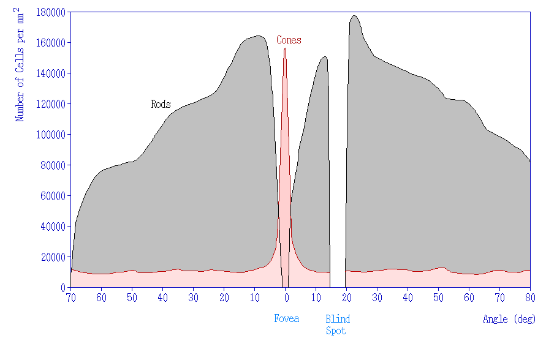
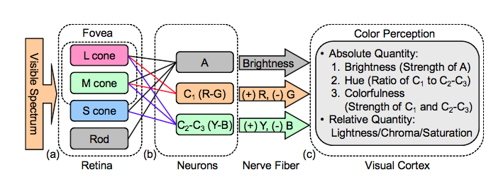

The perception of color derives from the stimulation of cone cells in the human eye by visible light. Light, containing all spectral colors is perceived white. Color of an object depends on the range of wavelengths of light that are absorbed or reflected by its surface. The sense of a particular color is produced in nervous system by combining signal from three types of cones, sensitive to red, green and blue ranges of the spectrum.

## Opposite color vision theory

## Human optic nerve cabling

