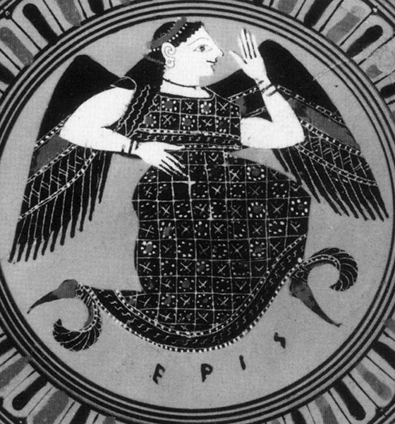
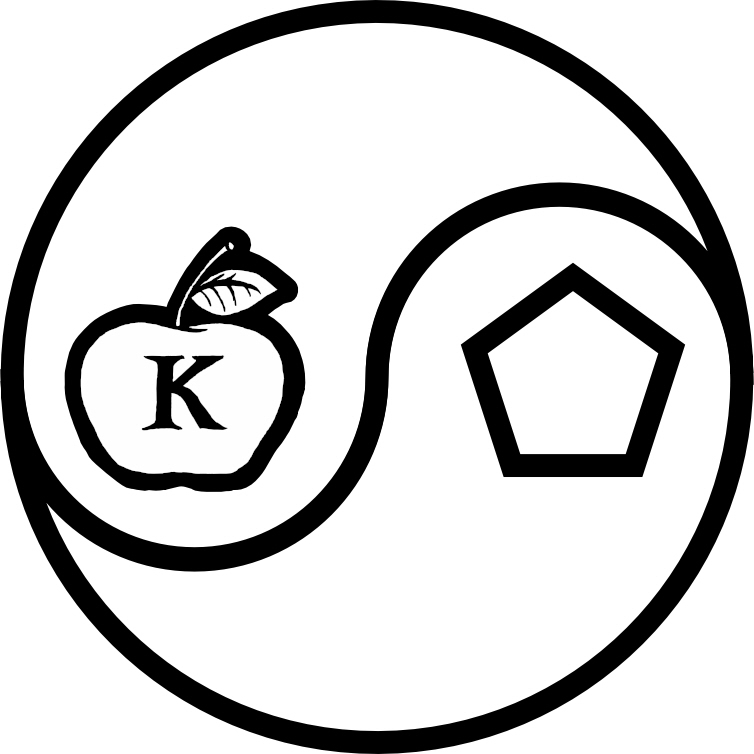
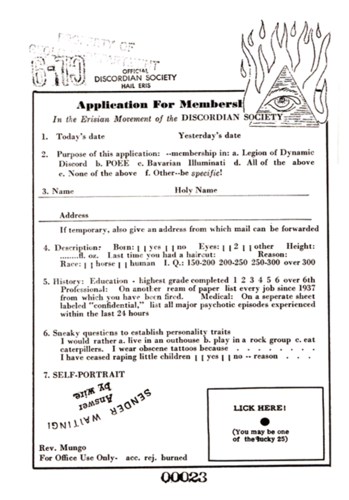
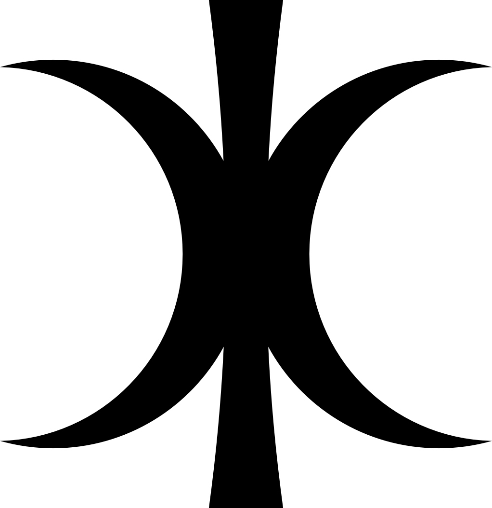

## Discordia

Eris (/ˈɪərɪs, ˈɛrɪs/; Greek: Ἔρις Éris, "Strife") is the Greek goddess of strife and discord. Her Roman equivalent is Discordia, which means the same. Eris's Greek opposite is Harmonia, whose Roman counterpart is Concordia. Homer equated her with the war-goddess Enyo, whose Roman counterpart is Bellona. The dwarf planet Eris is named after the goddess.

She had no temples in ancient Greece and functions essentially as a personification, as which she appears in Homer and many later works. 

The most famous tale of Eris recounts her initiating the Trojan War by causing the Judgement of Paris. The goddesses Hera, Athena and Aphrodite had been invited along with the rest of Olympus to the forced wedding of Peleus and Thetis, who would become the parents of Achilles, but Eris had been snubbed because of her troublemaking inclinations.

She therefore (as mentioned at the Kypria according to Proclus as part of a plan hatched by Zeus and Themis) tossed into the party the Apple of Discord, a golden apple inscribed Ancient Greek: τῇ καλλίστῃ, romanized: tē(i) kallistē(i)  – "For the most beautiful one", or "To the Fairest One" – provoking the goddesses to begin quarreling about the appropriate recipient. The hapless Paris, Prince of Troy, was appointed to select the fairest by Zeus. The goddesses stripped naked to try to win Paris's decision, and also attempted to bribe him. Hera offered political power; Athena promised infinite wisdom; and Aphrodite tempted him with the most beautiful woman in the world: Helen, wife of Menelaus of Sparta. While Greek culture placed a greater emphasis on prowess and power, Paris chose to award the apple to Aphrodite, thereby dooming his city, which was destroyed in the war that ensued. 

### Discordianism

Eris has been adopted as the patron deity of the modern Discordian religion, which was begun in the late 1950s by Gregory Hill and Kerry Wendell Thornley under the pen names of "Malaclypse the Younger" and "Omar Khayyam Ravenhurst". The Discordian version of Eris is considerably lighter in comparison to the rather malevolent Graeco-Roman original, wherein she is depicted as a positive (albeit mischievous) force of chaotic creation. Principia Discordia, the first holy book of Discordianism, states:

>One day Mal-2 consulted his Pineal Gland and asked Eris if She really created all of those terrible things. She told him that She had always liked the Old Greeks, but that they cannot be trusted with historic matters. "They were," She added, "victims of indigestion, you know." Suffice it to say that Eris is not hateful or malicious. But she is mischievous, and does get a little bitchy at times.

The story of Eris being snubbed and indirectly starting the Trojan War is recorded in the Principia, and is referred to as the Original Snub. The Principia Discordia states that her parents may be as described in Greek legend, or that she may be the daughter of Void. She is the Goddess of Disorder and Being, whereas her sister Aneris (called the equivalent of Harmonia by the Mythics of Harmonia) is the goddess of Order and Non-Being. Their brother is Spirituality.

Discordian Eris is looked upon as a foil to the preoccupation of western philosophy in attempting find order in the chaos of reality, in prescribing order to be synonymous with truth. Discordian Eris teaches us that the only truth is chaos, and that order and disorder are simply temporary filters applied to the lenses we view the chaos through. This is known as the Aneristic Illusion.

In this telling, Eris becomes something of a patron saint of chaotic creation:

>I am chaos. I am the substance from which your artists and scientists build rhythms. I am the spirit with which your children and clowns laugh in happy anarchy. I am chaos. I am alive, and I tell you that you are free.

The concept of Eris as developed by the Principia Discordia is used and expanded upon in the science fiction work The Illuminatus! Trilogy by Robert Shea and Robert Anton Wilson (in which characters from Principia Discordia appear). In this work, Eris is a major character.

>
>The Sacred Chao

[Discordianism](https://en.wikipedia.org/wiki/Discordianism) is a religion and subsequent philosophy based on the veneration or worship of Eris, a.k.a. Discordia, the Goddess of chaos, or archetypes or ideals associated with her. It was founded after the 1963 publication of its holy book, the Principia Discordia, written by Greg Hill with Kerry Wendell Thornley, the two working under the pseudonyms Malaclypse the Younger and Omar Khayyam Ravenhurst.

The religion has been likened to Zen based on similarities with absurdist interpretations of the Rinzai school, as well as Taoist philosophy. Discordianism is centered on the idea that both order and disorder are illusions imposed on the universe by the human nervous system, and that neither of these illusions of apparent order and disorder is any more accurate or objectively true than the other.

There is some division as to whether it should be regarded as a parody religion, and if so, to what degree. It is difficult to estimate the number of Discordians because they are not required to hold Discordianism as their only belief system, and because there is an encouragement to form schisms and cabals.

### Founding and structure

The foundational document of Discordianism is the Principia Discordia, fourth edition, written by Malaclypse the Younger, an alias of Greg Hill. The Principia Discordia often hints that Discordianism was founded as a dialectic antithesis to more popular religions based on order, although the rhetoric throughout the book describes chaos as a much more underlying impulse of the universe. This has been done with the intention of merely "balancing out" the tight order of society.

#### Episkopos

Episkoposes are the Overseers of sects of Discordianism, who have presumably created their own sect of Discordianism. They speak to Eris through the use of their pineal gland. It is said in the Principia Discordia that Eris says different things to each listener. She may even say radically different things to each Episkopos but, all of what she says is equally her word (even if it contradicts another iteration of her word).

Most Episkoposes have an assumed name and/or title of bizarre nature and self-proclaimed 'mystic import', such as Malaclypse the Younger, Omnibenevolent Polyfather of Virginity in Gold; Lord Omar Khayyam Ravenhurst, Bull Goose of Limbo; Professor Mu-Chao; Jay Bee the Elder; and Kassil the Erratic. Some Discordians choose their entire title by themselves, some turn to random generators, others assimilate things from other people, and a few never really offer any explanation.

#### Popes

According to the Principia Discordia, “every single man, woman, and child on this Earth” is a pope. Included in the Principia Discordia is an official Pope card that may be reproduced and distributed freely to anyone and everyone. Papacy is not granted through possession of this card; it merely informs people that they are “a genuine and authorized Pope” of Discordia.

This understanding of the notion of Pope has far reaching consequences in Discordianism. For example, the introduction to Principia Discordia says, “Only a Pope may canonize a Saint. ... So you can ordain yourself—and anyone or anything else—a Saint."

In most of his public presentations and lectures, Robert Anton Wilson's first gesture when taking the stage would be to declare everyone within the audience to be ordained Discordian Popes.

#### Saints

There are also five classes of saints within Discordianism, who are those who best act as exemplars and are closer to perfection. Only the first of these classes "Saint Second Class" contains real human beings (deceased and alive), with higher classes reserved for fictional beings who, by virtue of being fictional, are better able to reach the Discordian view of perfection.

A well-known example of a second-class saint is Emperor Norton, a citizen in 19th century San Francisco, who despite suffering delusions was beloved by much of the city. He is honoured as a saint within Discordianism for living his life according to truth as he saw it and a disregard for reality as others would perceive it.

### Principia Discordia

<a href="/media/pdf/Principia_Discordia.pdf" target="_blank" >The Principia Discordia</a> is a Discordian religious text written by Greg Hill (Malaclypse the Younger) with Kerry Wendell Thornley (Lord Omar Khayyam Ravenhurst). The first edition was printed using Jim Garrison's Xerox printer in 1963.[1] The second edition was published under the title Principia Discordia or How The West Was Lost in a limited edition of five copies in 1965. The phrase Principia Discordia, reminiscent of Isaac Newton's 1687 Principia Mathematica, is presumably intended to mean Discordant Principles, or Principles of Discordance. 

[The Principia Discordia](https://www.principiadiscordia.com/) describes the Discordian Society and its Goddess Eris, as well as the basics of the POEE denomination of Discordianism. It features typewritten and handwritten text intermixed with clip art, stamps, and seals appropriated from other sources.

While the Principia is full of literal contradictions and unusual humor, it contains several passages which propose that there is serious intent behind the work, for example a message scrawled on page 00075: "If you think the PRINCIPIA is just a ha-ha, then go read it again."

The [Principia](https://en.wikipedia.org/wiki/Principia_Discordia) is quoted extensively in and shares many themes with the satirical 1975 science fiction book The Illuminatus! Trilogy by Robert Shea and Robert Anton Wilson. Wilson was not directly involved in writing the Principia.

>
>Golden Apple, symbol of Eris, Our Lady of Discord

Notable symbols in the book include the Apple of Discord, the pentagon, and the "Sacred Chao", which resembles the Taijitu of Taoism, but the two principles depicted are "Hodge" and "Podge" rather than yin and yang, and they are represented by the apple and the pentagon, and not by dots. Saints identified include Emperor Norton, Yossarian, Don Quixote, and Bokonon. The Principia also introduces the mysterious word "fnord", later popularized in The Illuminatus! Trilogy; the trilogy itself is mentioned in the afterword to the Loompanics edition, and in the various introductions to the fifth editions. 

>
> POEE symbol (POEE stands for Paratheo-anametamystikhood of Eris Esoteric)

#### Principles

The Principia Discordia holds three core principles: the Aneristic Principle (order), the Eristic Principle (disorder) and the notion that both are mere illusions. The following excerpt summarizes these principles:

>The Aneristic Principle is that of apparent order; the Eristic Principle is that of apparent disorder. Both order and disorder are man made concepts and are artificial divisions of pure chaos, which is a level deeper than is the level of distinction making.
>
>With our concept-making apparatus called "the brain" we look at reality through the ideas-about-reality which our cultures give us. The ideas-about-reality are mistakenly labeled "reality" and unenlightened people are forever perplexed by the fact that other people, especially other cultures, see "reality" differently.
>
>It is only the ideas-about-reality which differ. Real (capital-T) True reality is a level deeper than is the level of concept. We look at the world through windows on which have been drawn grids (concepts). Different philosophies use different grids. A culture is a group of people with rather similar grids. Through a window we view chaos, and relate it to the points on our grid, and thereby understand it. The order is in the grid. That is the Aneristic Principle.
>
>Western philosophy is traditionally concerned with contrasting one grid with another grid, and amending grids in hopes of finding a perfect one that will account for all reality and will, hence, (say unenlightened westerners) be true. This is illusory; it is what we Erisians call the Aneristic Illusion. Some grids can be more useful than others, some more beautiful than others, some more pleasant than others, etc., but none can be more True than any other.
>
>Disorder is simply unrelated information viewed through some particular grid. But, like "relation", no-relation is a concept. Male, like female, is an idea about sex. To say that male-ness is "absence of female-ness", or vice versa, is a matter of definition and metaphysically arbitrary. The artificial concept of no-relation is the Eristic Principle.
>
>The belief that "order is true" and disorder is false or somehow wrong, is the Aneristic Illusion. To say the same of disorder, is the Eristic Illusion. The point is that (little-t) truth is a matter of definition relative to the grid one is using at the moment, and that (capital-T) Truth, metaphysical reality, is irrelevant to grids entirely. Pick a grid, and through it some chaos appears ordered and some appears disordered. Pick another grid, and the same chaos will appear differently ordered and disordered.
>
>Reality is the original Rorschach. Verily! So much for all that.
>
>— Malaclypse the Younger, Principia Discordia, Pages 00049–00050

<youtube-embed video="boc-u4ngCtw" />

#### History

The Principia Discordia or How The West Was Lost was first published in a limited edition of five copies and released into the public domain in 1965. The full title of the fourth and most well-known edition is Principia Discordia or How I Found Goddess And What I Did To Her When I Found Her: The Magnum Opiate Of Malaclypse The Younger, Wherein is Explained Absolutely Everything Worth Knowing About Absolutely Anything. Included on page 00075 is the following note about the history of the Principia:

>"This being the 4th Edition, March 1970, San Francisco; a revision of the 3rd Edition of 500 copies, whomped together in Tampa 1969; which revised the 2nd Edition of 100 copies from Los Angeles 1969; which was a revision of PRINCIPIA Discordia or HOW THE WEST WAS LOST published in New Orleans in 1965 in five copies, which were mostly lost."

Additionally, the "contents of this edition" note in the Loompanics edition identifies the fourth edition as having originally been published by Rip Off Press of San Francisco, California.

A "Fifth Edition" consisting of a single Western Union telegram page filled with the letter M was published as an appendix to the Loompanics and SJ Games re-printings of the 4th Edition.

In 1978, a copy of a work from Kerry Thornley titled "THE PRINCIPIA Discordia or HOW THE WEST WAS LOST" was placed in the HSCA JFK collections as document 010857. Adam Gorightly, author of The Prankster and the Conspiracy about Kerry Thornley and the early Discordians, said the copy in the JFK collection was not a copy of the first edition but a later and altered version containing some of the original material. In an interview with researcher Brenton Clutterbuck, Gorightly said he had been given Greg Hill's copy of the first edition. This appeared in its entirety in Historia Discordia, a book on Discordian history released in spring of 2014.

The Principia includes a notice which purports to disclaim any copyright in relation to the work: "Ⓚ All Rites Reversed – reprint what you like." Regardless of the legal effect of this notice, the Principia has been widely disseminated in the public domain via the Internet and more traditional print publishers. Some re-publishers have claimed copyright in relation to the additional material included in their editions. 

#### Mythology

In Discordian mythology, Aneris is described as the sister of Eris aka Discordia. Whereas Eris/Discordia is the Goddess of Disorder and Being, Aneris/Harmonia is the Goddess of Order and Non-Being.

"DOGMA III – HISTORY 32, 'COSMOGONY'" in Principia Discordia, states

>In the beginning there was VOID, who had two daughters; one (the smaller) was that of BEING, named ERIS, and one (the larger) was of NON-BEING, named ANERIS.[7]

The sterile Aneris becomes jealous of Eris (who was born pregnant), and starts making existent things non-existent. This explains why life begins, and later ends in death.

>And to this day, things appear and disappear in this very manner.[7]

The names of Eris and Aneris (who are later given a brother, Spirituality), are used to show some fundamental Discordian principles in "Psycho-Metaphysics":

>The Aneristic Principle is that of APPARENT ORDER; the Eristic Principle is that of APPARENT DISORDER. Both order and disorder are man made concepts and are artificial divisions of PURE CHAOS, which is a level deeper than is the level of distinction making.
