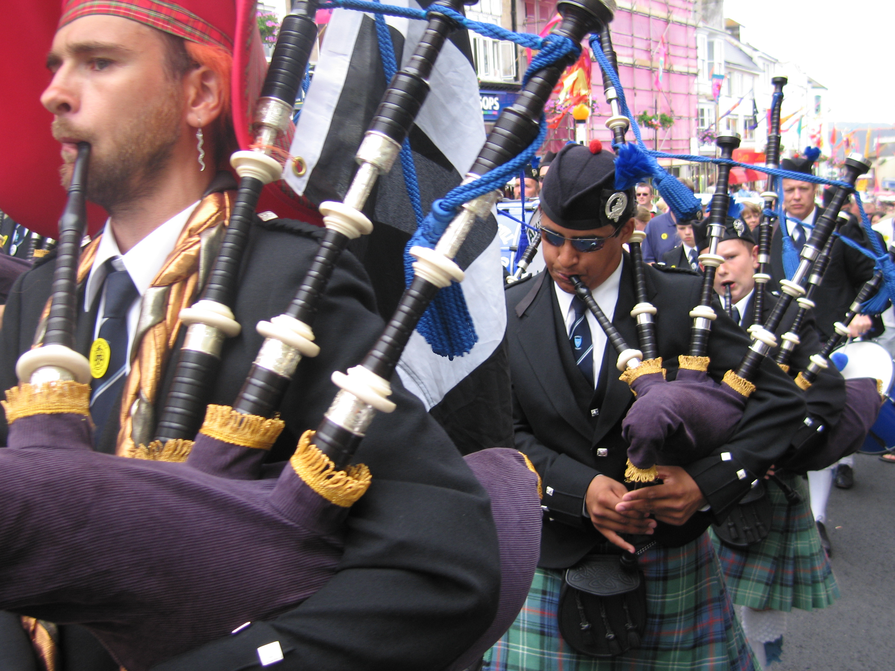
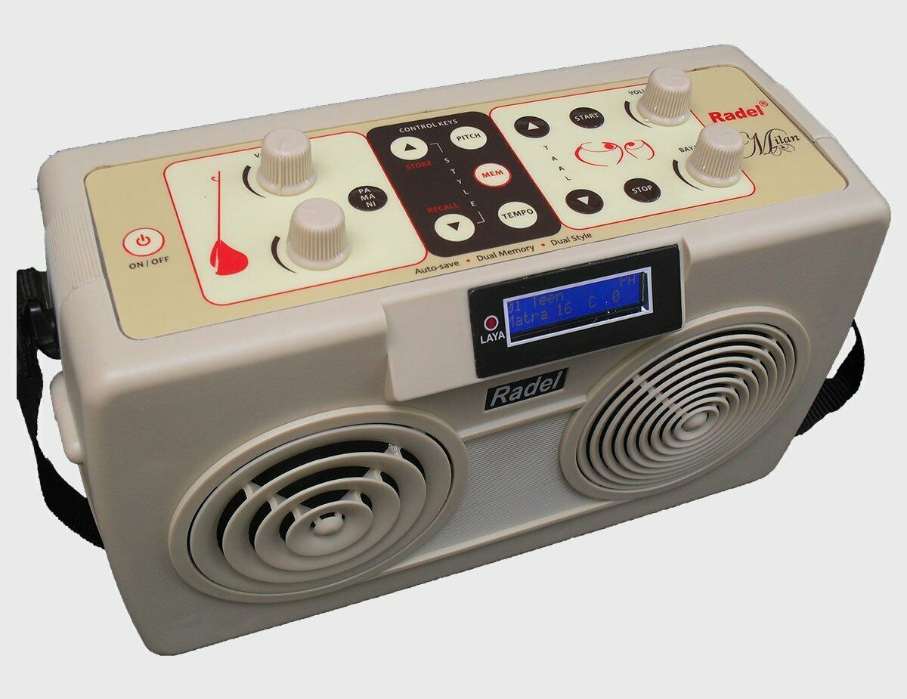
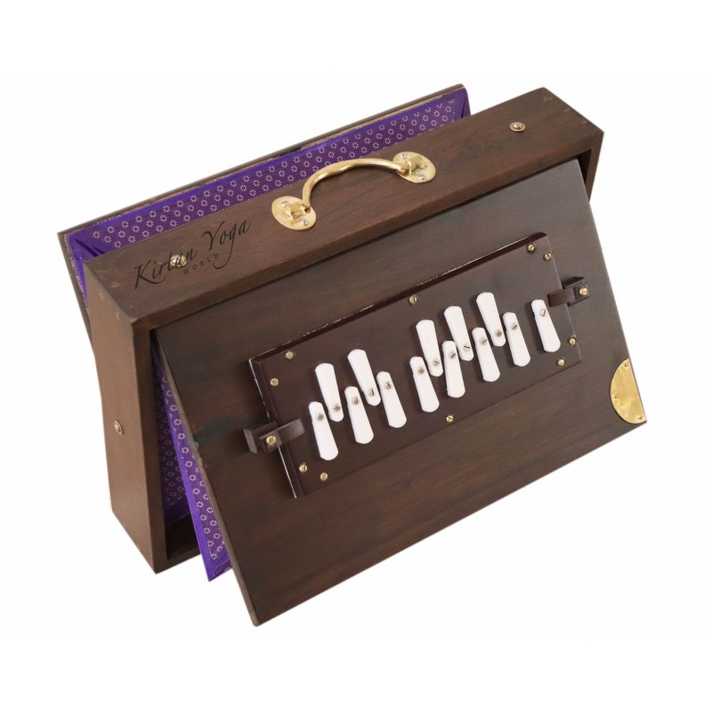
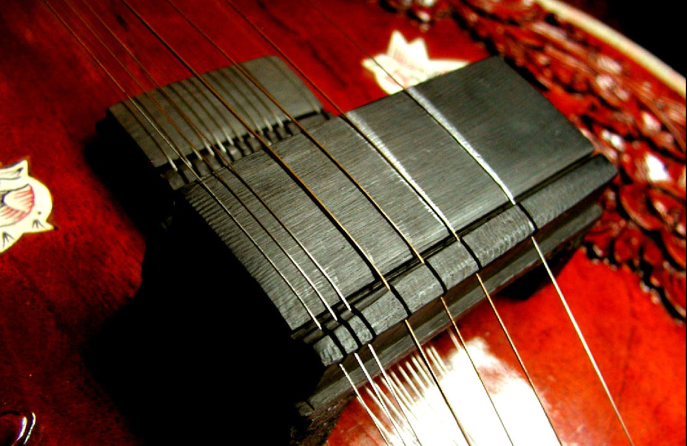
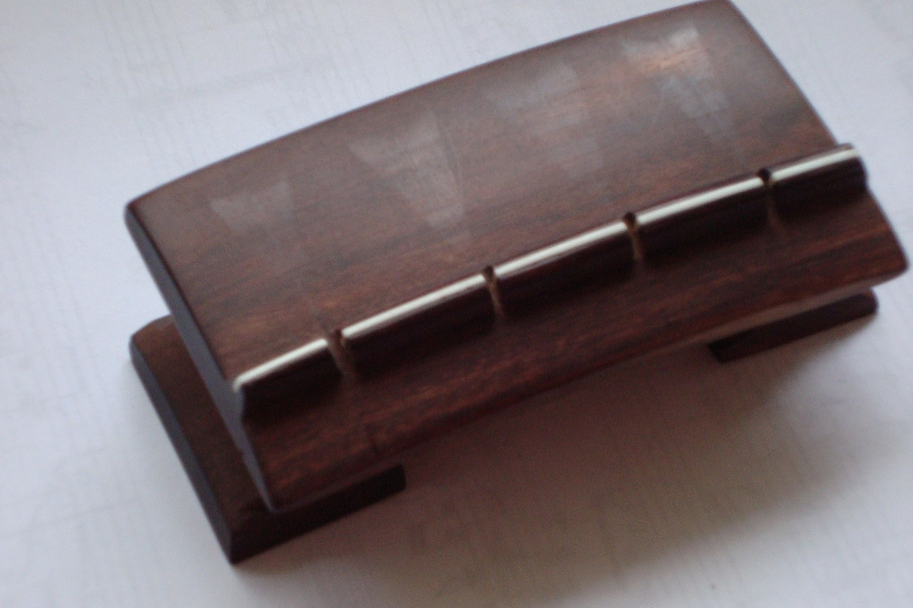
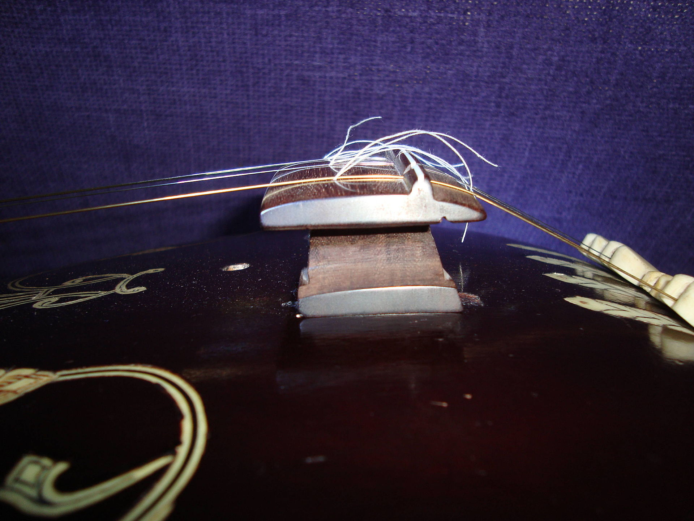

A drone is a harmonic or monophonic effect or accompaniment where a note or chord is continuously sounded throughout most or all of a piece. A drone may also be any part of a musical instrument used to produce this effect; an archaic term for this is burden (bourdon or burdon) such as a "drone [pipe] of a bagpipe", the pedal point in an organ, or the lowest course of a lute. Α burden is also part of a song that is repeated at the end of each stanza, such as the chorus or refrain.

## Musical effect

>"Of all harmonic devices, it [a drone] is not only the simplest, but probably also the most fertile."

A drone effect can be achieved through a sustained sound or through repetition of a note. It most often establishes a tonality upon which the rest of the piece is built. A drone can be instrumental, vocal or both. Drone (both instrumental and vocal) can be placed in different ranges of the polyphonic texture: in the lowest part, in the highest part, or in the middle. The drone is most often placed upon the tonic or dominant. A drone on the same pitch as a melodic note tends to both hide that note and to bring attention to it by increasing its importance.

A drone differs from a pedal tone or point in degree or quality. A pedal point may be a form of nonchord tone and thus required to resolve unlike a drone, or a pedal point may simply be considered a shorter drone, a drone being a longer pedal point.

## History and distribution

>
>A Lady Playing the Tanpura, ca. 1735.

The systematic use of drones originated in instrumental music of ancient Southwest Asia, and spread north and west to Europe, east to India, and south to Africa. It is used in Indian music and is played with the tanpura (or tambura) and other Indian drone instruments like the ottu, the ektar, the dotara (or dotar; dutar in Persian Central Asia), the surpeti, the surmandal (or swarmandal) and the shankh (conch shell). Most of the types of bagpipes that exist worldwide have up to three drones, making this one of the first instruments that comes to mind when speaking of drone music. In America, most forms of the African-influenced banjo contain a drone string. Since the 1960s, the drone has become a prominent feature in drone music and other forms of avant-garde music.

In vocal music drone is particularly widespread in traditional musical cultures, particularly in Europe, Polynesia and Melanesia. It is also present in some isolated regions of Asia (like among Pearl-divers in the Persian Gulf, some national minorities of South-West China, Taiwan, Vietnam, and Afghanistan).

## Part(s) of a musical instrument

>
>Highland bagpipes, with drone pipes over the pipers' left shoulders

Drone is also the term for the part of a musical instrument intended to produce the drone effect's sustained pitch, generally without the ongoing attention of the player. Different melodic Indian instruments (e.g. the sitar, the sarod, the sarangi and the rudra veena) contain a drone. For example, the sitar features three or four resonating drone strings, and Indian notes (sargam) are practiced to a drone. Bagpipes (like the Great Highland Bagpipe and the Zampogna) feature a number of drone pipes, giving the instruments their characteristic sounds. A hurdy-gurdy has one or more drone strings. The fifth string on a five-string banjo is a drone string with a separate tuning peg that places the end of the string five frets down the neck of the instrument; this string is usually tuned to the same note as that which the first string produces when played at the fifth fret, and the drone string is seldom fretted. The bass strings of the Slovenian drone zither also freely resonate as a drone. The Welsh Crwth also features two drone strings. 

## Use in musical compositions

Composers of Western classical music occasionally used a drone (especially one on open fifths) to evoke a rustic or archaic atmosphere, perhaps echoing that of Scottish or other early or folk music. Examples include the following:

- Haydn, Symphony No. 104, "London", opening of finale, accompanying a folk melody
- Beethoven, Symphony No. 6, "Pastoral", opening and trio section of scherzo
- Mendelssohn, Symphony No. 3 in A minor, opus 56, 'Scottish', especially the finale.
- Chopin, Mazurkas, Op. 7: all five contain a drone.
- Berlioz, Harold in Italy, accompanying oboes as they imitate the piffero of Italian peasants
- Richard Strauss, Also sprach Zarathustra, Introduction: the opening grows out of a drone effect in the orchestra.
- Mahler, Symphony No. 1, introduction; a seven-octave drone on A evokes "the awakening of nature at the earliest dawn"
- Bartók, in his adaptations for piano of Hungarian and other folk music

The best-known drone piece in the concert repertory is the Prelude to Wagner's Das Rheingold (1854) wherein low horns and bass instruments sustain an E♭ throughout the entire movement. The atmospheric ostinato effect that opens Beethoven's Ninth Symphony, which inspired similar gestures in the opening of all the symphonies of Anton Bruckner, represents a gesture derivative of drones.

One consideration for composers of common practice keyboard music was equal temperament. The adjustments lead to slight mistunings as heard against a sustained drone. Even so, drones have often been used to spotlight dissonance purposefully.

Modern concert musicians make frequent use of drones, often with just or other non-equal tempered tunings. Drones are a regular feature in the music of composers indebted to the chant tradition, such as Arvo Pärt, Sofia Gubaidulina, and John Tavener. The single-tones that provided the impetus for minimalism through the music of La Monte Young and many of his students qualify as drones. David First, the band Coil, the early experimental compilations of John Cale (Sun Blindness Music, Dream Interpretation, and Stainless Gamelan), Pauline Oliveros and Stuart Dempster, Alvin Lucier (Music On A Long Thin Wire), Ellen Fullman, Lawrence Chandler and Arnold Dreyblatt all make notable use of drones. The music of Italian composer Giacinto Scelsi is essentially drone-based. Shorter drones or the general concept of a continuous element are often used by many other composers. Other composers whose music is entirely based on drones include Charlemagne Palestine and Phill Niblock. The Immovable Do by Percy Grainger contains a sustained high C (heard in the upper woodwinds) that lasts for the entirety of the piece. Drone pieces also include Loren Rush's Hard Music (1970)  and Folke Rabe's Was?? (1968), as well as Robert Erickson's Down at Piraeus. The avant-garde guitarist Glenn Branca also used drones extensively. French singer Camille uses a continuous B throughout her album Le_Fil.

Drones continue to be characteristic of folk music. Early songs by Bob Dylan employ the effect with a retuned guitar in "Masters of War" and "Mr. Tambourine Man". The song "You Will Be My Ain True Love", written by Sting for the 2003 movie Cold Mountain and performed by Alison Krauss and Sting, uses drone bass.

Drones are used widely in the blues and blues-derived genres. Jerry Lee Lewis featured drones in solos and fills. Drones were virtually absent in original rock and roll music, but gained popularity after the Beatles used drones in a few popular compositions (for example, "Blackbird" has a drone in the middle of a texture throughout the whole song, "Tomorrow Never Knows" makes use of tambura). They also used high drone for the dramatic effect in some sections of several of their compositions (like the last verses of "Yesterday" and "Eleanor Rigby"). The rock band U2 uses drones in their compositions particularly widely. In the Led Zeppelin song "In The Light", a keyboard drone is used throughout the song, mostly in the intro.

## Use for musical training

Drones are used by a number of music education programs for ear training and pitch awareness, as well as a way to improvise ensemble music. A shruti box is often used by vocalists in this style of musical training. Drones, owing to their acoustic properties and following their longstanding use in ritual and chant, can be useful in constructing aural structures outside common practice expectations of harmony and melody.

## Shruti box

A shruti box (sruti box or surpeti) is an instrument, originating from the Indian subcontinent, that traditionally works on a system of bellows. It is similar to a harmonium and is used to provide a drone in a practice session or concert of Indian classical music. It is used as an accompaniment to other instruments and notably the flute. The shruti box is also used in classical singing. In classical singing, the shruti box is used to help tune the voice. The use of the shruti box has widened with the cross-cultural influences of world music and new-age music to provide a drone for many other instruments as well as vocalists.

Adjustable buttons allow tuning. Nowadays, electronic shruti boxes are commonly used, which are called shruthi pettige in Kannada, shruti petti in Tamil and Telugu and sur peti in Hindi. Recent versions also allow for changes to be made in the tempo, and the notes such as Madhyamam, Nishadam to be played in place of the usual three notes (i.e., Lower shadjam, panchamam, and the upper shadjam)

### History

Before the arrival of the harmonium in the Indian subcontinent, musicians used either a tambura or a specific pitch reference instrument, such as the nadaswaram, to produce the drone. Some forms of music such as Yakshagana used the pungi reedpipe as drone. After the Western small pump harmonium became popular, musicians would modify the harmonium to automatically produce the reference pitch. Typically, one would open up the cover and adjust the stop of the harmonium to produce a drone.

Later, a keyless version of the harmonium was invented for the specific purpose of producing the drone sound. It was given the name shruti box or sruti box. These types of instruments had controls on the top or on the side of the box for controlling the pitch.

The shruti box is enjoying a renaissance in the West amongst traditional and contemporary musicians, who are using it for a range of different styles. In the early nineties, traditional Irish singer Nóirín Ní Riain brought the shruti box to Ireland, giving it a minor place in traditional Irish music. More recently Scottish folk artist Karine Polwart and Julie Fowlis use the instrument, using it on some of their songs. Singers find it very useful as an accompaniment and instrumentalists enjoy the drone reference it gives to play along with.

### Jivari
>
>The Javari of a sitar, made from ebony, showing graphite marks from the first two strings

Javārī, (also: 'joārī', 'juvārī', 'jvārī' (alternately transcribed 'jawārī', 'jowārī', 'joyārī', 'juwārī', and 'jwārī')) in Indian classical music refers to the overtone-rich "buzzing" sound characteristic of classical Indian string instruments such as the tanpura, sitar, surbahar, rudra veena and Sarasvati veena. Javari can refer to the acoustic phenomenon itself and to the meticulously carved bone, ivory or wooden bridges that support the strings on the sounding board and produce this particular effect. A similar sort of bridge is used on traditional Ethiopian lyres, as well as on the ancient Greek kithara, and the "bray pins" of some early European harps operated on the same principle. A similar sound effect, called in Japanese sawari, is used on some traditional Japanese instruments as well.

Under the strings of tanpuras, which are unfretted (unstopped), and occasionally under those bass drone strings of sitars and surbahars which are seldom fretted, cotton threads are placed on the javari bridge to control the exact position of the node and its height above the curved surface, in order to more precisely refine the sound of javari. These cotton threads are known in Hindi as 'jīvā', meaning "life" and referring to the brighter tone heard from the plucked string once the thread has been slid into the correct position. This process is called "adjusting the javari". After a substantial time of playing, the surface directly under the string will wear out through the erosive impact of the strings. The sound will become thin and sharp and tuning also becomes a problem. Then a skilled, experienced craftsman needs to redress and polish the surface, which is called "doing the javari" ("'Javārī Sāf Karnā' or "Cleaning the Javārī'").

>
>Top view of a rosewood tambura bridge. Notice the marks left by the strings as the javari-maker assures that the contact-lines on the surface of the bridge are continuous and even. As a further test strings are pulled sideways and lengthwise in order to rub the bridge with the string, to better judge the quality of the surface, as unevenness in the surface shows clearly as a gap.

The rich and very much 'alive' resonant sound requires great sensitivity and experience in the tuning process. In the actual tuning, the fundamentals are of lesser interest as attention is drawn to the sustained harmonics that should be clearly audible, particularly the octaves, fifths, major thirds and minor sevenths of the (fundamental) tone of the string. The actual tuning is done on three levels: firstly by means of the large pegs, secondly, by carefully shifting tuning-beads for micro-tuning and thirdly, on a tanpura, by even more careful shifting of the cotton threads that pass between the strings and the bridge, somewhat before the zenith of its curve.

#### Effect

Typical of javari on an instrument with preferably long strings, is that on the soundboard the strings run over a wide bridge with a very flat parabolic curve. The curvature of the bridge has been made in a precise relation to the optimum level of playing, or more exact, a precise amplitude of each string. Any string, given length, density, pitch and tension, wants to be plucked within the limits of its elasticity, and so vibrate harmoniously with a steady pitch. When a string of a tanpura is plucked properly, it produces a tone with a certain amplitude that will slowly decrease as the tone fades out. In this gradual process, the string, moving up and down according to its frequency, will make a periodic grazing contact with the curved surface of the bridge. The exact grazing-spot will gradually shift up the sloping surface, as a function of the decreasing amplitude, finally dissolving into the rest-position of the open string. In this complex dynamic sonation process, the shifting grazing will touch upon micro-nodes on the string, exciting a wide range of harmonics in a sweeping mode. The desired effect is that of a cascading row of harmonics in a rainbow of sound. As an analogy, a properly shaped and adjusted javari is similar to the refraction of white light through a prism. When the prism is of good proportions and quality and used properly, the phenomenon should produce itself. "The voice of an artist which is marked by a rich sound resembling that produced by two consonants played together, is often loosely known to have Javārī in it, although such use is arbitrary."

#### Construction

The javari of a tanpura is in a way fine-tuned with a cotton thread under the string. Both the thread itself and its function is called 'jiva'. The jiva lifts the string by its diameter off the bridge and gives the necessary clearance and adjustability. By carefully shifting the jiva the sequence of the shifting grazing on the parabolic surface of the bridge becomes 'tuneable' within limits. For each string there should be a spot relative to the curve of the bridge where optimum sound quality is found. Within the area of optimum resonance and sustain, a little play should be available for further fine-tuning, in which the jiva can hardly be seen to move. Staying with optics, shifting the jiva would be similar to using the manual fine focus on a camera. Experienced 'javari-makers' will agree that the 'javari' has to be made specific to certain string lengths, gauges and pitches and certain amplitudes.

> 
>Side view of a Tanjore-style rosewood tanpura bridge with cotton threads adjusted for full resonance.

The curvature of the bridge of the main strings of a sitar will be different from that of the smaller and lower bridge in front of the main bridge, which carries the sympathetic resonance-strings (tarafs). As this choir of thinner and shorter strings is excited solely by the sympathetic resonance with the tones played on the main strings, the general amplitude is smaller, so accordingly the curvature will be flatter. The making of a perfectly sounding javari for any instrument requires a very high degree of skill and expertise. Tanpuras are the only instruments that are always used with jiva-threads, except the octave-tamburis. Sitar, Rudra Veena, Sarasvati Veena, all have parabolic wide javari bridges for the main playing strings. Sarod and Sarangi have some of their sympathetic resonance strings (tarafs) on small, flat javari-bridges similar to that of the sitar. The javari of a sitar will be made according to the wishes of the player, either 'open',('khula') with a bright sounding javari-effect, or 'closed' ('band') with a relatively more plain tone, or something in between ('ghol'). The choice depends on the preference of the sitar-player and on the adapted playing style. 

