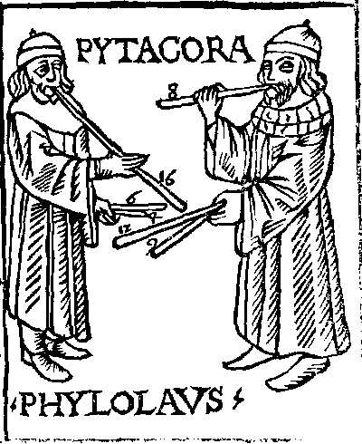

## Ancient Greece

In Greek mythology, Harmonia (/hɑːrˈmoʊniə/; Ancient Greek: Ἁρμονία) is the immortal goddess of harmony and concord. Her Roman counterpart is Concordia. Her Greek opposite is Eris, whose Roman counterpart is Discordia. 

According to one account, she is the daughter of Ares and Aphrodite. By another account, Harmonia was from Samothrace and was the daughter of Zeus and Electra, her brother Iasion being the founder of the mystic rites celebrated on the island.

Almost always, Harmonia is the wife of Cadmus. With Cadmus, she was the mother of Ino, Polydorus, Autonoë, Agave, and Semele. Their youngest son was Illyrius.

He was the first Greek hero and, alongside Perseus and Bellerophon, the greatest hero and slayer of monsters before the days of Heracles.

Cadmus was credited by the ancient Greeks (such as Herodotus c. 484 – c. 425 BC, one of the first Greek historians, but one who also wove standard myths and legends through his work) with introducing the original Phoenician alphabet to the Greeks, who adapted it to form their Greek alphabet. Herodotus estimates that Cadmus lived sixteen hundred years before his time, which would be around 2000 BC.

### Pythagoreans

Pythagoras pioneered the mathematical and experimental study of music. He objectively measured physical quantities, such as the length of a string, and discovered quantitative mathematical relationships of music through arithmetic ratios. Pythagoras attempted to explain subjective psychological and aesthetic feelings, such as the enjoyment of musical harmony. Pythagoras and his students experimented systematically with strings of varying length and tension, with wind instruments, with brass discs of the same diameter but different thickness, and with identical vases filled with different levels of water. Early Pythagoreans established quantitative ratios between the length of a string or pipe and the pitch of notes and the frequency of string vibration.

Pythagoras is credited with discovering that the most harmonious musical intervals are created by the simple numerical ratio of the first four natural numbers which derive respectively from the relations of string length: the octave (1/2), the fifth (2/3) and the fourth (3/4). The sum of those numbers 1 + 2 + 3 + 4 = 10 was for Pythagoreans the perfect number, because it contained in itself "the whole essential nature of numbers". Werner Heisenberg has called this formulation of musical arithmetic as "among the most powerful advances of human science" because it enables the measurement of sound in space.

Pythagorean tuning is a system of musical tuning in which the frequency ratios of all intervals are based on the ratio 3:2. This ratio, also known as the "pure" perfect fifth, is chosen because it is one of the most consonant and easiest to tune by ear and because of importance attributed to the integer 3. As Novalis put it, "The musical proportions seem to me to be particularly correct natural proportions."

The fact that mathematics could explain the human sentimental world had a profound impact on the Pythagorean philosophy. Pythagoreanism became the quest for establishing the fundamental essences of reality. Pythagorean philosophers advanced the unshakable belief that the essence of all thing are numbers and that the universe was sustained by harmony. According to ancient sources music was central to the lives of those practicing Pythagoreanism. They used medicines for the purification (katharsis) of the body and, according to Aristoxenus, music for the purification of the soul. Pythagoreans used different types of music to arouse or calm their souls.

> 
>
>Medieval woodcut by Franchino Gaffurio, depicting Pythagoras and Philolaus conducting musical investigations.

For Pythagoreans, harmony signified the "unification of a multifarious composition and the agreement of unlike spirits". In Pythagoreanism, numeric harmony was applied in mathematical, medical, psychological, aesthetic, metaphysical and cosmological problems. For Pythagorean philosophers, the basic property of numbers was expressed in the harmonious interplay of opposite pairs. Harmony assured the balance of opposite forces. Pythagoras had in his teachings named numbers and the symmetries of them as the first principle, and called these numeric symmetries harmony. This numeric harmony could be discovered in rules throughout nature. Numbers governed the properties and conditions of all beings and were regarded the causes of being in everything else. Pythagorean philosophers believed that numbers were the elements of all beings and the universe as a whole was composed of harmony and numbers.

