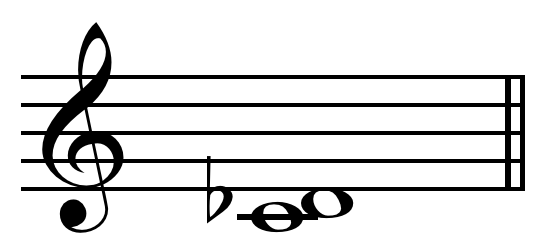

## Second

### Major second M2

- <chroma-row :chroma="'101000000000'" />

A major second (sometimes also called whole tone or a whole step) is a second spanning two semitones. The major second is the interval that occurs between the first and second degrees of a major scale, the tonic and the supertonic.

On a musical keyboard, a major second is the interval between two keys separated by one key, counting white and black keys alike. On a guitar string, it is the interval separated by two frets. In moveable-do solfège, it is the interval between do and re. It is considered a melodic step, as opposed to larger intervals called skips. 

In just intonation, major seconds can occur in at least two different frequency ratios: 9:8 (about 203.9 cents) major tone and 10:9 minor tone (about 182.4 cents). The largest (9:8) ones are called major tones or greater tones, the smallest (10:9) are called minor tones or lesser tones. Their size differs by exactly one syntonic comma (81:80, or about 21.5 cents). Some equal temperaments, such as 15-ET and 22-ET, also distinguish between a greater and a lesser tone. 

The major tone may be derived from the harmonic series as the interval between the eighth and ninth harmonics. The minor tone may be derived from the harmonic series as the interval between the ninth and tenth harmonics. 

In Pythagorean music theory, the epogdoon (Ancient Greek: ἐπόγδοον) is the interval with the ratio 9 to 8. The word is composed of the prefix epi- meaning "on top of" and ogdoon meaning "one eighth"; so it means "one eighth in addition".

>
>
>Diagram showing relations between epogdoon, diatessaron, diapente, and diapason

### Minor second m2

- <chroma-row :chroma="'110000000000'" />

A semitone, also called a half step or a half tone, is the smallest musical interval commonly used in Western tonal music, and it is considered the most dissonant when sounded harmonically. It is defined as the interval between two adjacent notes in a 12-tone scale. 

In twelve-tone equal temperament all semitones are equal in size (100 cents). In other tuning systems, "semitone" refers to a family of intervals that may vary both in size and name. In Pythagorean tuning, seven semitones out of twelve are diatonic, with ratio 256:243 or 90.2 cents (Pythagorean limma), and the other five are chromatic, with ratio 2187:2048 or 113.7 cents (Pythagorean apotome); they differ by the Pythagorean comma of ratio 531441:524288 or 23.5 cents. In quarter-comma meantone, seven of them are diatonic, and 117.1 cents wide, while the other five are chromatic, and 76.0 cents wide; they differ by the lesser diesis of ratio 128:125 or 41.1 cents. 12-tone scales tuned in just intonation typically define three or four kinds of semitones. For instance, Asymmetric five-limit tuning yields chromatic semitones with ratios 25:24 (70.7 cents) and 135:128 (92.2 cents), and diatonic semitones with ratios 16:15 (111.7 cents) and 27:25 (133.2 cents).

Melodically, this interval is very frequently used, and is of particular importance in cadences. In the perfect and deceptive cadences it appears as a resolution of the leading-tone to the tonic. In the plagal cadence, it appears as the falling of the subdominant to the mediant. It also occurs in many forms of the imperfect cadence, wherever the tonic falls to the leading-tone. 

Harmonically, the interval usually occurs as some form of dissonance or a nonchord tone that is not part of the functional harmony. It may also appear in inversions of a major seventh chord, and in many added tone chords. 

### Minor seventh m7

- <chroma-row :chroma="'100000000010'" />

The minor seventh spans ten semitones.

Minor seventh intervals rarely feature in melodies (and especially in their openings) but occur more often than major sevenths.

Consonance and dissonance are relative, depending on context, the minor seventh being defined as a dissonance requiring resolution to a consonance.

In just intonation there is both a 16:9 "small just minor seventh", also called the "Pythagorean small minor seventh", equivalent to two perfect fourths stacked on top of each other, and a 9:5 "large just minor seventh" equivalent to a perfect fifth and a minor third on top of each other.

### Major seventh M7

- <chroma-row :chroma="'100000000001'" />

The major seventh spans eleven semitones.

A major seventh in just intonation most often corresponds to a pitch ratio of 15:8 (About this soundplay (help·info)); in 12-tone equal temperament, a major seventh is equal to eleven semitones, or 1100 cents, about 12 cents wider than the 15:8 major seventh.

The major seventh interval is considered one of the most dissonant intervals after its inversion the minor second. For this reason, its melodic use is infrequent in classical music. 

The major seventh chord is however very common in jazz, especially 'cool' jazz, and has a characteristically soft and sweet sound.