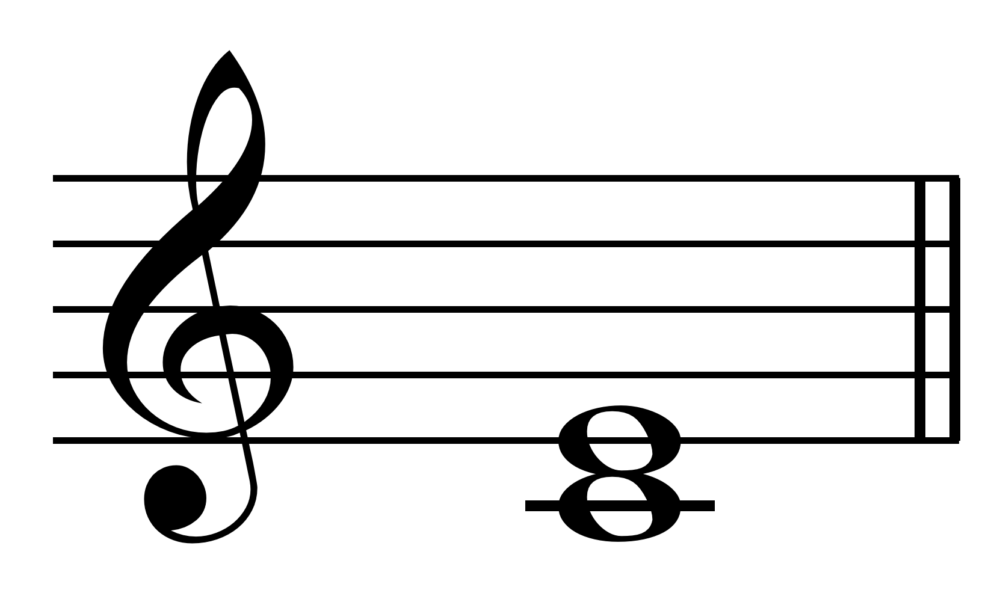
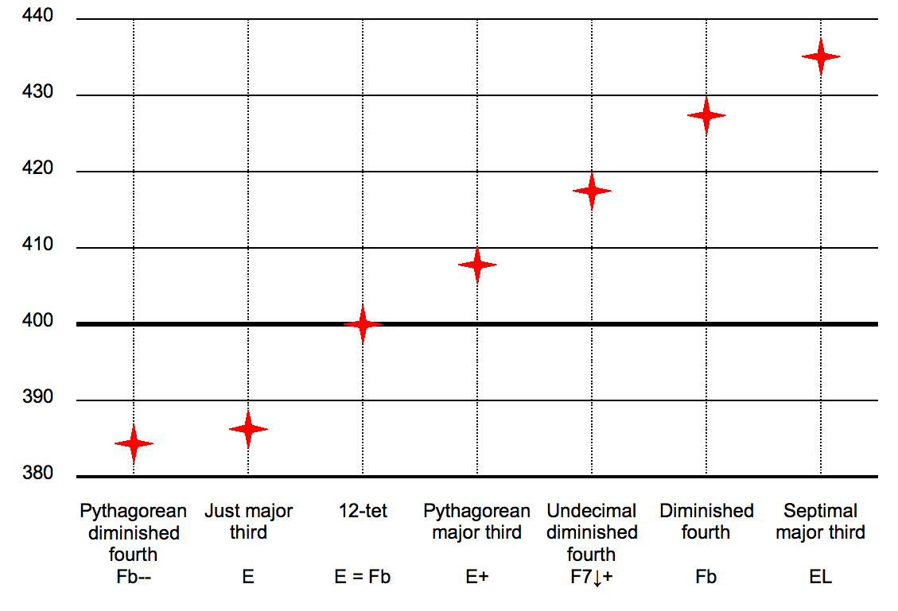
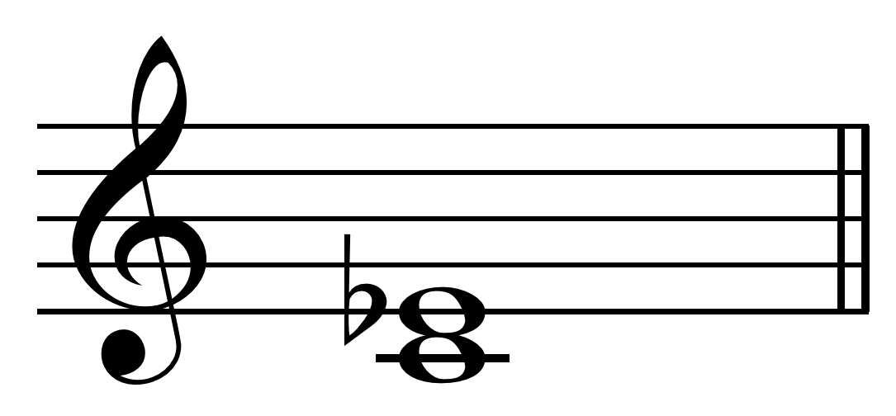
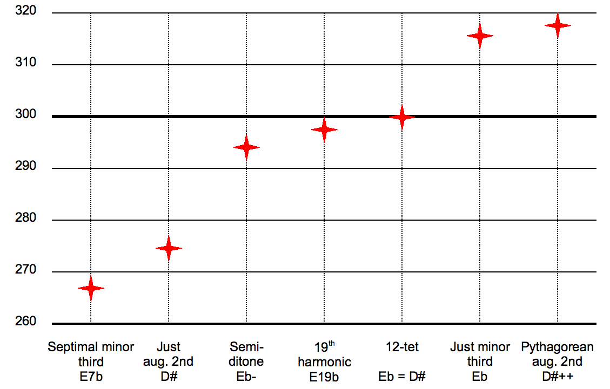
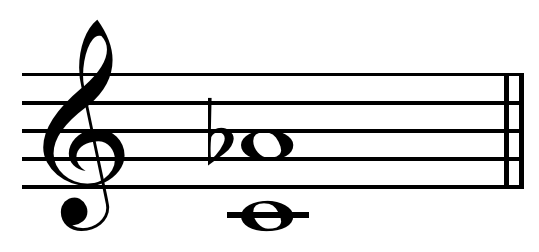
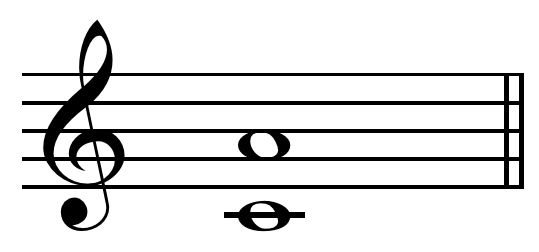

## Major third M3

- <chroma-row :chroma="'100010000000'" />

The major third may be derived from the harmonic series as the interval between the fourth and fifth harmonics. The major third is classed as an imperfect consonance and is considered one of the most consonant intervals after the unison, octave, perfect fifth, and perfect fourth. 

A major third is slightly different in different musical tunings: 

- in just intonation corresponds to a pitch ratio of 5:4 (fifth harmonic in relation to the fourth) or 386.31 cents; 
- in equal temperament, a major third is equal to four semitones, a ratio of 21/3:1 (about 1.2599) or 400 cents, 13.69 cents wider than the 5:4 ratio. 
- The older concept of a ditone (two 9:8 major seconds) made a dissonantly wide major third with the ratio 81:64 (408 cents). 
- The septimal major third is 9:7 (435 cents), the undecimal major third is 14:11 (418 cents), and the tridecimal major third is 13:10 (452 cents).

In equal temperament three major thirds in a row are equal to an octave (for example, A♭ to C, C to E, and E to G♯; G♯ and A♭ represent the same note). This is sometimes called the "circle of thirds". In just intonation, however, three 5:4 major third, the 125th subharmonic, is less than an octave. For example, three 5:4 major thirds from C is B♯ (C to E to G♯ to B♯) (B♯ = 5^3 / 2^6 = 125 / 64 ). The difference between this just-tuned B♯ and C, like that between G♯ and A♭, is called the "enharmonic diesis", about 41 cents (the inversion of the 125/64 interval: 128 / 125 = 2^7 / 3^3 ). 

## Minor third m3

- <chroma-row :chroma="'100100000000'" />

A minor third is a musical interval that encompasses three half steps, or semitones. It is called minor because it is the smaller of the two: the major third spans an additional semitone. 

The minor third may be derived from the harmonic series as the interval between the fifth and sixth harmonics, or from the 19th harmonic. The minor third is also obtainable in reference to a fundamental note from the undertone series, while the major third is obtainable as such from the overtone series. The 12-TET minor third (300 cents) more closely approximates the nineteenth harmonic with only 2.49 cents error.

- A minor third, in just intonation, corresponds to a pitch ratio of 6:5 or 315.64 cents. 
- In an equal tempered tuning, a minor third is equal to three semitones, a ratio of 2^1/4:1 (about 1.189), or 300 cents, 15.64 cents narrower than the 6:5 ratio.

The minor third is commonly used to express sadness in music, and research shows that this mirrors its use in speech, as a tone similar to a minor third is produced during sad speech.

## Minor sixth m6

- <chroma-row :chroma="'100000001000'" />

Minor sixth is the inverse the major third. 

In the common practice period, sixths were considered interesting and dynamic consonances along with their inverses the thirds.

In just intonation multiple definitions of a minor sixth can exist:

- In 3-limit tuning, i.e. Pythagorean tuning, the minor sixth is the ratio 128:81, or 792.18 cents, i.e. 7.82 cents flatter than the 12-ET-minor sixth. This is denoted with a "-" (minus) sign (see figure).

- In 5-limit tuning, a minor sixth most often corresponds to a pitch ratio of 8:5  or 814 cents; i.e. 13.7 cents sharper than the 12-ET-minor sixth.

- In 11-limit tuning, the 11:7 undecimal minor sixth is 782.49 cents.

In the common practice period, sixths were considered interesting and dynamic consonances along with their inverses the thirds, but in medieval times they were considered dissonances unusable in a stable final sonority. In that period they were tuned to the flatter Pythagorean minor sixth of 128:81. In 5-limit just intonation, the minor sixth of 8:5 is classed as a consonance. 

## Major sixth M6

- <chroma-row :chroma="'100000000100'" />

Major sixth is the inverse the minor third. 

The major sixth spans nine semitones. It is a sixth because it encompasses six note letter names (C, D, E, F, G, A) and six staff positions.

The major sixth is one of the consonances of common practice music, along with the unison, octave, perfect fifth, major and minor thirds, minor sixth, and (sometimes) the perfect fourth. In the common practice period, sixths were considered interesting and dynamic consonances along with their inverses the thirds. In medieval times theorists always described them as Pythagorean major sixths of 27/16 and therefore considered them dissonances unusable in a stable final sonority. We cannot know how major sixths actually were sung in the Middle Ages. In just intonation, the (5/3) major sixth is classed as a consonance of the 5-limit. 

The nineteenth subharmonic is a major sixth, 32/19 = 902.49 cents. 

- In just intonation, the most common major sixth is the pitch ratio of 5:3 , approximately 884 cents.
- In 12-tone equal temperament, a major sixth is equal to nine semitones, exactly 900 cents, with a frequency ratio of the (9/12) root of 2 over 1.
- Another major sixth is the Pythagorean major sixth with a ratio of 27:16, approximately 906 cents,[4] called "Pythagorean" because it can be constructed from three just perfect fifths (C-A = C-G-D-A = 702+702+702-1200=906). It corresponds to the interval between the 27th and the 16th harmonics.

