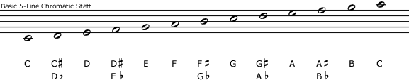
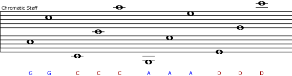
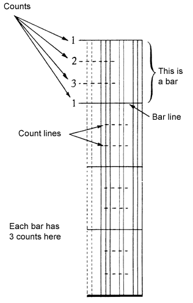
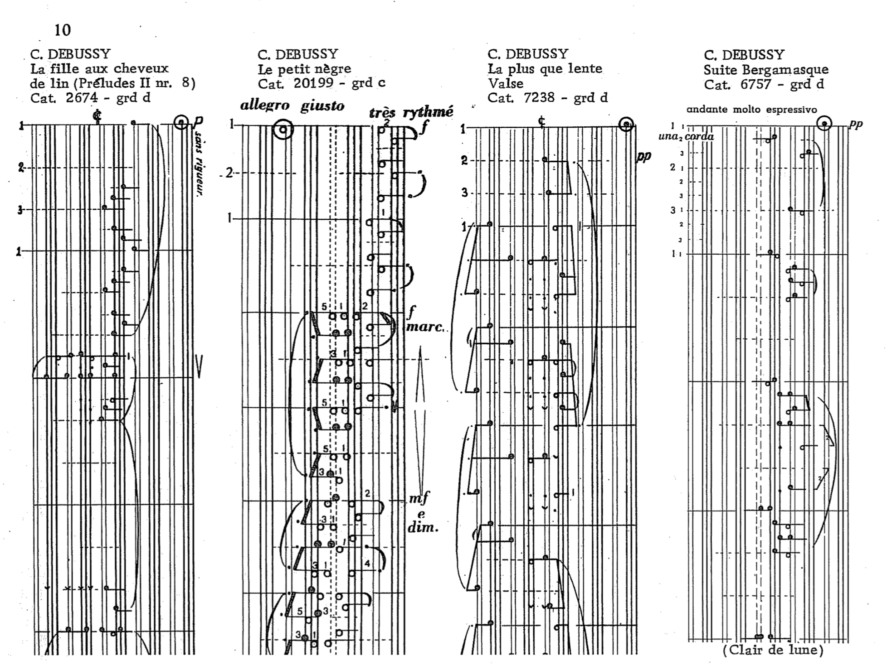
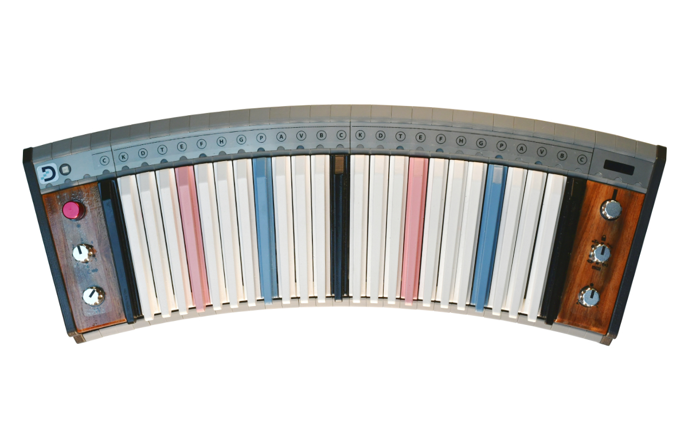
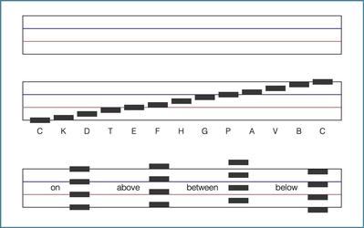
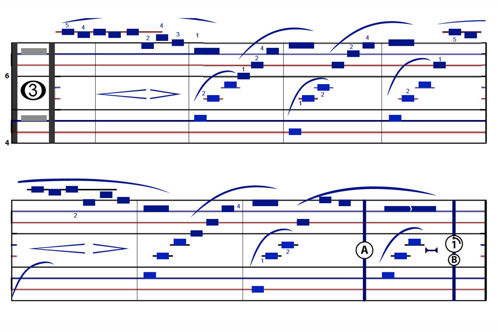

## Bilinear notation by Jose A. Sotorrio

Bilinear is quite similar to [Reed’s Twinline](http://musicnotation.org/system/twinline-notation-by-thomas-reed/). Sotorrio maintains he had no prior knowledge of Twinline when designing Bilinear, since he relied primarily on Gardner Read’s Source Book of Proposed Music Notation Reforms which does not include Twinline. (It was published in 1987, just after Twinline was introduced in 1986.) Since Twinline is the earlier system (Bilinear was introduced in 1997), Sotorrio now offers Bilinear as a variant of Twinline.


The two systems share the same line pattern and the same alternating oval and triangle shaped noteheads, but there are differences in their details. Twinline’s triangles are right triangles with the 90 degree angle at their tip, while Bilinear’s triangles have a sharper angle at their tip. Also, the shape, color, and size of noteheads in Bilinear may be different depending on a note’s duration, as illustrated in the following image (courtesy of the Bilinear website):


## Chromatic staff

>“The need for a new notation, or a radical improvement of the old, is greater than it seems, and the number of ingenious minds that have tackled the problem is greater than one might think.” — Arnold Schoenberg

Here is a chromatic scale on a traditional diatonic staff (above) and the same chromatic scale on a chromatic staff with five lines (below). This is just one of many versions of chromatic staff.



On a chromatic staff each note has its own line or space on the staff. On the traditional staff only seven notes have their own line or space, the notes from just one key (C major/A minor, the white keys on the piano). The remaining notes (the black keys) have to be represented by altering these seven notes with sharp signs (#) or flat signs (b), either in the key signature or as an accidental.



All of these features of traditional music notation combine to make reading music much more difficult than it might be with a better notation system. For an analogy, imagine trying to do arithmetic with Roman numerals. It can be done, but the notation system makes a big difference. Of course it is important to view traditional notation in its broader historical context and to keep in mind the innovations and reforms that it has undergone over time.

[Music notation project](http://musicnotation.org/)

---

## Klavarskribo 

Klavarskribo (sometimes shortened to klavar) is a music notation system that was introduced in 1931 by the Dutchman Cornelis Pot (1885–1977). The name means "keyboard writing" in Esperanto. It differs from conventional music notation in a number of ways and is intended to be easily readable. 


The stave on which the notes are written is vertical so the music is read from top to bottom. Each note has its own individual position, low notes on the left and high notes on the right as on the piano. This stave consists of groups of two and three vertical lines corresponding to the black keys (notes) of the piano. White notes are written in the seven white spaces between the lines. Therefore sharps and flats are no longer needed, as each note has its own place in the octave. The evident correspondence between the stave and a piano induced Pot to use the name Klavarskribo.



All notes are provided with stems—stems to the right: play with the right hand, stems to the left: left hand.

<youtube-embed video="efTv05nWNhk" />

<youtube-embed video="5mTRUF6q5-I" />



[](https://www.klavarskribo.eu/en/)

---

## Dodeka



The Dodeka Keyboard Design is an isomorphic keyboard invented and designed by Jacques-Daniel Rochat. It is similar to a piano keyboard but with only a single row of keys containing each chromatic note.The keys corresponding to C, E and A flat are highlighted to provide visual landmarks. The creators aimed to create a rational and chromatic approach to music and performance. As an isomorphic keyboard, any musical sequence or interval has the same shape in each of the 12 keys. 


The Dodeka Music Notation is an alternative music notation or musical notation system invented and designed in 1980s by inventor and musician Jacques-Daniel Rochat in an attempt to improve upon traditional music notation. 



Unlike conventional musical notation, the Dodeka music notation system uses a chromatic scale of 12 pitches and follows an equal pitch intervals configuration, with 4 lines per octave. In this configuration, the 12 notes of an octave appear in four positions vis-à-vis the staff lines, that is, either on, between, above and below the lines.

Each pitch has its own unique place on the staff. And while conventional music notation may alter notes using accidental signs or key signatures, notes in the Dodeka notation appear as they are. There are no more key signatures or accidental signs in this musical system. 

>
>(Excerpt of Beethoven Für Elise written in Dodeka Notation)

The Dodeka notation system represents note duration in a visual manner. Note lengths are represented through the notes graphical shapes, similar to what can be found in sequencer programmes. The reference time unit or time value being the quarter note (or crotchet), all durations are expressed as visual ratios from this reference point. For example, a whole note is the representation of four quarter note lengths. At the opposite, an eighth note (or quaver) is twice as short as a quarter note. All the other symbols and articulation marks are also [reimagined in Dodeka](https://www.dodekamusic.com/learn/alternative-music-notation/dodeka-musical-symbols-list-meaning/).

[](https://apps.apple.com/us/app/dodeka-music/id1260932281?ls=1)

### Dodeka note names

The objective was to create 2-letter names that convey a relationship between the names of the notes and their position on the staff. We did that using letters that are not present in the English (anglo-saxon) designation. For example, the note Do# (C#) is called Ka (K) because it shares the same position as La (A) (ie. both notes are above a line).

Following this logic, the 12 notes can be written as:
Do / Ka / Ré / To(l) / Mi / Fa / Hu / So(l) / Pi / La / Vé / Si.

In English, we only use the first letters, which gives us the following sequence:
C / K / D / T / E / F / H / G / P / A / V / B.

[Dodeka music](https://www.dodekamusic.com)

---

## Parsons code

The Parsons code, formally named the Parsons code for melodic contours, is a simple notation used to identify a piece of music through melodic motion — movements of the pitch up and down. Denys Parsons (father of Alan Parsons) developed this system for his 1975 book The Directory of Tunes and Musical Themes. Representing a melody in this manner makes it easier to index or search for pieces, particularly when the notes' values are unknown. Parsons covered around 15,000 classical, popular and folk pieces in his dictionary. In the process he found out that *UU is the most popular opening contour, used in 23% of all the themes, something that applies to all the genres. 

```
Parsons Code of Ode to Joy

    Parsons$ ./contour *RUURDDDDRUURDR
            *-*                    
           /   \                  
          *     *                  
         /       \                
      *-*         *         *-*    
                   \       /   \  
                    *     *     *-*
                     \   /        
                      *-*

```

The first note of a melody is denoted with an asterisk (*), although some Parsons code users omit the first note. All succeeding notes are denoted with one of three letters to indicate the relationship of its pitch to the previous note:

- * = first tone as reference,
- u = "up", for when the note is higher than the previous note,
- d = "down", for when the note is lower than the previous note,
- r = "repeat", for when the note has the same pitch as the previous note.

[Search a melody by it's Parsons code at Musipedia](https://www.musipedia.org/melodic_contour.html)

### Some examples
- Ode to Joy: *RUURDDDDRUURDR
- "Twinkle Twinkle Little Star": *rururddrdrdrdurdrdrdurdrdrddrururddrdrdrd
- "Silent Night": *udduuddurdurdurudddudduruddduddurudduuddduddd
- "Aura Lea" ("Love Me Tender"): *uduududdduu
- "White Christmas": *udduuuu
- First verse in Madonna's "Like a Virgin": *rrurddrdrrurdudurrrrddrduuddrdu

There are [studies](http://ismir2003.ismir.net/papers/Uitdenbogerd.pdf) showing that despite it's simplicity, Parsons code is still too hard for non-musicians to formulate and interpret the code for melody search. Yet it may be useful for more skilled musicians, but the audio-based search becomes more widely spread and adopted.

---

## ABC-notation

[ABC notation](https://abcnotation.com/wiki/abc:standard:v2.1) is a shorthand form of musical notation for computers. In basic form it uses the letter notation with a–g, A–G, and z, to represent the corresponding notes and rests, with other elements used to place added value on these – sharp, flat, raised or lowered octave, the note length, key, and ornamentation. This form of notation began from a combination of Helmholtz pitch notation and using ASCII characters to imitate standard musical notation (bar lines, tempo marks, etc.) that could facilitate the sharing of music online, and also added a new and simple language for software developers, not unlike other notations designed for ease, such as tablature and solfège.

[Interactive ABC notation renderer](/practice/experiment/abc.md)

The earlier ABC notation was built on, standardized, and changed by Chris Walshaw to better fit the keyboard and an ASCII character set, with the help and input of others. Originally designed to encode folk and traditional Western European tunes (e.g., from England, Ireland, and Scotland) which are typically single-voice melodies that can be written in standard notation on a single staff line, the extensions by Walshaw and others has opened this up with an increased list of characters and headers in a syntax that can also support metadata for each tune:
- The index, when there are more than one tune in a file (X:)- the title (T:), 
- the time signature (M:), 
- the default note length (L:), 
- the type of tune (R:),
- the key (K:)
  - with the clef (K: clef=[treble|alto|tenor|bass|perc])

Lines following the key designation represent the tune. 

After a surge of renewed interest in clarifying some ambiguities in the 2.0 draft and suggestions for new features, serious discussion of a new (and official) standard resumed in 2011, culminating in the release of ABC 2.1 as a new standard in late December 2011. Chris Walshaw has become involved again and is coordinating the effort to further improve and clarify the language, with plans for topics to be addressed in future versions to be known as ABC 2.2 and ABC 2.3 . 

<youtube-embed video="H8hWKP5cEXE" />

https://abcnotation.com/learn

---

## Piano roll

The Buffalo Convention of December 10, 1908 established two future roll formats for the US-producers of piano rolls for self-playing pianos. The two formats had different punchings of 65 and 88 notes, but the same width (11+1⁄4 inches or 286 millimetres); thus 65-note rolls would be perforated at 6 holes to the inch, and 88-note rolls at 9 holes to the inch, leaving margins at both ends for future developments. This made it possible to play the piano rolls on any self-playing instrument built according to the convention, albeit sometimes with a loss of special functionality. This format became a loose world standard. 


## MIDI

At the 1983 Winter NAMM Show, Smith demonstrated a MIDI connection between Prophet 600 and Roland JP-6 synthesizers. The MIDI specification was published in August 1983. The MIDI standard was unveiled by Kakehashi and Smith, who received Technical Grammy Awards in 2013 for their work. In 1982, the first instruments were released with MIDI, the Roland Jupiter-6 and the Prophet 600. In 1983, the first MIDI drum machine, the Roland TR-909, and the first MIDI sequencer, the Roland MSQ-700 were released. The first computer to support MIDI, the NEC PC-88 and PC-98, was released in 1982.


A MIDI message is an instruction that controls some aspect of the receiving device. A MIDI message consists of a status byte, which indicates the type of the message, followed by up to two data bytes that contain the parameters. MIDI messages can be channel messages sent on only one of the 16 channels and monitored only by devices on that channel, or system messages that all devices receive. Each receiving device ignores data not relevant to its function.There are five types of message: Channel Voice, Channel Mode, System Common, System Real-Time, and System Exclusive.

Channel Voice messages transmit real-time performance data over a single channel. Examples include "note-on" messages which contain a MIDI note number that specifies the note's pitch, a velocity value that indicates how forcefully the note was played, and the channel number; "note-off" messages that end a note; program change messages that change a device's patch; and control changes that allow adjustment of an instrument's parameters. MIDI notes are numbered from 0 to 127 assigned to C−1 to G9. This corresponds to a range of 8.175799 to 12543.85 Hz (assuming equal temperament and 440 Hz A4) and extends beyond the 88 note piano range from A0 to C8. 


## Integer notation

In music, integer notation is the translation of pitch classes and/or interval classes into whole numbers. Thus if C = 0, then C♯ = 1 ... A♯ = 10, B = 11, with "10" and "11" substituted by "t" and "e" in some sources, A and B in others (like the duodecimal numeral system, which also uses "t" and "e", or A and B, for "10" and "11"). This allows the most economical presentation of information regarding post-tonal materials.

To avoid the problem of enharmonic spellings, theorists typically represent pitch classes using numbers beginning from zero, with each successively larger integer representing a pitch class that would be one semitone higher than the preceding one, if they were all realised as actual pitches in the same octave. Because octave-related pitches belong to the same class, when an octave is reached, the numbers begin again at zero. This cyclical system is referred to as modular arithmetic and, in the usual case of chromatic twelve-tone scales, pitch-class numbering is regarded as "modulo 12" (customarily abbreviated "mod 12" in the music-theory literature) — that is, every twelfth member is identical. 

One can map a pitch's fundamental frequency f (measured in hertz) to a real number p using the equation

    p = 9 + 12 log 2 (⁡ f / 440  Hz ). 


This creates a linear pitch space in which octaves have size 12, semitones (the distance between adjacent keys on the piano keyboard) have size 1, and middle C (C4) is assigned the number 0 (thus, the pitches on piano are −39 to +48). Indeed, the mapping from pitch to real numbers defined in this manner forms the basis of the MIDI Tuning Standard, which uses the real numbers from 0 to 127 to represent the pitches C−1 to G9 (thus, middle C is 60). 

To represent pitch classes, we need to identify or "glue together" all pitches belonging to the same pitch class. The result is a cyclical quotient group that musicians call pitch class space and mathematicians call R/12Z. Points in this space can be labelled using real numbers in the range 0 ≤ x < 12. These numbers provide numerical alternatives to the letter names of elementary music theory:

- 0 = C, 
- 1 = C♯/D♭, 
- 2 = D, 
- 2.5 = Dhalf sharp (quarter tone sharp), 
- 3 = D♯/E♭,

and so on. In this system, pitch classes represented by integers are classes of twelve-tone equal temperament (assuming standard concert A). 
