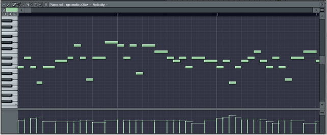

## ABC-notation

ABC notation is a shorthand form of musical notation for computers. In basic form it uses the letter notation with a–g, A–G, and z, to represent the corresponding notes and rests, with other elements used to place added value on these – sharp, flat, raised or lowered octave, the note length, key, and ornamentation. This form of notation began from a combination of Helmholtz pitch notation and using ASCII characters to imitate standard musical notation (bar lines, tempo marks, etc.) that could facilitate the sharing of music online, and also added a new and simple language for software developers, not unlike other notations designed for ease, such as tablature and solfège.

[Interactive ABC notation renderer](/practice/experiment/abc.md)

The earlier ABC notation was built on, standardized, and changed by Chris Walshaw to better fit the keyboard and an ASCII character set, with the help and input of others. Originally designed to encode folk and traditional Western European tunes (e.g., from England, Ireland, and Scotland) which are typically single-voice melodies that can be written in standard notation on a single staff line, the extensions by Walshaw and others has opened this up with an increased list of characters and headers in a syntax that can also support metadata for each tune.

https://abcnotation.com/learn

<youtube-embed video="H8hWKP5cEXE" />

## Klavarskribo 

Klavarskribo (sometimes shortened to klavar) is a music notation system that was introduced in 1931 by the Dutchman Cornelis Pot (1885–1977). The name means "keyboard writing" in Esperanto. It differs from conventional music notation in a number of ways and is intended to be easily readable. 

## Dodeka

The Dodeka Keyboard Design is an isomorphic keyboard invented and designed by Jacques-Daniel Rochat. It is similar to a piano keyboard but with only a single row of keys containing each chromatic note.The keys corresponding to C, E and A flat are highlighted to provide visual landmarks. The creators aimed to create a rational and chromatic approach to music and performance. As an isomorphic keyboard, any musical sequence or interval has the same shape in each of the 12 keys. 

## Parsons code

The Parsons code, formally named the Parsons code for melodic contours, is a simple notation used to identify a piece of music through melodic motion — movements of the pitch up and down. Denys Parsons (father of Alan Parsons) developed this system for his 1975 book The Directory of Tunes and Musical Themes. Representing a melody in this manner makes it easier to index or search for pieces, particularly when the notes' values are unknown. Parsons covered around 15,000 classical, popular and folk pieces in his dictionary. In the process he found out that *UU is the most popular opening contour, used in 23% of all the themes, something that applies to all the genres.

The first note of a melody is denoted with an asterisk (*), although some Parsons code users omit the first note. All succeeding notes are denoted with one of three letters to indicate the relationship of its pitch to the previous note:

- * = first tone as reference,
- u = "up", for when the note is higher than the previous note,
- d = "down", for when the note is lower than the previous note,
- r = "repeat", for when the note has the same pitch as the previous note.

[Search a melody by it's Parsons code at Musipedia](https://www.musipedia.org/melodic_contour.html)

### Some examples
- Ode to Joy: *RUURDDDDRUURDR
- "Twinkle Twinkle Little Star": *rururddrdrdrdurdrdrdurdrdrddrururddrdrdrd
- "Silent Night": *udduuddurdurdurudddudduruddduddurudduuddduddd
- "Aura Lea" ("Love Me Tender"): *uduududdduu
- "White Christmas": *udduuuu
- First verse in Madonna's "Like a Virgin": *rrurddrdrrurdudurrrrddrduuddrdu

## Piano roll

The Buffalo Convention of December 10, 1908 established two future roll formats for the US-producers of piano rolls for self-playing pianos. The two formats had different punchings of 65 and 88 notes, but the same width (11+1⁄4 inches or 286 millimetres); thus 65-note rolls would be perforated at 6 holes to the inch, and 88-note rolls at 9 holes to the inch, leaving margins at both ends for future developments. This made it possible to play the piano rolls on any self-playing instrument built according to the convention, albeit sometimes with a loss of special functionality. This format became a loose world standard. 

## MIDI

At the 1983 Winter NAMM Show, Smith demonstrated a MIDI connection between Prophet 600 and Roland JP-6 synthesizers. The MIDI specification was published in August 1983. The MIDI standard was unveiled by Kakehashi and Smith, who received Technical Grammy Awards in 2013 for their work. In 1982, the first instruments were released with MIDI, the Roland Jupiter-6 and the Prophet 600. In 1983, the first MIDI drum machine, the Roland TR-909, and the first MIDI sequencer, the Roland MSQ-700 were released. The first computer to support MIDI, the NEC PC-88 and PC-98, was released in 1982.

A MIDI message is an instruction that controls some aspect of the receiving device. A MIDI message consists of a status byte, which indicates the type of the message, followed by up to two data bytes that contain the parameters. MIDI messages can be channel messages sent on only one of the 16 channels and monitored only by devices on that channel, or system messages that all devices receive. Each receiving device ignores data not relevant to its function.There are five types of message: Channel Voice, Channel Mode, System Common, System Real-Time, and System Exclusive.

Channel Voice messages transmit real-time performance data over a single channel. Examples include "note-on" messages which contain a MIDI note number that specifies the note's pitch, a velocity value that indicates how forcefully the note was played, and the channel number; "note-off" messages that end a note; program change messages that change a device's patch; and control changes that allow adjustment of an instrument's parameters. MIDI notes are numbered from 0 to 127 assigned to C−1 to G9. This corresponds to a range of 8.175799 to 12543.85 Hz (assuming equal temperament and 440 Hz A4) and extends beyond the 88 note piano range from A0 to C8. 

