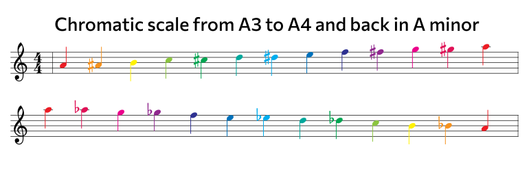

## Chromatic scale on the staff

## Note values and rests

## J.S.Bach Prelude

## String technique instructions

<youtube-embed video="ux3Z3yAK-UE" />

### Alexander Scriabin - Piano Concerto in F sharp minor, Op. 20

<youtube-embed video="F734PyD3NAw" />