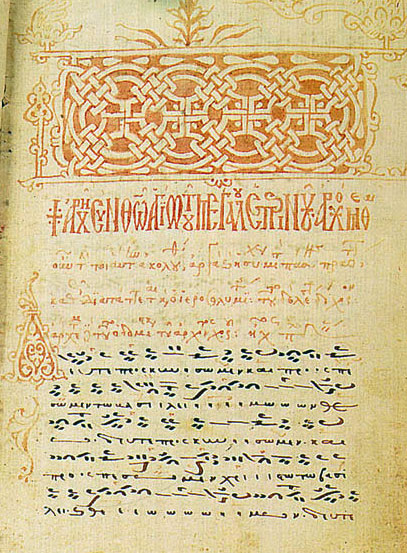
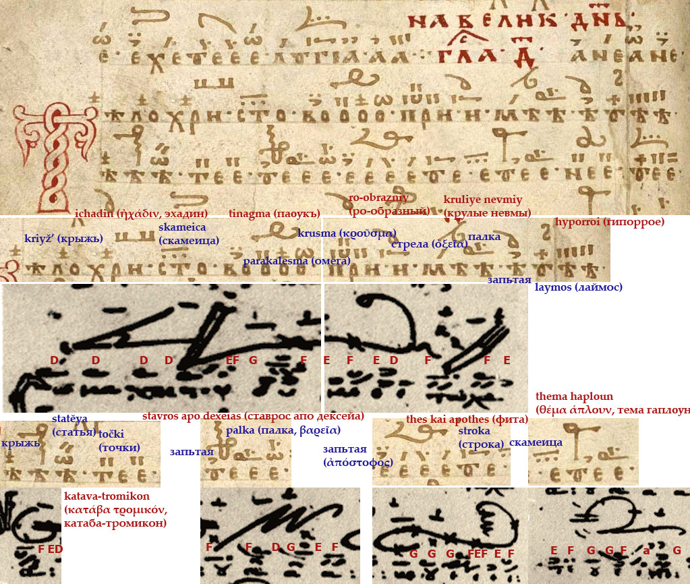
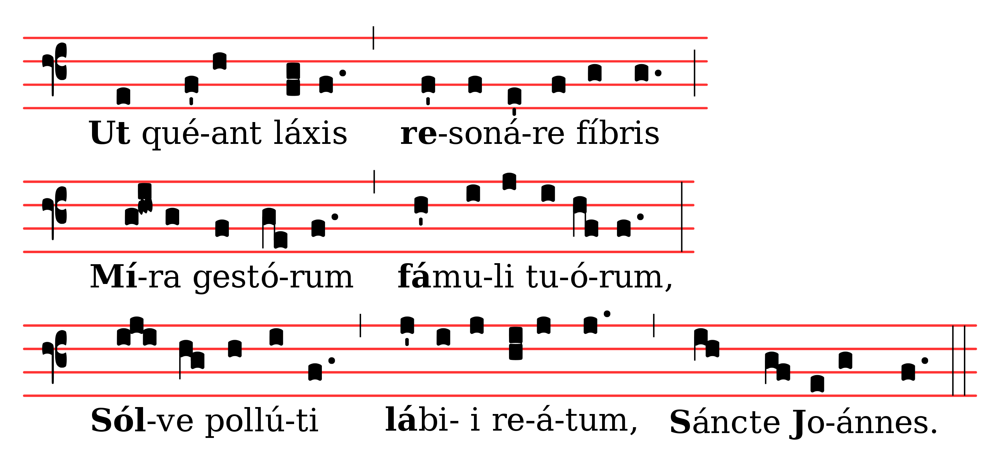
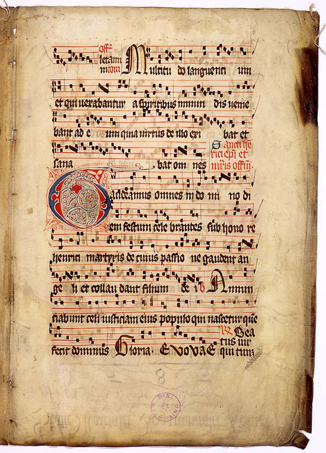
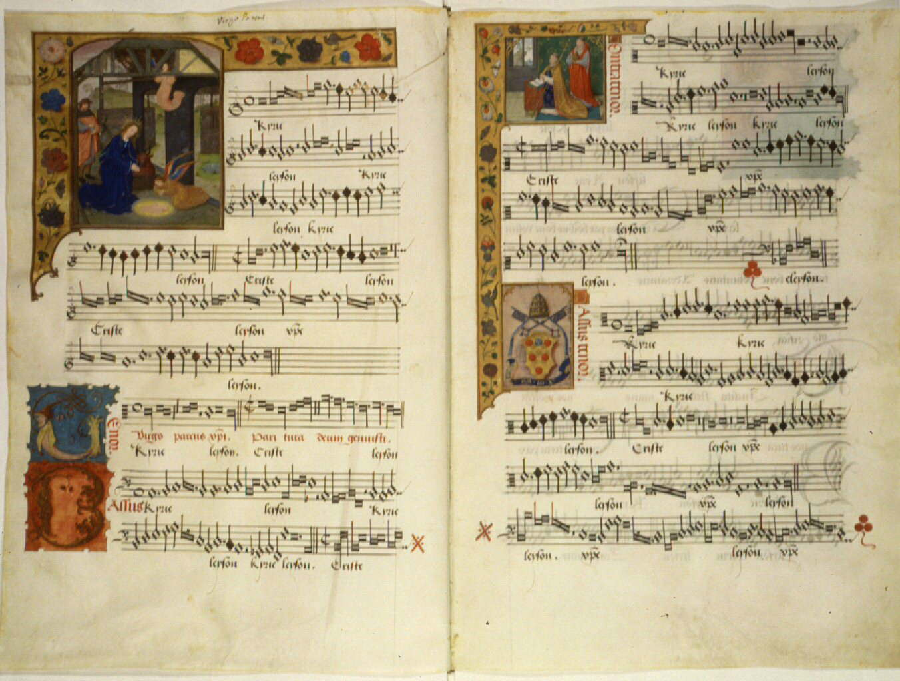
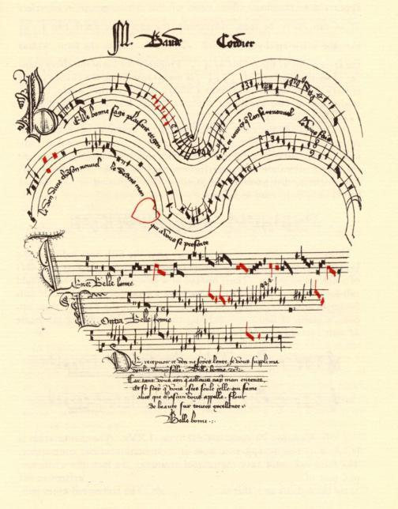
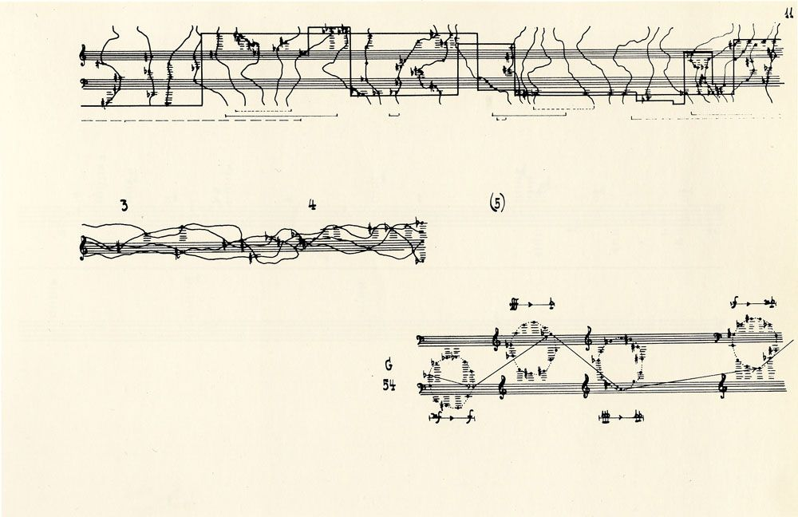

Early Western medieval notation was written with neumes, which did not specify exact pitches but only the shape of the melodies, i.e. indicating when the musical line went up or down; presumably these were intended as mnemonics for melodies which had been taught by rote.

During the 9th through 11th centuries a number of systems were developed to specify pitch more precisely, including diastematic neumes whose height on the page corresponded with their absolute pitch level (Longobardian and Beneventan manuscripts from Italy show this technique around AD 1000). Digraphic notation, using letter names similar to modern note names in conjunction with the neumes, made a brief appearance in a few manuscripts, but a number of manuscripts used one or more horizontal lines to indicate particular pitches. 

A musical manuscript of 1433 (Pantokratoros monastery, code 214)

## Russia

Znamenny Chant is a singing tradition used in the Russian Orthodox Church which uses a "hook and banner" notation. Znamenny Chant is unison, melismatic liturgical singing that has its own specific notation, called the stolp notation. The symbols used in the stolp notation are called kryuki (Russian: крюки, 'hooks') or znamena (Russian: знамёна, 'signs'). Often the names of the signs are used to refer to the stolp notation. Znamenny melodies are part of a system, consisting of Eight Modes (intonation structures; called glasy); the melodies are characterized by fluency and well-balancedness (Kholopov 2003, 192). There exist several types of Znamenny Chant: the so-called Stolpovoy, Malyj (Little) and Bolshoy (Great) Znamenny Chant. Ruthenian Chant (Prostopinije) is sometimes considered a sub-division of the Znamenny Chant tradition, with the Muscovite Chant (Znamenny Chant proper) being the second branch of the same musical continuum.

Znamenny Chants are not written with notes (the so-called linear notation), but with special signs, called Znamëna (Russian for "marks", "banners") or Kryuki ("hooks"), as some shapes of these signs resemble hooks. Each sign may include the following components: a large black hook or a black stroke, several smaller black 'points' and 'commas' and lines near the hook or crossing the hook. Some signs may mean only one note, some 2 to 4 notes, and some a whole melody of more than 10 notes with a complicated rhythmic structure. The stolp notation was developed in Kievan Rus' as an East Slavic refinement of the Byzantine neumatic musical notation.

The most notable feature of this notation system is that it records transitions of the melody, rather than notes. The signs also represent a mood and a gradation of how this part of melody is to be sung (tempo, strength, devotion, meekness, etc.) Every sign has its own name and also features as a spiritual symbol. For example, there is a specific sign, called "little dove" (Russian: голубчик (golubchik)), which represents two rising sounds, but which is also a symbol of the Holy Ghost. Gradually the system became more and more complicated. This system was also ambiguous, so that almost no one, except the most trained and educated singers, could sing an unknown melody at sight. The signs only helped to reproduce the melody, not coding it in an unambiguous way.

Easter koinonikon тҍло христово / σῶμα χριστοῦ ("The body of Christ") in echos plagios protos notated with kondakarian notation in 2 rows: great (red names) and small signs (blue names) 

----

In the early 11th century, Beneventan neumes (from the churches of Benevento in southern Italy) were written at varying distances from the text to indicate the overall shape of the melody; such neumes are called "heightened" or "diastematic" neumes, which showed the relative pitches between neumes. A few manuscripts from the same period use "digraphic" notation in which note names are included below the neumes. Shortly after this, one to four staff lines—an innovation traditionally ascribed to Guido d'Arezzo—clarified the exact relationship between pitches. One line was marked as representing a particular pitch, usually C or F. These neumes resembled the same thin, scripty style of the chironomic notation. By the 11th century, chironomic neumes had evolved into square notation; in Germany, a variant called Gothic neumes continued to be used until the 16th century. This variant is also known as Hufnagel notation, as the used neumes resemble the nails (hufnagels) one uses to attach horseshoes.

By the 13th century, the neumes of Gregorian chant were usually written in square notation on a staff with four lines and three spaces and a clef marker, as in the 14th–15th century Graduale Aboense shown here. In square notation, small groups of ascending notes on a syllable are shown as stacked squares, read from bottom to top, while descending notes are written with diamonds read from left to right. In melismatic chants, in which a syllable may be sung to a large number of notes, a series of smaller such groups of neumes are written in succession, read from left to right. A special symbol called the custos, placed at the end of a system, showed which pitch came next at the start of the following system. Special neumes such as the oriscus, quilisma, and liquescent neumes, indicate particular vocal treatments for these notes. This system of square notation is standard in modern chantbooks. 

<youtube-embed video="veJNu1fi8p4" />

>  Ut queant laxis     
>  Resonare fibris,     
>  Mira gestorum      
>   Famuli tuorum,     
>   Solve polluti     
>   Labii reatum,     
>   Sancte Johannes.    

## Mensural notation

Mensural notation is the musical notation system used for European vocal polyphonic music from the later part of the 13th century until about 1600. The term "mensural" refers to the ability of this system to describe precisely measured rhythmic durations in terms of numerical proportions between note values. Its modern name is inspired by the terminology of medieval theorists, who used terms like musica mensurata ("measured music") or cantus mensurabilis ("measurable song") to refer to the rhythmically defined polyphonic music of their age, as opposed to musica plana or musica choralis, i.e., Gregorian plainchant. 

Mensural notation grew out of an earlier, more limited method of notating rhythms in terms of fixed repetitive patterns, the so-called rhythmic modes, which were developed in France around 1200. An early form of mensural notation was first described and codified in the treatise Ars cantus mensurabilis ("The art of measured chant") by Franco of Cologne (c. 1280). A much expanded system allowing for greater rhythmic complexity was introduced in France with the stylistic movement of the Ars nova in the 14th century, while Italian 14th-century music developed its own, somewhat different variant. Around 1400, the French system was adopted across Europe, and became the standard form of notation of the Renaissance music of the 15th and 16th centuries. After around 1600, mensural notation gradually evolved into modern measure (or bar) notation. 

The decisive innovation of mensural notation was the systematic use of different note shapes to denote rhythmic durations that stood in well-defined, hierarchical numerical relations to each other. While less context dependent than notation in rhythmic modes, mensural notation differed from the modern system in that the values of notes were still somewhat context-dependent. 

## Aleatoric music

Aleatoric music (also aleatory music or chance music; from the Latin word alea, meaning "dice") is music in which some element of the composition is left to chance, and/or some primary element of a composed work's realization is left to the determination of its performer(s). The term is most often associated with procedures in which the chance element involves a relatively limited number of possibilities. 

Witold Roman Lutosławski (25 January 1913 – 7 February 1994) was a Polish composer and conductor. 

John Milton Cage Jr. (September 5, 1912 – August 12, 1992) was an American composer, music theorist, artist, and philosopher. A pioneer of indeterminacy in music, electroacoustic music, and non-standard use of musical instruments, Cage was one of the leading figures of the post-war avant-garde.

