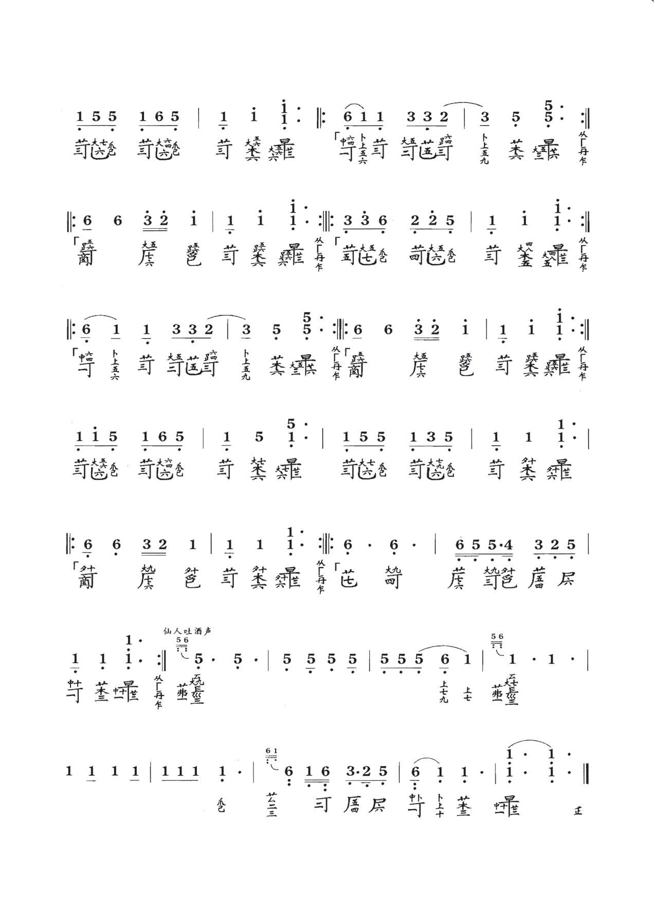
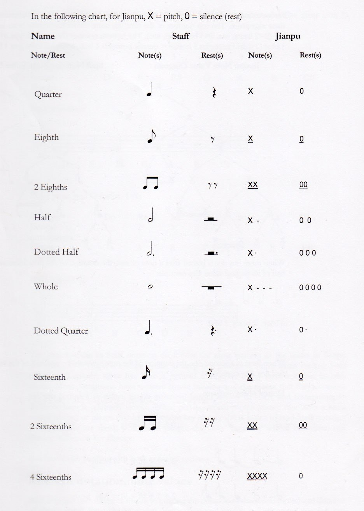

##	Ancient Greece 

Hymn to Applo in Delphi

## Korea

**Jeongganbo** musical notation system

## Japan

**Kunkunshi** (工工四  (Okinawan) pronounced [kuŋkunɕiː]) is the traditional notation system by which music is recorded in the Ryukyu Islands. The term kunkunshi originally referred to the first three notes of a widely known Chinese melody, although today it is used almost exclusively in reference to the sheet music.

<youtube-embed video="O7DR4kjWG_c" />

## China

Modern chinese numbered musical notation

<youtube-embed video="TyB1efr8nGY" />

