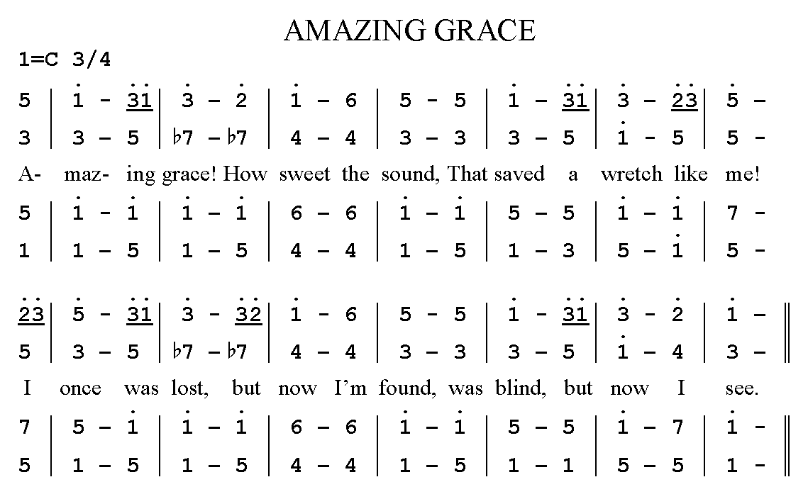

## Indian notation

### The seven varnas of a saptak.

The Samaveda text (1200 BC – 1000 BC) contains notated melodies, and these are probably the world's oldest surviving ones.

https://en.wikipedia.org/wiki/Vedic_accent

The musical notation is written usually immediately above, sometimes within, the line of Samaveda text, either in syllabic or a numerical form depending on the Samavedic Sakha (school). The Indian scholar and musical theorist Pingala (c. 200 BC), in his Chanda Sutra, used marks indicating long and short syllables.

## Saptak - सप्तक - 7 svaras - Octave

<table class="text-center">
<tr>
  <th>Solfege</th>
  <th>Syllable</th>

  <th>Name</th>
  <th>Meaning</th>
  <th>Variants</th>
  <th>Color</th>
  <th>Planet</th>
  <th>Chakra</th>
</tr>
<tr v-for="svara in $frontmatter.svaras" :key="svara.name">
  <td> {{svara.solfege}}</td>
  <td class="font-bold"> {{svara.mnem}}</td>
  <td> {{svara.name}}</td>
  <td> {{svara.trans}}</td>
  <td> {{svara.variants}}</td>
  <td :style="{backgroundColor: svara.color}"> {{svara.color}}</td>
  <td> {{svara.planet}}</td>
  <td> {{svara.chakra}}</td>
</tr>
</table>

https://en.wikipedia.org/wiki/Svara

http://sanskritdictionary.com/%E1%B9%A3a%E1%B8%8Dja/242242/1

##	Ancient Greece 

Hymn to Applo in Delphi

## China

### Gongche - 'mi re'

1. 上 - [sɑ̄ːŋ] - shàng - do
2. 尺 - [tsʰɛ́ː] - chě - re
3. 工 - [kʊ́ŋ] - gōng - mi
4. 凡 - [fɑ́ːn] - fán - fa
5. 六 - [líːu] - liù - sol
6. 五 - [wúː] - wǔ - la
7. 乙 - [jìː] - yǐ - si

### Jian pu - 'simplified notation' 

A similar invention was presented by Jean-Jacques Rousseau in his work presented to the French Academy of Sciences in 1742. Due to its straightforward correspondence to the standard notation, it is possible that many other claims of independent invention are also true. Grove's credits Emile J.M. Chevé.

Although the system is used to some extent in Germany, France, and the Netherlands, and more by the Mennonites in Russia, it has never become popular in the Western world. Number notation was used extensively in the 1920s and 30s by Columbia University, Teachers College music educator Satis Coleman, who felt it "proved to be very effective for speed with adults, and also as a means simple enough for young children to use in writing and reading tunes which they sing, and which they play on simple instruments."

The system is very popular among some Asian people, making conventions to encode and decode music more accessible than in the West, as more Chinese can sight read jianpu than standard notation. Most Chinese traditional music scores and popular song books are published in jianpu, and jianpu notation is often included in vocal music with staff notation. 

<youtube-embed video="TyB1efr8nGY" />

## Korea

**Jeongganbo** musical notation system

## Japan

**Kunkunshi** (工工四  (Okinawan) pronounced [kuŋkunɕiː]) is the traditional notation system by which music is recorded in the Ryukyu Islands. The term kunkunshi originally referred to the first three notes of a widely known Chinese melody, although today it is used almost exclusively in reference to the sheet music.

<youtube-embed video="O7DR4kjWG_c" />
