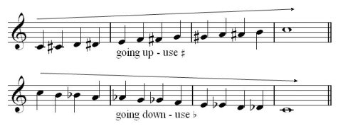
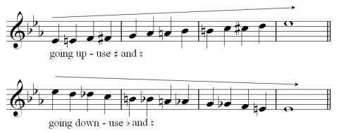
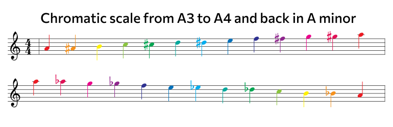
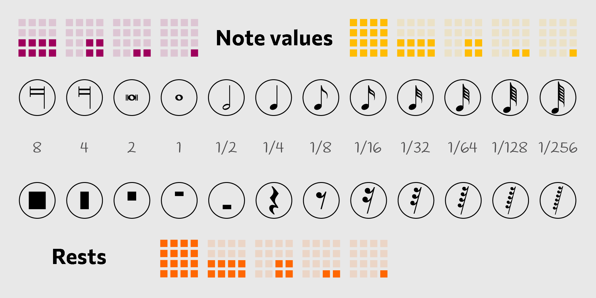

## Chromatic scale on the staff

## Note values and rests

## J.S.Bach Prelude

## String technique instructions

<youtube-embed video="ux3Z3yAK-UE" />

### Alexander Scriabin - Piano Concerto in F sharp minor, Op. 20

<youtube-embed video="F734PyD3NAw" />

## Sight-reading

Sight-singing is used to describe a singer who is sight-reading. Both activities require the musician to play or sing the notated rhythms and pitches. 

## Psychology

The ability to sight-read partly depends on a strong short-term musical memory. An experiment on sight reading using an eye tracker indicates that highly skilled musicians tend to look ahead further in the music, storing and processing the notes until they are played; this is referred to as the eye–hand span.

Storage of notational information in working memory can be expressed in terms of the amount of information (load) and the time for which it must be held before being played (latency). The relationship between load and latency changes according to tempo, such that t = x/y, where t is the change in tempo, x is the change in load, and y is the change in latency. Some teachers and researchers have proposed that the eye–hand span can be trained to be larger than it would otherwise be under normal conditions, leading to more robust sight-reading ability.

Human memory can be divided into three broad categories: long-term memory, sensory memory, and short-term (working) memory. According to the formal definition, working memory is "a system for temporarily storing and managing the information required to carry out complex cognitive tasks such as learning, reasoning, and comprehension". The paramount feature that distinguishes the working memory from both the long-term and sensory memory is this system's ability to simultaneously process and store information. The knowledge has what is called a "limited capacity", so there is only a certain amount of information that can be stored and it is easily accessible for only a small window of time after it has been processed, with a recall time block of roughly fifteen seconds to one minute.

Experiments dealing with memory span have been conducted by George Miller in 1956 that indicated, "Most common number of items that can be stored in the working memory is five plus or minus two.” However, if this information is not retained and stored (“consolidated”) in one's long-term memory, it will fade quickly.

Research indicates that the main area of the brain associated with the working memory is the prefrontal cortex. The prefrontal cortex is located in the frontal lobe of the brain. This area deals with cognition and contains two major neural loops or pathways that are central to processing tasks via the working memory: the visual loop, which is necessary for the visual component of the task, and the phonological loop, which deals with the linguistic aspects of the task (i.e. repeating the word or phrase). Although the hippocampus, in the temporal lobe, is the brain structure most frequently paired with memories, studies have indicated that its role is more vital for consolidation of the short-term memories into long-term ones than the ability to process, carry out, and briefly recall certain tasks.

This type of memory has specifically come into focus when discussing sight reading, since the process of looking at musical notes for the first time and deciphering them while playing an instrument can be considered a complex task of comprehension. The main conclusion in terms of this idea is that working memory, short-term memory capacity and mental speed are three important predictors for sight reading achievement. Although none of the studies discredits the correlation between the amount of time one spends practicing and musical ability, specifically sight-reading proficiency, more studies are pointing to the level at which one’s working memory functions as the key factor in sight-reading abilities. As stated in one such study, "Working memory capacity made a statistically significant contribution as well (about 7 percent, a medium-size effect). In other words, if you took two pianists with the same amount of practice, but different levels of working memory capacity, it's likely that the one higher in working memory capacity would have performed considerably better on the sight-reading task."

Based on the research and opinions of multiple musicians and scientists, the take home message about one's sight-reading ability and working memory capacity seems to be that “The best sight-readers combined strong working memories with tens of thousands of hours of practice.”

Sight-reading also depends on familiarity with the musical idiom being performed; this permits the reader to recognize and process frequently occurring patterns of notes as a single unit, rather than individual notes, thus achieving greater efficiency. This phenomenon, which also applies to the reading of language, is referred to as chunking. Errors in sight-reading tend to occur in places where the music contains unexpected or unusual sequences; these defeat the strategy of "reading by expectation" that sight-readers typically employ. 

## Professional use

Studio musicians (e.g., musicians employed to record pieces for commercials, etc.) often record pieces on the first take without having seen them before. Often, the music played on television is played by musicians who are sight-reading. This practice has developed through intense commercial competition in these industries.

Kevin McNerney, jazz musician, professor, and private instructor, describes auditions for University of North Texas Jazz Lab Bands as being almost completely based on sight-reading: "you walk into a room and see three or four music stands in front of you, each with a piece of music on it (in different styles ...). You are then asked to read each piece in succession."

This emphasis on sight-reading, according to McNerney, prepares musicians for studio work "playing backing tracks for pop performers or recording [commercials]". The expense of the studio, musicians, and techs makes sight-reading skills essential. Typically, a studio performance is "rehearsed" only once to check for copying errors before recording the final track. Many professional big bands also sight-read every live performance. They are known as "rehearsal bands", even though their performance is the rehearsal.

According to Frazier, score reading is an important skill for those interested in the conducting profession and "Conductors such as the late Robert Shaw and Yoel Levi have incredibly strong piano skills and can read at sight full orchestral scores at the piano" (a process which requires the pianist to make an instant piano reduction of the key parts of the score).

## Pedagogy

Although 86% of piano teachers polled rated sight-reading as the most important or a highly important skill, only 7% of them said they address it systematically. Reasons cited were a lack of knowledge of how to teach it, inadequacy of the training materials they use, and deficiency in their own sight-reading skills. Teachers also often emphasize rehearsed reading and repertoire building for successful recitals and auditions to the detriment of sight-reading and other functional skills.

Hardy reviewed research on piano sight-reading pedagogy and identified a number of specific skills essential to sight-reading proficiency:

- Technical fundamentals in reading and fingering
- Visualization of keyboard topography
- Tactile facility (psychomotor skills) and memory
- Ability to read, recognize, and remember groups of notes (directions, patterns, phrases, chords, rhythmic groupings, themes, inversions, intervals, etc.)
- Ability to read and remember ahead of playing with more and wider progressive fixations
- Aural imagery (ear-playing and sight-singing improves sight-reading)
- Ability to keep the basic pulse, read, and remember rhythm
- Awareness and knowledge of the music's structure and theory

Beauchamp identifies five building blocks in the development of piano sight-reading skills:

- Grand-staff knowledge
- Security within the five finger positions
- Security with keyboard topography
- Security with basic accompaniment patterns
- Understanding of basic fingering principles

Grand-staff knowledge consists of fluency in both clefs such that reading a note evokes an automatic and immediate physical response to the appropriate position on the keyboard. Beauchamp asserts it is better to sense and know where the note is than what the note is. The performer does not have time to think of the note name and translate it to a position, and the non-scientific note name does not indicate the octave to be played. Beauchamp reports success using a Key/Note Visualizer, note-reading flashcards, and computer programs in group and individual practice to develop grand-staff fluency.

Udtaisuk also reports that a sense of keyboard geography and an ability to quickly and efficiently match notes to keyboard keys is important for sight-reading. He found that "computer programs and flash cards are effective ways to teach students to identify notes [and] enhance a sense of keyboard geography by highlighting the relationships between the keyboard and the printed notation".

Most students do not sight-read well because it requires specific instruction, which is seldom given. A major challenge in sight-reading instruction, according to Hardy, is obtaining enough practice material. Since practicing rehearsed reading does not help improve sight-reading, a student can only use a practice piece once. Moreover, the material must be at just the right level of difficulty for each student, and a variety of styles is preferred. Hardy suggests music teachers cooperate to build a large lending library of music and purchase inexpensive music from garage sales and store sales. 

https://en.wikipedia.org/wiki/Sight-reading