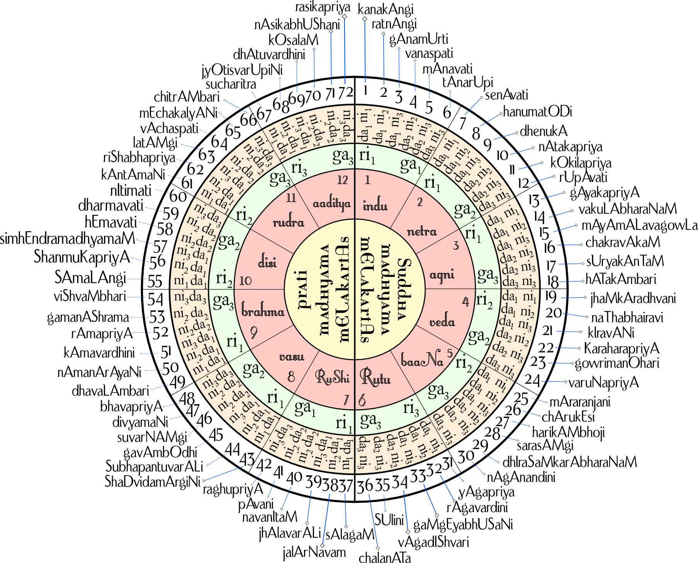

## Raga

A raga or raag (IAST: rāga; also raaga or ragam; literally "coloring, tingeing, dyeing") is a melodic framework for improvisation akin to a melodic mode in Indian classical music. The rāga is a unique and central feature of the classical Indian music tradition, and as a result has no direct translation to concepts in classical European music. Each rāga is an array of melodic structures with musical motifs, considered in the Indian tradition to have the ability to "colour the mind" and affect the emotions of the audience.

Each rāga provides the musician with a musical framework within which to improvise. Improvisation by the musician involves creating sequences of notes allowed by the rāga in keeping with rules specific to the rāga. Rāgas range from small rāgas like Bahar and Shahana that are not much more than songs to big rāgas like Malkauns, Darbari and Yaman, which have great scope for improvisation and for which performances can last over an hour. Rāgas may change over time, with an example being Marwa, the primary development of which has been going down into the lower octave, in contrast with the traditional middle octave. Each rāga traditionally has an emotional significance and symbolic associations such as with season, time and mood. The rāga is considered a means in the Indian musical tradition to evoking specific feelings in an audience. Hundreds of rāga are recognized in the classical tradition, of which about 30 are common, and each rāga has its "own unique melodic personality".

Every raga has a swara (a note or named pitch) called shadja, or adhara sadja, whose pitch may be chosen arbitrarily by the performer. This is taken to mark the beginning and end of the saptak (loosely, octave). The raga also contains an adhista, which is either the swara Ma or the swara Pa. The adhista divides the octave into two parts or anga - the purvanga, which contains lower notes, and the uttaranga, which contains higher notes. Every raga has a vadi and a samvadi. The vadi is the most prominent swara, which means that an improvising musician emphasizes or pays more attention to the vadi than to other notes. The samvadi is consonant with the vadi (always from the anga that does not contain the vadi) and is the second most prominent swara in the raga.

According to Monier Monier-Williams, the term comes from a Sanskrit word for "the act of colouring or dyeing", or simply a "colour, hue, tint, dye". The term also connotes an emotional state referring to a "feeling, affection, desire, interest, joy or delight", particularly related to passion, love, or sympathy for a subject or something. In the context of ancient Indian music, the term refers to a harmonious note, melody, formula, building block of music available to a musician to construct a state of experience in the audience.

The word appears in the ancient Principal Upanishads of Hinduism, as well as the Bhagavad Gita.[ For example, verse 3.5 of the Maitri Upanishad and verse 2.2.9 of the Mundaka Upanishad contain the word rāga. The Mundaka Upanishad uses it in its discussion of soul (Atman-Brahman) and matter (Prakriti), with the sense that the soul does not "color, dye, stain, tint" the matter. The Maitri Upanishad uses the term in the sense of "passion, inner quality, psychological state". The term rāga is also found in ancient texts of Buddhism where it connotes "passion, sensuality, lust, desire" for pleasurable experiences as one of three impurities of a character. Alternatively, rāga is used in Buddhist texts in the sense of "color, dye, hue".

 In 1933, states José Luiz Martinez – a professor of music, Stern refined this explanation to "the rāga is more fixed than mode, less fixed than the melody, beyond the mode and short of melody, and richer both than a given mode or a given melody; it is mode with added multiple specialities".

 According to Walter Kaufmann, though a remarkable and prominent feature of Indian music, a definition of rāga cannot be offered in one or two sentences. rāga is a fusion of technical and ideational ideas found in music, and may be roughly described as a musical entity that includes note intonation, relative duration and order, in a manner similar to how words flexibly form phrases to create an atmosphere of expression. In some cases, certain rules are considered obligatory, in others optional. The rāga allows flexibility, where the artist may rely on simple expression, or may add ornamentations yet express the same essential message but evoke a different intensity of mood.

 A rāga has a given set of notes, on a scale, ordered in melodies with musical motifs.[7] A musician playing a rāga, states Bruno Nettl, may traditionally use just these notes, but is free to emphasize or improvise certain degrees of the scale.[7] The Indian tradition suggests a certain sequencing of how the musician moves from note to note for each rāga, in order for the performance to create a rasa (mood, atmosphere, essence, inner feeling) that is unique to each rāga. A rāga can be written on a scale. Theoretically, thousands of rāga are possible given 5 or more notes, but in practical use, the classical tradition has refined and typically relies on several hundred.[7] For most artists, their basic perfected repertoire has some forty to fifty rāgas.[60] Rāga in Indian classic music is intimately related to tala or guidance about "division of time", with each unit called a matra (beat, and duration between beats).
