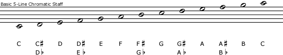
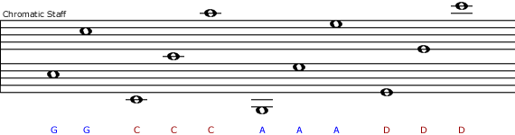

> “The need for a new notation, or a radical improvement of the old, is greater than it seems, and the number of ingenious minds that have tackled the problem is greater than one might think.” — Arnold Schoenberg

Here is a chromatic scale on a traditional diatonic staff (above) and the same chromatic scale on a chromatic staff with five lines (below). This is just one of many versions of chromatic staff.

On a chromatic staff each note has its own line or space on the staff. On the traditional staff only seven notes have their own line or space, the notes from just one key (C major/A minor, the white keys on the piano). The remaining notes (the black keys) have to be represented by altering these seven notes with sharp signs (#) or flat signs (b), either in the key signature or as an accidental.

All of these features of traditional music notation combine to make reading music much more difficult than it might be with a better notation system. For an analogy, imagine trying to do arithmetic with Roman numerals. It can be done, but the notation system makes a big difference. Of course it is important to view traditional notation in its broader historical context and to keep in mind the innovations and reforms that it has undergone over time.

[Music notation project](http://musicnotation.org/)
