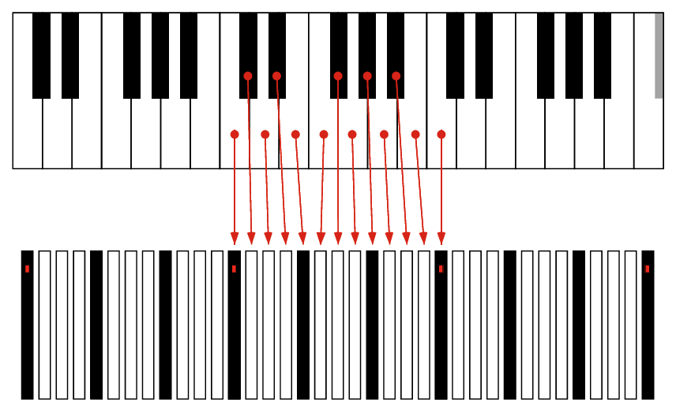
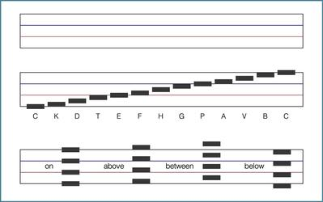
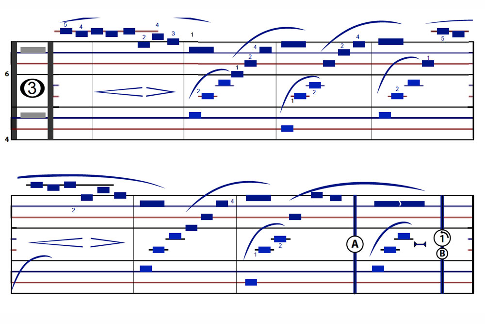
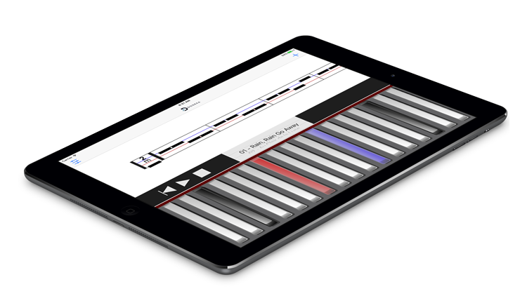

The Dodeka Keyboard Design is an isomorphic keyboard invented and designed by Jacques-Daniel Rochat. It is similar to a piano keyboard but with only a single row of keys containing each chromatic note.The keys corresponding to C, E and A flat are highlighted to provide visual landmarks. The creators aimed to create a rational and chromatic approach to music and performance. As an isomorphic keyboard, any musical sequence or interval has the same shape in each of the 12 keys.

The Dodeka Music Notation is an alternative music notation or musical notation system invented and designed in 1980s by inventor and musician Jacques-Daniel Rochat in an attempt to improve upon traditional music notation.

Unlike conventional musical notation, the Dodeka music notation system uses a chromatic scale of 12 pitches and follows an equal pitch intervals configuration, with 4 lines per octave. In this configuration, the 12 notes of an octave appear in four positions vis-à-vis the staff lines, that is, either on, between, above and below the lines.

Each pitch has its own unique place on the staff. And while conventional music notation may alter notes using accidental signs or key signatures, notes in the Dodeka notation appear as they are. There are no more key signatures or accidental signs in this musical system.

> 
> (Excerpt of Beethoven Für Elise written in Dodeka Notation)

The Dodeka notation system represents note duration in a visual manner. Note lengths are represented through the notes graphical shapes, similar to what can be found in sequencer programmes. The reference time unit or time value being the quarter note (or crotchet), all durations are expressed as visual ratios from this reference point. For example, a whole note is the representation of four quarter note lengths. At the opposite, an eighth note (or quaver) is twice as short as a quarter note. All the other symbols and articulation marks are also [reimagined in Dodeka](https://www.dodekamusic.com/learn/alternative-music-notation/dodeka-musical-symbols-list-meaning/).

### Dodeka note names

The objective was to create 2-letter names that convey a relationship between the names of the notes and their position on the staff. We did that using letters that are not present in the English (anglo-saxon) designation. For example, the note Do# (C#) is called Ka (K) because it shares the same position as La (A) (ie. both notes are above a line).

Following this logic, the 12 notes can be written as:
Do / Ka / Ré / To(l) / Mi / Fa / Hu / So(l) / Pi / La / Vé / Si.

In English, we only use the first letters, which gives us the following sequence:
C / K / D / T / E / F / H / G / P / A / V / B.

[Dodeka music](https://www.dodekamusic.com)

