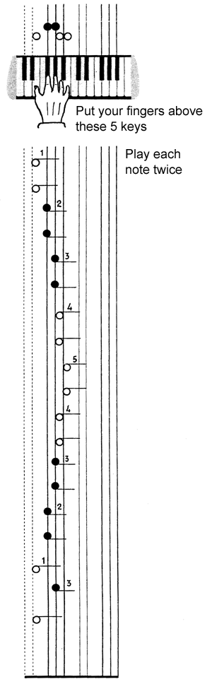
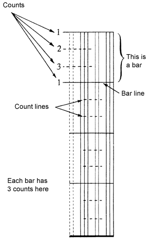
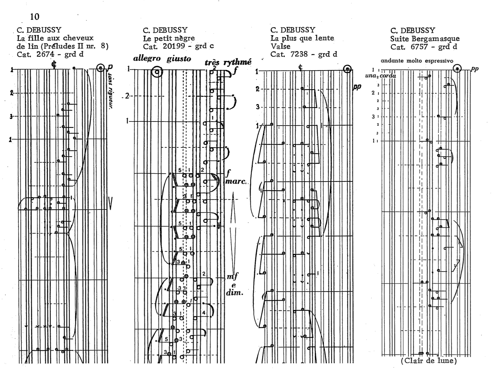

Klavarskribo (sometimes shortened to klavar) is a music notation system that was introduced in 1931 by the Dutchman Cornelis Pot (1885–1977). The name means "keyboard writing" in Esperanto. It differs from conventional music notation in a number of ways and is intended to be easily readable.

The stave on which the notes are written is vertical so the music is read from top to bottom. Each note has its own individual position, low notes on the left and high notes on the right as on the piano. This stave consists of groups of two and three vertical lines corresponding to the black keys (notes) of the piano. White notes are written in the seven white spaces between the lines. Therefore sharps and flats are no longer needed, as each note has its own place in the octave. The evident correspondence between the stave and a piano induced Pot to use the name Klavarskribo.

All notes are provided with stems—stems to the right: play with the right hand, stems to the left: left hand.

<youtube-embed video="efTv05nWNhk" />

<youtube-embed video="5mTRUF6q5-I" />

