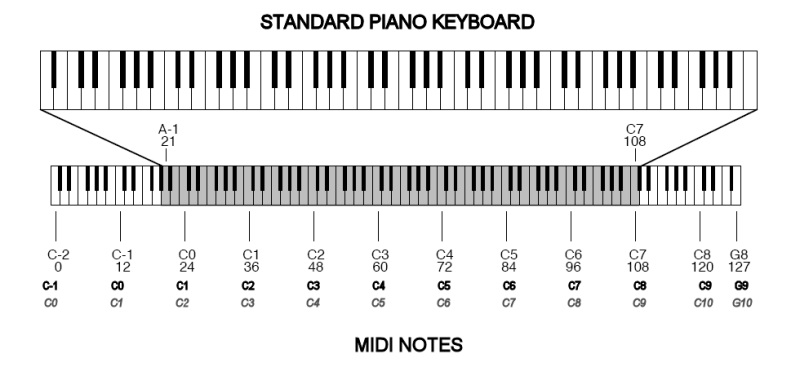
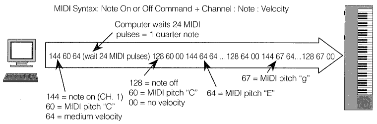
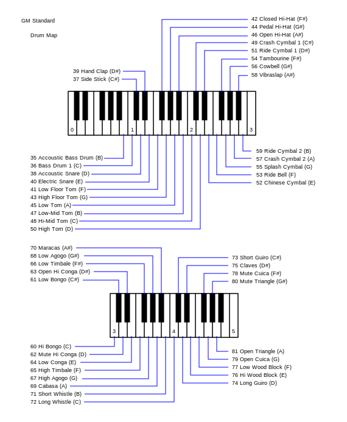

At the 1983 Winter NAMM Show, Smith demonstrated a MIDI connection between Prophet 600 and Roland JP-6 synthesizers. The MIDI specification was published in August 1983. The MIDI standard was unveiled by Kakehashi and Smith, who received Technical Grammy Awards in 2013 for their work. In 1982, the first instruments were released with MIDI, the Roland Jupiter-6 and the Prophet 600. In 1983, the first MIDI drum machine, the Roland TR-909, and the first MIDI sequencer, the Roland MSQ-700 were released. The first computer to support MIDI, the NEC PC-88 and PC-98, was released in 1982.

A MIDI message is an instruction that controls some aspect of the receiving device. A MIDI message consists of a status byte, which indicates the type of the message, followed by up to two data bytes that contain the parameters. MIDI messages can be channel messages sent on only one of the 16 channels and monitored only by devices on that channel, or system messages that all devices receive. Each receiving device ignores data not relevant to its function.There are five types of message: Channel Voice, Channel Mode, System Common, System Real-Time, and System Exclusive.

Channel Voice messages transmit real-time performance data over a single channel. Examples include "note-on" messages which contain a MIDI note number that specifies the note's pitch, a velocity value that indicates how forcefully the note was played, and the channel number; "note-off" messages that end a note; program change messages that change a device's patch; and control changes that allow adjustment of an instrument's parameters. MIDI notes are numbered from 0 to 127 assigned to C−1 to G9. This corresponds to a range of 8.175799 to 12543.85 Hz (assuming equal temperament and 440 Hz A4) and extends beyond the 88 note piano range from A0 to C8. Middle C has the number 60. A4 (A440) – 69.

