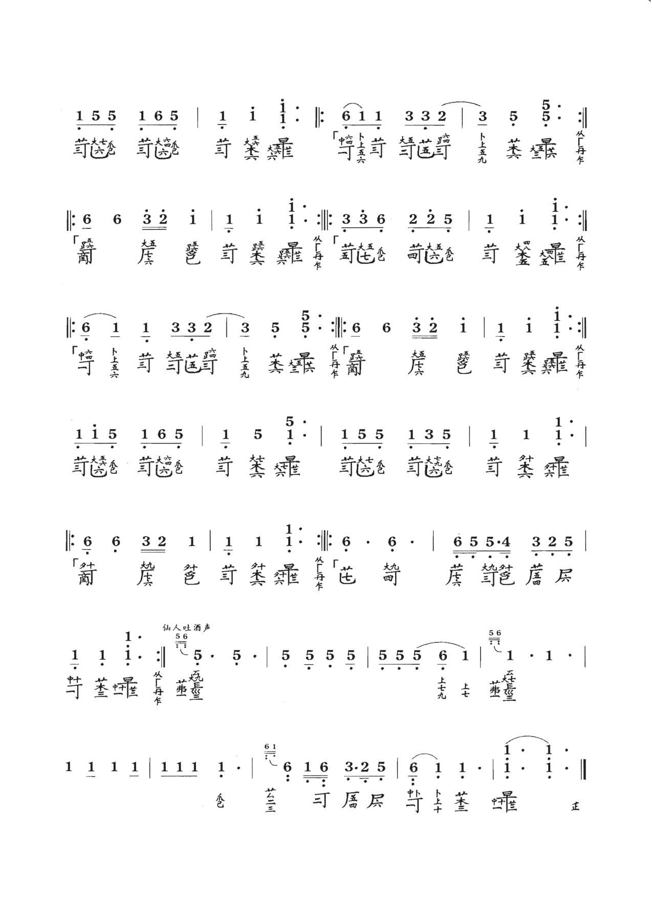
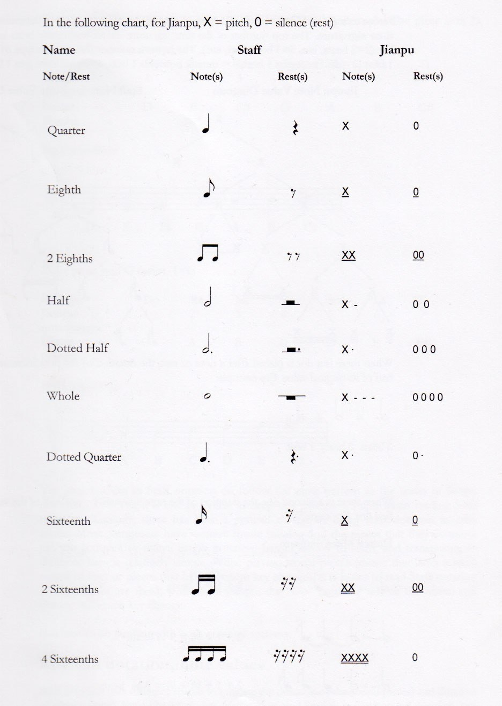
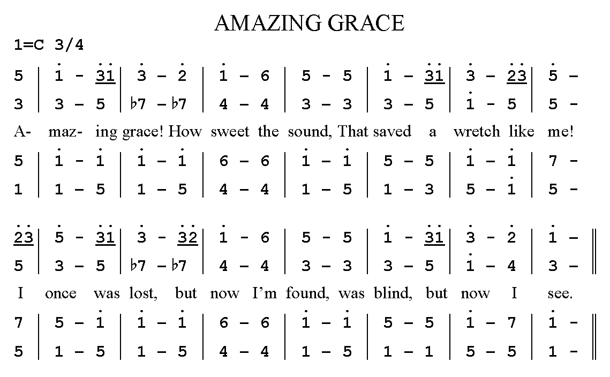

### Jian pu - 'simplified notation'

A similar invention was presented by Jean-Jacques Rousseau in his work presented to the French Academy of Sciences in 1742. Due to its straightforward correspondence to the standard notation, it is possible that many other claims of independent invention are also true. Grove's credits Emile J.M. Chevé.

Although the system is used to some extent in Germany, France, and the Netherlands, and more by the Mennonites in Russia, it has never become popular in the Western world. Number notation was used extensively in the 1920s and 30s by Columbia University, Teachers College music educator Satis Coleman, who felt it "proved to be very effective for speed with adults, and also as a means simple enough for young children to use in writing and reading tunes which they sing, and which they play on simple instruments."

The system is very popular among some Asian people, making conventions to encode and decode music more accessible than in the West, as more Chinese can sight read jianpu than standard notation. Most Chinese traditional music scores and popular song books are published in jianpu, and jianpu notation is often included in vocal music with staff notation.

<youtube-embed video="TyB1efr8nGY" />

