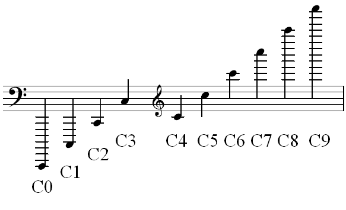
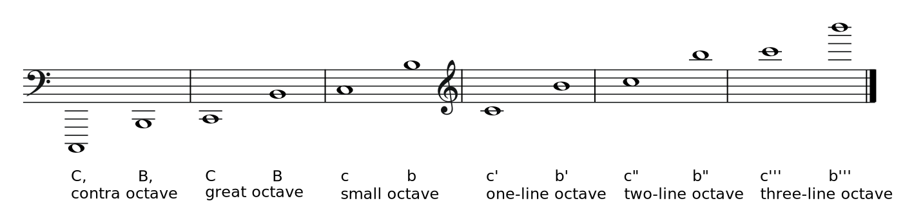

Scientific pitch notation (SPN), also known as American standard pitch notation (ASPN) and international pitch notation (IPN),[1] is a method of specifying musical pitch by combining a musical note name (with accidental if needed) and a number identifying the pitch's octave.

Although scientific pitch notation was originally designed as a companion to scientific pitch (see below), the two are not synonymous. Scientific pitch is a pitch standard—a system that defines the specific frequencies of particular pitches (see below). Scientific pitch notation concerns only how pitch names are notated, that is, how they are designated in printed and written text, and does not inherently specify actual frequencies. Thus, the use of scientific pitch notation to distinguish octaves does not depend on the pitch standard used.

The notation makes use of the traditional tone names (A to G) which are followed by numbers showing which octave they are part of.

For standard A440 pitch equal temperament, the system begins at a frequency of 16.35160 Hz, which is assigned the value C0.

The octave 0 of the scientific pitch notation is traditionally called the sub-contra octave, and the tone marked C0 in SPN is written as ,,C or C,, or CCC in traditional systems, such as Helmholtz notation. Octave 0 of SPN marks the low end of what humans can actually perceive, with the average person being able to hear frequencies no lower than 20 Hz as pitches.

### Use

Scientific pitch notation is often used to specify the range of an instrument. It provides an unambiguous means of identifying a note in terms of textual notation rather than frequency, while at the same time avoiding the transposition conventions that are used in writing the music for instruments such as the clarinet and guitar. It is also easily translated into staff notation, as needed. In describing musical pitches, nominally enharmonic spellings can give rise to anomalies where, for example in meantone temperaments C♭
4 is a lower frequency than B3; but such paradoxes usually do not arise in a scientific context.

Scientific pitch notation avoids possible confusion between various derivatives of Helmholtz notation which use similar symbols to refer to different notes. For example, "c" in Helmholtz's original notation refers to the C below middle C, whereas "C" in ABC Notation refers to middle C itself. With scientific pitch notation, middle C is always C4, and C4 is never any note but middle C. This notation system also avoids the "fussiness" of having to visually distinguish between four and five primes, as well as the typographic issues involved in producing acceptable subscripts or substitutes for them. C7 is much easier to quickly distinguish visually from C8, than is, for example, c′′′′ from c′′′′′, and the use of simple integers (e.g. C7 and C8) makes subscripts unnecessary altogether.

Although pitch notation is intended to describe sounds audibly perceptible as pitches, it can also be used to specify the frequency of non-pitch phenomena. Notes below E0 or higher than E♭
10 are outside most humans' hearing range, although notes slightly outside the hearing range on the low end may still be indirectly perceptible as pitches due to their overtones falling within the hearing range.

## Helmholtz pitch notation

Helmholtz pitch notation is a system for naming musical notes of the Western chromatic scale. Fully described and normalized by the German scientist Hermann von Helmholtz, it uses a combination of upper and lower case letters (A to G), and the sub- and super-prime symbols ( ͵  ′  or ⸜ ⸝) to denote each individual note of the scale. It is one of two formal systems for naming notes in a particular octave, the other being scientific pitch notation.

### Use

The accenting of the scale in Helmholtz notation always starts on the note C and ends at B (e.g. C D E F G A B). The note C is shown in different octaves by using upper-case letters for low notes, and lower-case letters for high notes, and adding sub-primes and primes in the following sequence: C͵͵ C͵ C c c′ c″ c‴ (or ,,C ,C C c c′ c″ c‴ or C⸜⸜ C⸜ C c c⸝ c⸝⸝ c⸝⸝⸝) and so on.

Middle C is designated c′, therefore the octave from middle C upwards is c′–b′.

Whole octaves may also be given a name based on "English strokes notation". For example, the octave from c′–b′ is called the one-line octave or (less common) once-accented octave. Correspondingly, the notes in the octave may be called one-lined C (for c′), etc.

This diagram gives examples of the lowest and highest note in each octave, giving their name in the Helmholtz system, and the "German method" of octave nomenclature. (The octave below the contra octave is known as the sub-contra octave).

