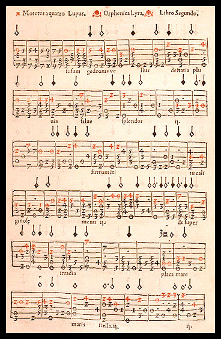
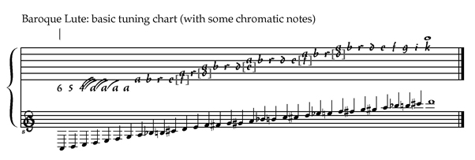
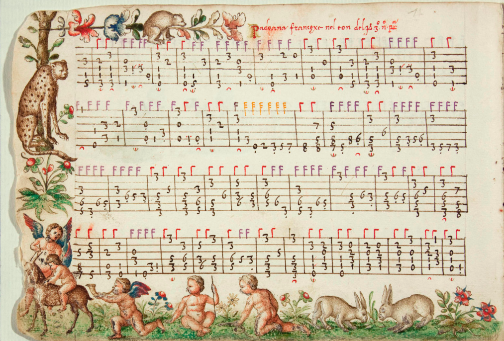
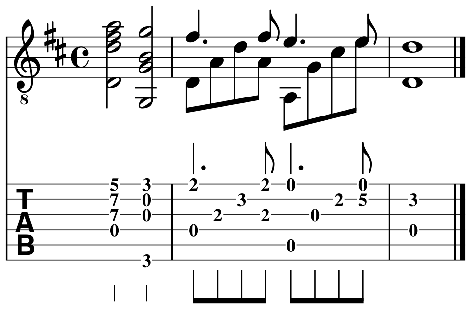
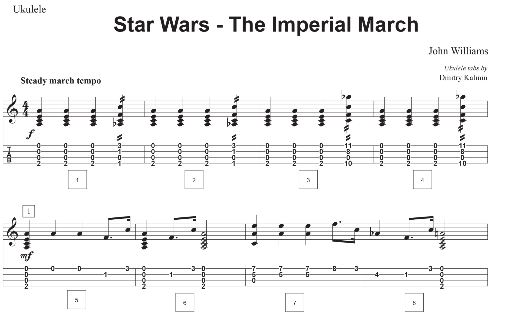

Tablature (or tabulature, or tab for short) is a form of musical notation indicating instrument fingering rather than musical pitches. The word tablature originates from the Latin word tabulatura. Tabula is a table or slate, in Latin. To tabulate something means to put it into a table or chart.

Tablature is common for fretted stringed instruments such as the lute, vihuela, or guitar, as well as many free reed aerophones such as the harmonica. Tablature was common during the Renaissance and Baroque eras, and is commonly used today in notating many forms of music. Three types of organ tablature were used in Europe: German, Spanish and Italian.

> 
> Example of numeric vihuela tablature from the book "Orphenica Lyra" by Miguel de Fuenllana (1554). Red numerals (original) mark the vocal part.

While standard notation represents the rhythm and duration of each note and its pitch relative to the scale based on a twelve tone division of the octave, tablature is instead operationally based, indicating where and when a finger should be placed to generate a note, so pitch is denoted implicitly rather than explicitly.



Tablature for plucked strings is based upon a diagrammatic representation of the strings and frets of the instrument, keyboard tablature represents the keys of the instrument, and woodwind tablature shows whether each of the fingerholes is to be closed or left open.







### Drum tabs

Instead of the durational notes normally seen on a piece of sheet music, drum tab uses proportional horizontal placement to indicate rhythm and vertical placement on a series of lines to represent which drum from the drum kit to stroke. Drum tabs frequently depict drum patterns.

```
HH|x-x-x-x-x-x-x-x-||
 S|----o-------o---||
 B|o-------o-------||
   1 + 2 + 3 + 4 +
```

### Keyboard tabulature

The modern keyboard tabs are built using any monospaced font. THey show each octave of the piano on a separate lane (with "R" and "L" for the hand). Letters show the note played. ">" symbols show note durations in the fixed time periods, divided by "|" symbols. The actual chords are placed above the tabs.

```
Penny Lane - The Beatles
Tabbed By: Ebon-Ivor

             C          Am7          Dm7        Gsus7
   +  1  +   1  +  2  +  3  +  4  +   1  +  2  +  3  +  4  +
R5|---c-d-e-|e>>d>>c---c>>>>---------|------------------c-d-e>|
R4|g>>------|--------b------b>>a>>---|a-----------------a>>>>>|
R4|---------|g>>>>>g>>>>>g>>>>>---g>>|--g-f>>>>>>>>>>g>>f>>>>>|
R4|---------|e>>>>>e>>>>>e>>>>>e>>>>>|------------------------|
R4|---------|------------------c>>>>>|c>>>>>c>>>>>c>>>>>------|
R3|---------|------------------------|a>>>>>a>>>>>a>>>>>------|
L3|---------|c>>>>>------------------|------------------------|
L2|---------|------b>>>>>a>>>>>g>>>>>|f>>>>>d>>>>>g>>>>>g>>>>>|

   C          Am7          Cm7                     Am7b5

```

[tabnabber.com](https://tabnabber.com/view_Tab.asp?tabID=11885&sArtist=Beatles%2C%20The&sName=Penny%20Lane)
