## Medieval neumes c. 500–1400

<client-only>
	<audio class="mx-auto my-4" controls>
		<source src="/audio/Dies.Irae.mp3" type="audio/mpeg">
	</audio>
</client-only>

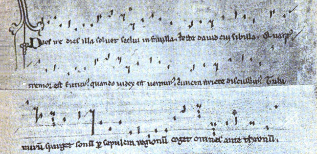
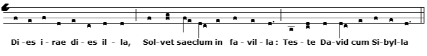

Early Western medieval notation was written with neumes, which did not specify exact pitches but only the shape of the melodies, i.e. indicating when the musical line went up or down; presumably these were intended as mnemonics for melodies which had been taught by rote.

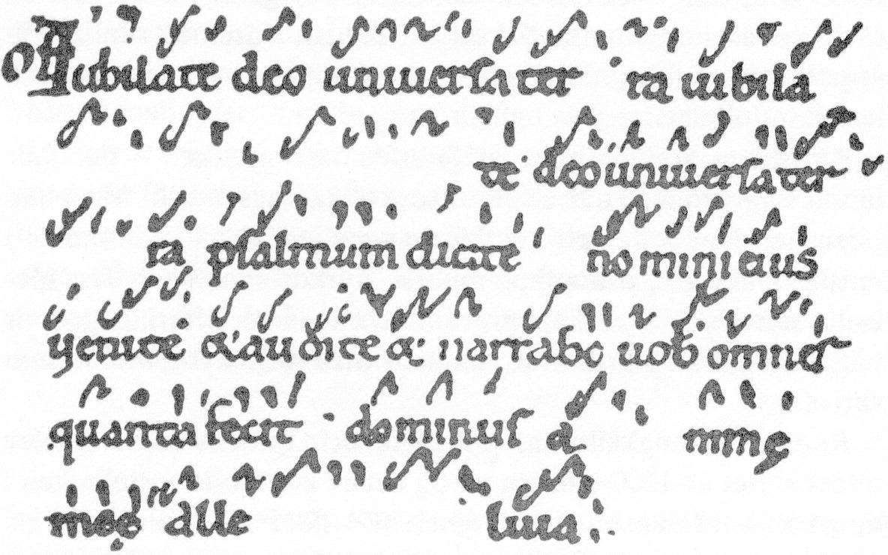

During the 9th through 11th centuries a number of systems were developed to specify pitch more precisely, including diastematic neumes whose height on the page corresponded with their absolute pitch level (Longobardian and Beneventan manuscripts from Italy show this technique around AD 1000). Digraphic notation, using letter names similar to modern note names in conjunction with the neumes, made a brief appearance in a few manuscripts, but a number of manuscripts used one or more horizontal lines to indicate particular pitches.

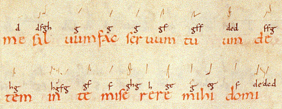

### Diastemic neumes

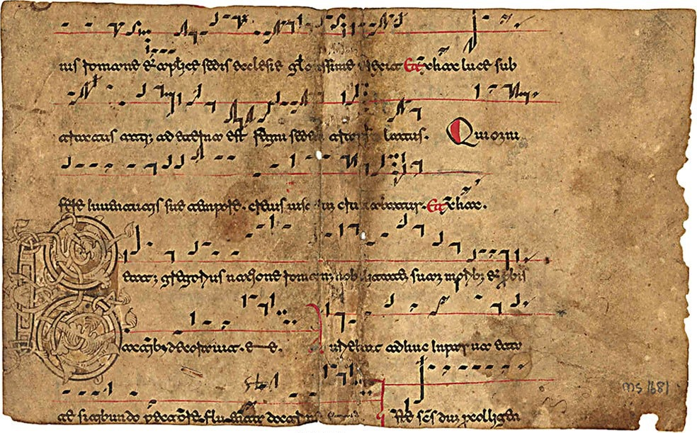

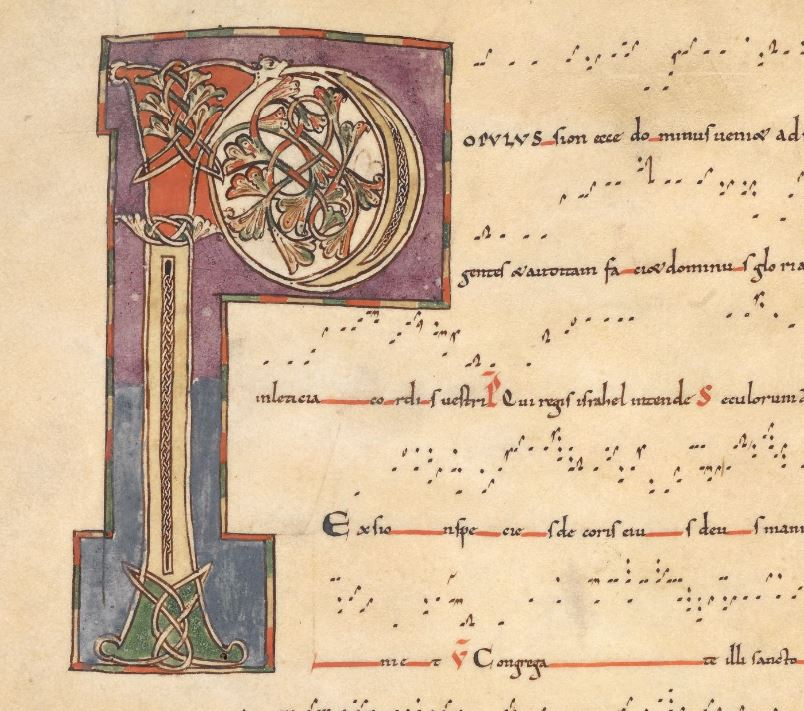

In the early 11th century, Beneventan neumes (from the churches of Benevento in southern Italy) were written at varying distances from the text to indicate the overall shape of the melody; such neumes are called "heightened" or "diastematic" neumes, which showed the relative pitches between neumes. A few manuscripts from the same period use "digraphic" notation in which note names are included below the neumes. Shortly after this, one to four staff lines—an innovation traditionally ascribed to Guido d'Arezzo—clarified the exact relationship between pitches. One line was marked as representing a particular pitch, usually C or F. These neumes resembled the same thin, scripty style of the chironomic notation. By the 11th century, chironomic neumes had evolved into square notation; in Germany, a variant called Gothic neumes continued to be used until the 16th century. This variant is also known as Hufnagel notation, as the used neumes resemble the nails (hufnagels) one uses to attach horseshoes.

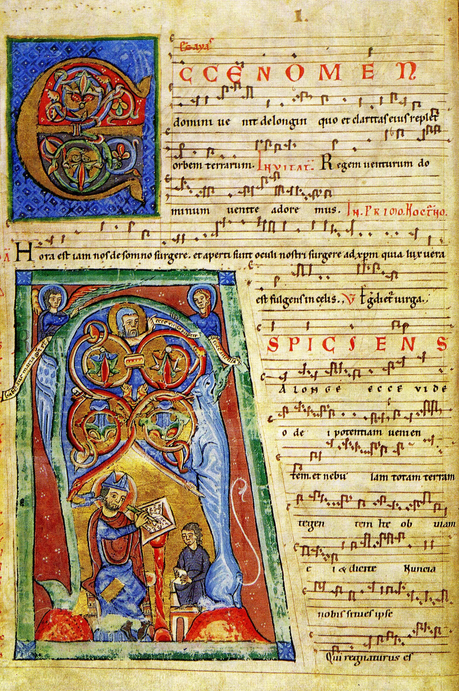

## Russian neumes

Znamenny Chant is a singing tradition used in the Russian Orthodox Church which uses a "hook and banner" notation. Znamenny Chant is unison, melismatic liturgical singing that has its own specific notation, called the stolp notation. The symbols used in the stolp notation are called kryuki (Russian: крюки, 'hooks') or znamena (Russian: знамёна, 'signs'). Often the names of the signs are used to refer to the stolp notation. Znamenny melodies are part of a system, consisting of Eight Modes (intonation structures; called glasy); the melodies are characterized by fluency and well-balancedness (Kholopov 2003, 192). There exist several types of Znamenny Chant: the so-called Stolpovoy, Malyj (Little) and Bolshoy (Great) Znamenny Chant. Ruthenian Chant (Prostopinije) is sometimes considered a sub-division of the Znamenny Chant tradition, with the Muscovite Chant (Znamenny Chant proper) being the second branch of the same musical continuum.

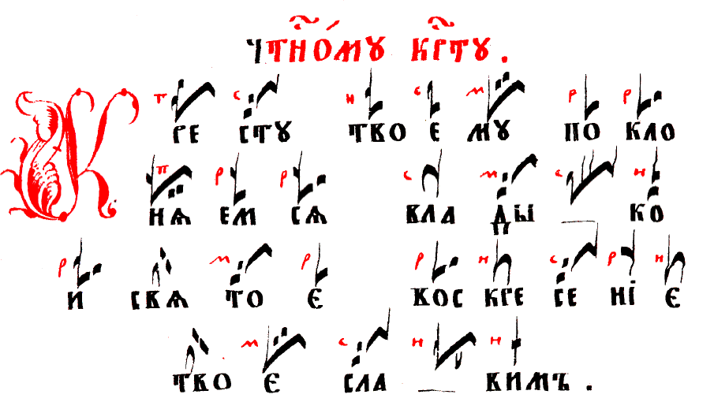

Znamenny Chants are not written with notes (the so-called linear notation), but with special signs, called Znamëna (Russian for "marks", "banners") or Kryuki ("hooks"), as some shapes of these signs resemble hooks. Each sign may include the following components: a large black hook or a black stroke, several smaller black 'points' and 'commas' and lines near the hook or crossing the hook. Some signs may mean only one note, some 2 to 4 notes, and some a whole melody of more than 10 notes with a complicated rhythmic structure. The stolp notation was developed in Kievan Rus' as an East Slavic refinement of the Byzantine neumatic musical notation.

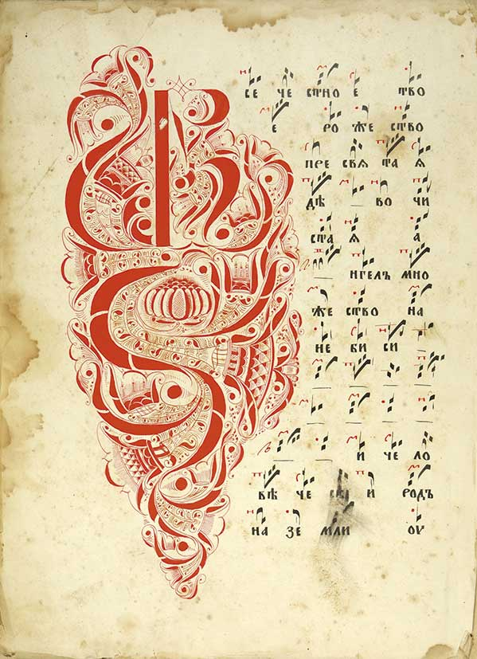

The most notable feature of this notation system is that it records transitions of the melody, rather than notes. The signs also represent a mood and a gradation of how this part of melody is to be sung (tempo, strength, devotion, meekness, etc.) Every sign has its own name and also features as a spiritual symbol. For example, there is a specific sign, called "little dove" (Russian: голубчик (golubchik)), which represents two rising sounds, but which is also a symbol of the Holy Ghost. Gradually the system became more and more complicated. This system was also ambiguous, so that almost no one, except the most trained and educated singers, could sing an unknown melody at sight. The signs only helped to reproduce the melody, not coding it in an unambiguous way.

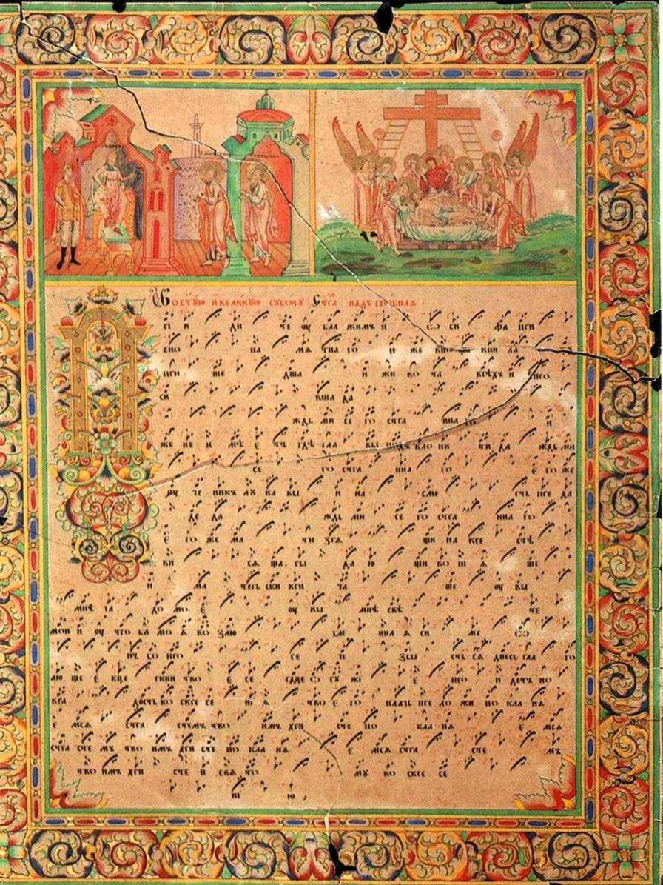

> 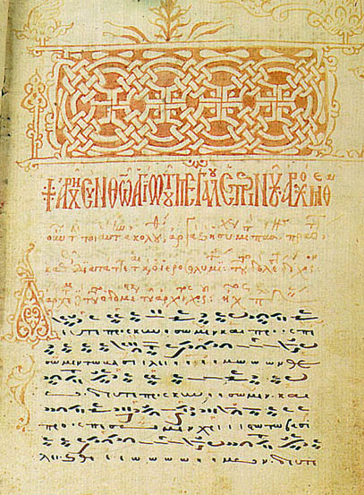
> A musical manuscript of 1433 (Pantokratoros monastery, code 214)

> 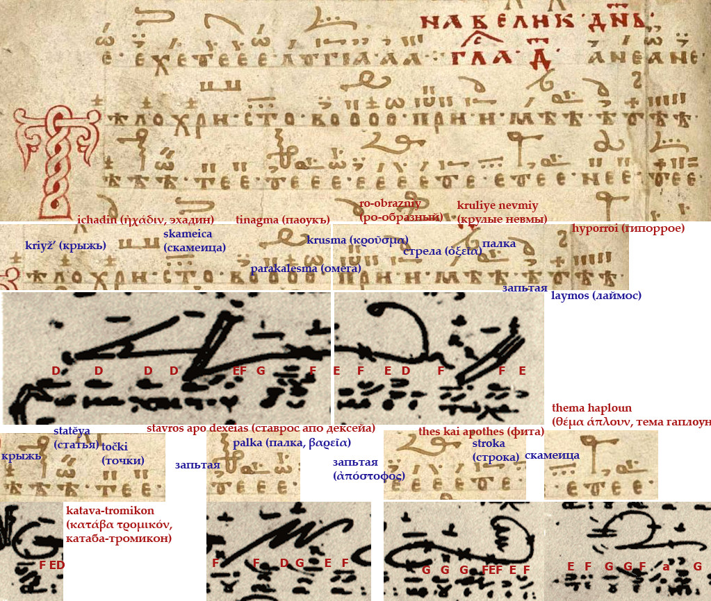
> Easter koinonikon тҍло христово / σῶμα χριστοῦ ("The body of Christ") in echos plagios protos notated with kondakarian notation in 2 rows: great (red names) and small signs (blue names)

---

## Guido d'Arezzo

Guido of Arezzo or Guido d'Arezzo (c. 991–992 – after 1033) was an Italian music theorist and pedagogue of High medieval music. A Benedictine monk, he is regarded as the inventor—or by some, developer—of the modern staff notation that replaced the predominant neumatic notation and was thus massively influential to the development of Western musical notation and practice.

> 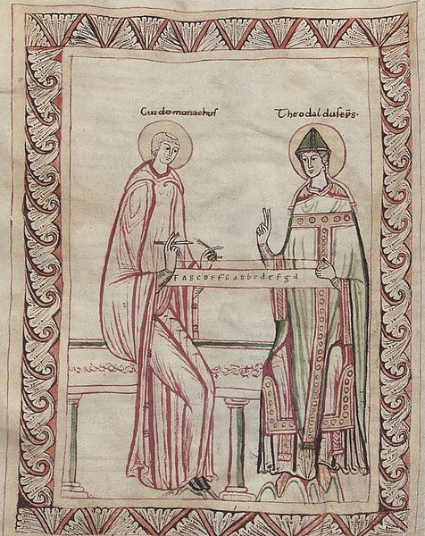
> Guido (left) showing Tedald the monochord, depicted in an 11th-century medieval manuscript

By around 1013 he began teaching at Pomposa Abbey, but his antiphonary Prologus in antiphonarium and novel teaching methods based on staff notation brought considerable resentment from his colleagues. He thus moved to Arezzo in 1025 and under the patronage of Bishop Tedald of Arezzo he taught singers at the Arezzo Cathedral. Using staff notation, he was able to teach large amounts of music quickly and he wrote the multifaceted Micrologus, attracting attention from around Italy. Interested in his innovations, Pope John XIX called him to Rome. After arriving and beginning to explain his methods to the clergy, sickness sent him away in the summer. The rest of his life is largely unclear, but he settled in a monastery near Arezzo, probably one of the Avellana of the Camaldolese order.

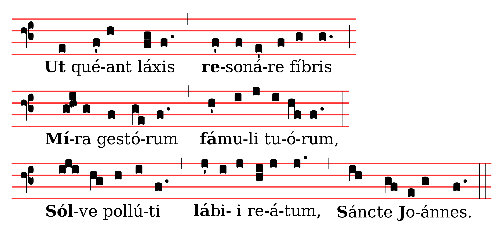

Guido developed new techniques for teaching, such as staff notation and the use of the "ut–re–mi–fa–sol–la" (do–re–mi–fa–so–la) mnemonic (solmization). The ut–re–mi-fa-sol-la syllables are taken from the initial syllables of each of the first six half-lines of the first stanza of the hymn Ut queant laxis, whose text is attributed to the Italian monk and scholar Paulus Diaconus (though the musical line either shares a common ancestor with the earlier setting of Horace's "Ode to Phyllis" (Odes 4.11), recorded in the Montpellier manuscript H425, or may have been taken from it).[23] Giovanni Battista Doni is known for having changed the name of note "Ut" (C), renaming it "Do" (in the "Do Re Mi ..." sequence known as solfège).[24] A seventh note, "Si" (from the initials for "Sancte Iohannes," Latin for Saint John the Baptist) was added shortly after to complete the diatonic scale.[25] In anglophone countries, "Si" was changed to "Ti" by Sarah Glover in the nineteenth century so that every syllable might begin with a different letter (this also freed up Si for later use as Sol-sharp). "Ti" is used in tonic sol-fa and in the song "Do-Re-Mi".

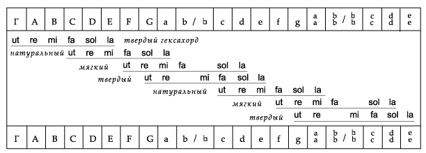

### Guidonian hand

Guido is somewhat erroneously credited with the invention of the Guidonian hand, a widely used mnemonic system where note names are mapped to parts of the human hand. Only a rudimentary form of the Guidonian hand is actually described by Guido, and the fully elaborated system of natural, hard, and soft hexachords cannot be securely attributed to him.

In the 12th century, a development in teaching and learning music in a more efficient manner had arisen. Guido of Arezzo's alleged development of the Guidonian hand, more than a hundred years after his death, allowed for musicians to label a specific joint or fingertip with the gamut (also referred to as the hexachord in the modern era).[citation needed] Using specific joints of the hand and fingertips transformed the way one would learn and memorize solmization syllables. Not only did the Guidonian hand become a standard use in preparing music in the 12th century, its popularity grew more widespread well into the 17th and 18th century. The knowledge and use of the Guidonian hand would allow a musician to simply transpose, identify intervals, and aid in use of notation and the creation of new music. Musicians were able to sing and memorize longer sections of music and counterpoint during performances and the amount of time spent diminished dramatically.

<youtube-embed video="veJNu1fi8p4" />

> **Ut** queant laxis  
>  **Re**sonare fibris,  
>  **Mi**ra gestorum  
>  **Fa**muli tuorum,  
>  **So**lve polluti  
>  **La**bii reatum,  
>  **S**ancte **J**ohannes.

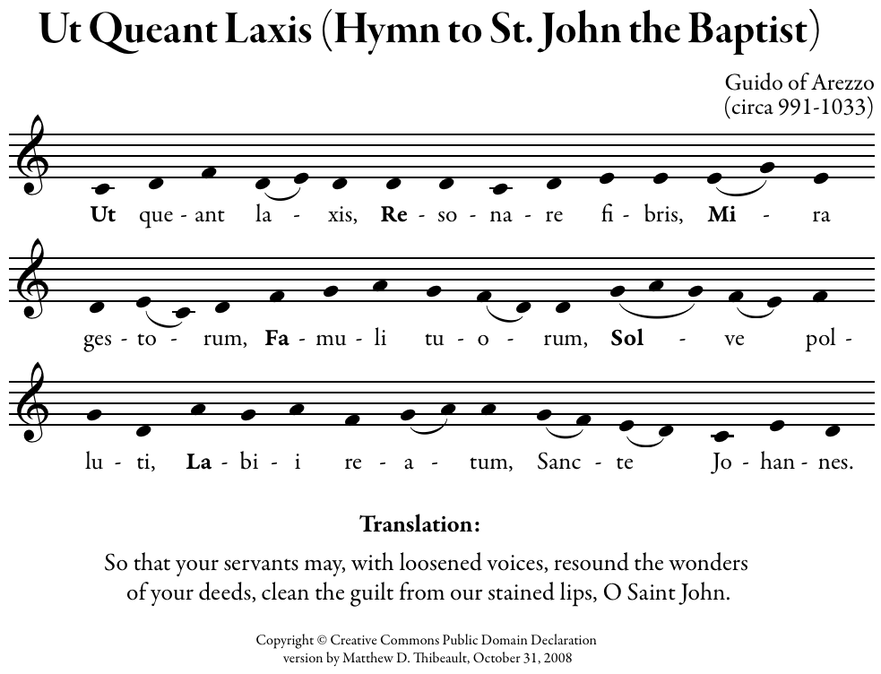

---

## Square notation

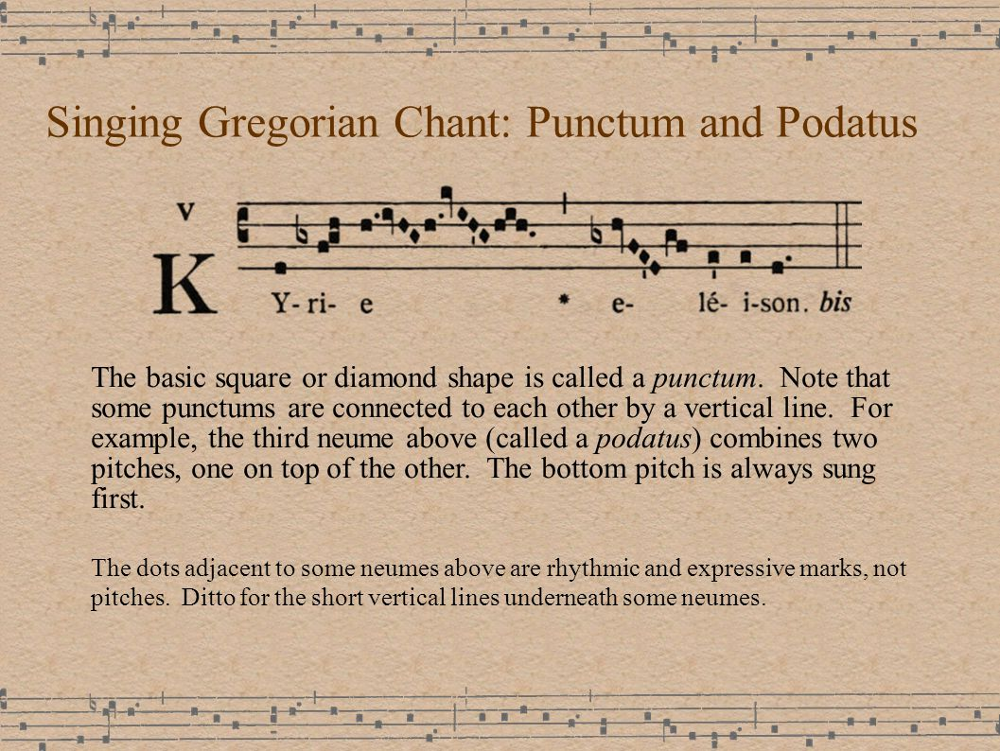

By the 13th century, the neumes of Gregorian chant were usually written in square notation on a staff with four lines and three spaces and a clef marker, as in the 14th–15th century Graduale Aboense shown here. In square notation, small groups of ascending notes on a syllable are shown as stacked squares, read from bottom to top, while descending notes are written with diamonds read from left to right. In melismatic chants, in which a syllable may be sung to a large number of notes, a series of smaller such groups of neumes are written in succession, read from left to right. A special symbol called the custos, placed at the end of a system, showed which pitch came next at the start of the following system. Special neumes such as the oriscus, quilisma, and liquescent neumes, indicate particular vocal treatments for these notes. This system of square notation is standard in modern chantbooks.

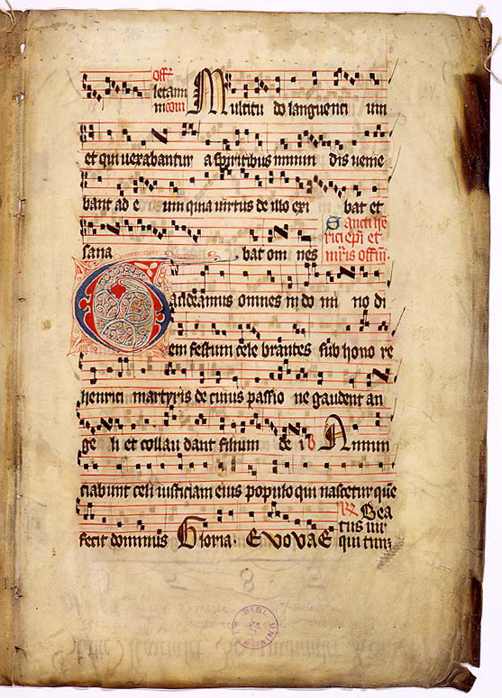

---

## Mensural notation of Renaissance c. 1400–1600

Mensural notation is the musical notation system used for European vocal polyphonic music from the later part of the 13th century until about 1600. The term "mensural" refers to the ability of this system to describe precisely measured rhythmic durations in terms of numerical proportions between note values. Its modern name is inspired by the terminology of medieval theorists, who used terms like musica mensurata ("measured music") or cantus mensurabilis ("measurable song") to refer to the rhythmically defined polyphonic music of their age, as opposed to musica plana or musica choralis, i.e., Gregorian plainchant.

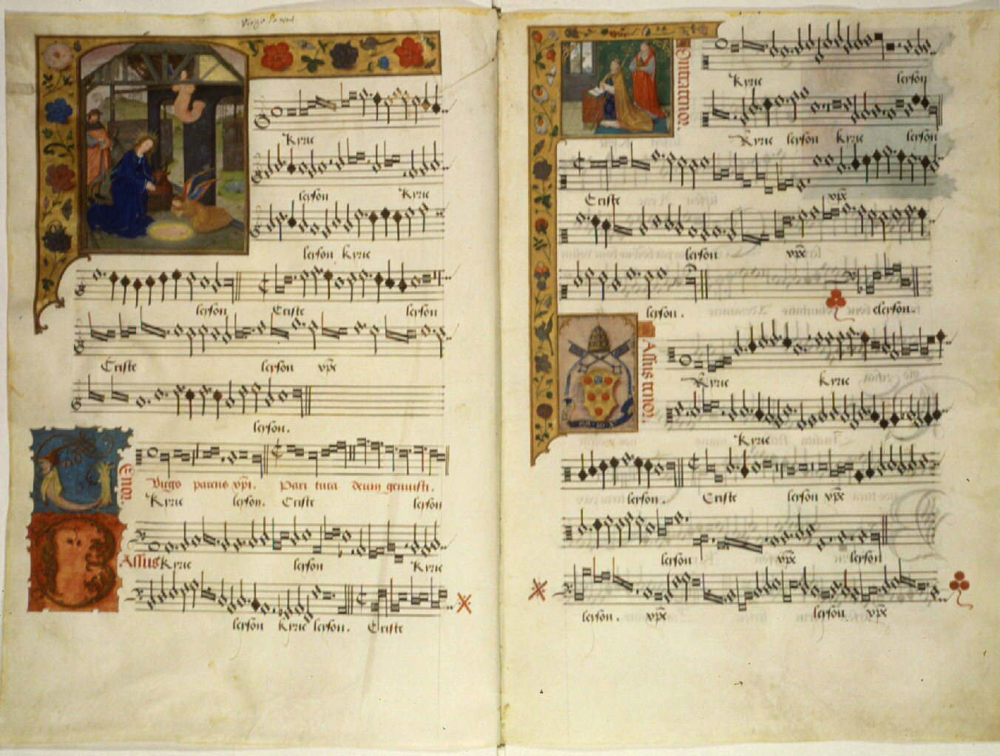

Mensural notation grew out of an earlier, more limited method of notating rhythms in terms of fixed repetitive patterns, the so-called rhythmic modes, which were developed in France around 1200. An early form of mensural notation was first described and codified in the treatise Ars cantus mensurabilis ("The art of measured chant") by Franco of Cologne (c. 1280). A much expanded system allowing for greater rhythmic complexity was introduced in France with the stylistic movement of the Ars nova in the 14th century, while Italian 14th-century music developed its own, somewhat different variant. Around 1400, the French system was adopted across Europe, and became the standard form of notation of the Renaissance music of the 15th and 16th centuries. After around 1600, mensural notation gradually evolved into modern measure (or bar) notation.

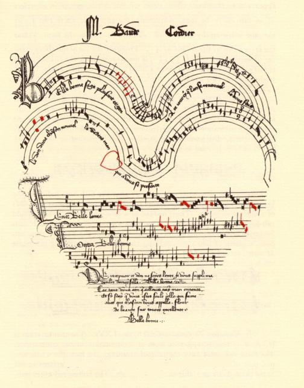

The decisive innovation of mensural notation was the systematic use of different note shapes to denote rhythmic durations that stood in well-defined, hierarchical numerical relations to each other. While less context dependent than notation in rhythmic modes, mensural notation differed from the modern system in that the values of notes were still somewhat context-dependent.

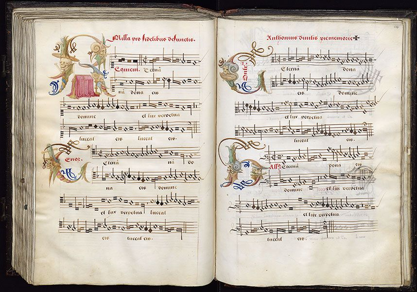

---

## Baroque music c. 1580–1750

Baroque music forms a major portion of the "classical music" canon, and is now widely studied, performed, and listened to. The term "baroque" comes from the Portuguese word barroco, meaning "misshapen pearl". Key composers of the Baroque era include Johann Sebastian Bach, Antonio Vivaldi, George Frideric Handel, Claudio Monteverdi, Domenico Scarlatti, Alessandro Scarlatti, Henry Purcell, Georg Philipp Telemann, Jean-Baptiste Lully, Jean-Philippe Rameau, Marc-Antoine Charpentier, Arcangelo Corelli, François Couperin, Giuseppe Tartini, Heinrich Schütz, Jan Pieterszoon Sweelinck, Dieterich Buxtehude, and others.

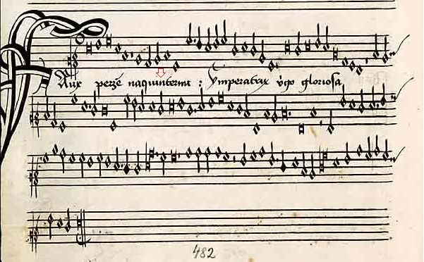

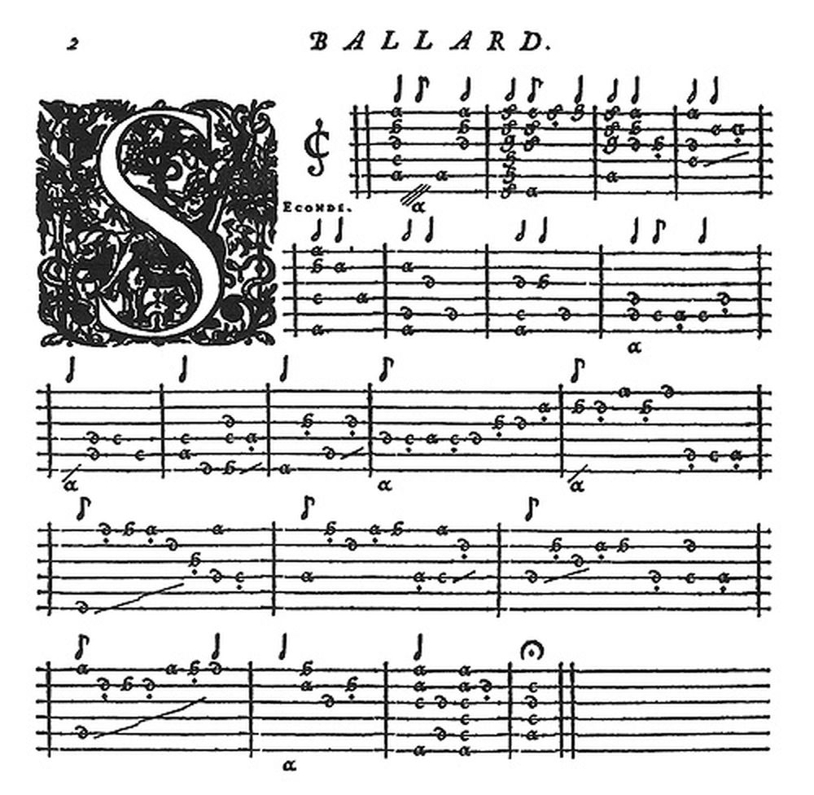

> 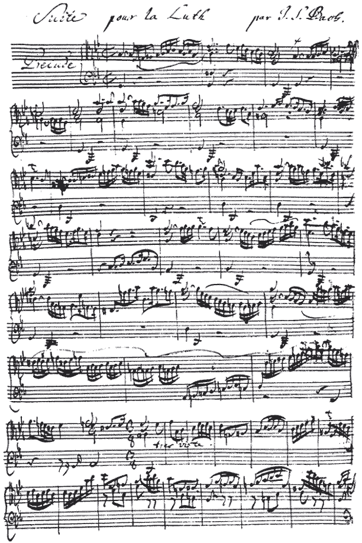
>
> 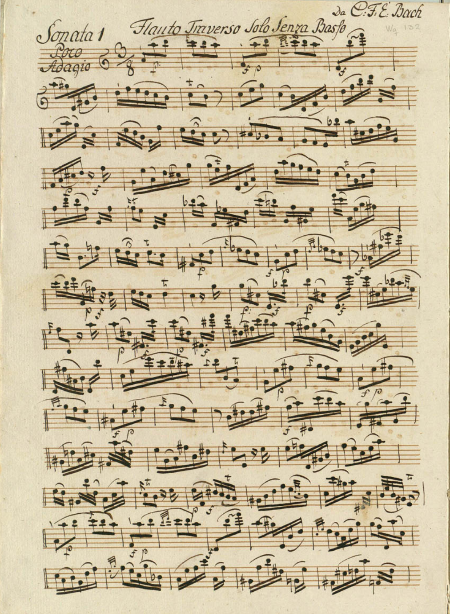
> J.S. Bach

## Galant music c. 1720–1770

In music, galant refers to the style which was fashionable from the 1720s to the 1770s. This movement featured a return to simplicity and immediacy of appeal after the complexity of the late Baroque era. This meant simpler, more song-like melodies, decreased use of polyphony, short, periodic phrases, a reduced harmonic vocabulary emphasizing tonic and dominant, and a clear distinction between soloist and accompaniment. C. P. E. Bach and Daniel Gottlob Türk, who were among the most significant theorists of the late 18th century, contrasted the galant with the "learned" or "strict" styles.

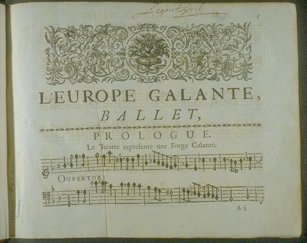

---

## Classical period c. 1750–1820

Classical music has a lighter, clearer texture than Baroque music, but a more sophisticated use of form. It is mainly homophonic, using a clear melody line over a subordinate chordal accompaniment, but counterpoint was by no means forgotten, especially in liturgical vocal music and, later in the period, secular instrumental music. Variety and contrast within a piece became more pronounced than before and the orchestra increased in size, range, and power.

> 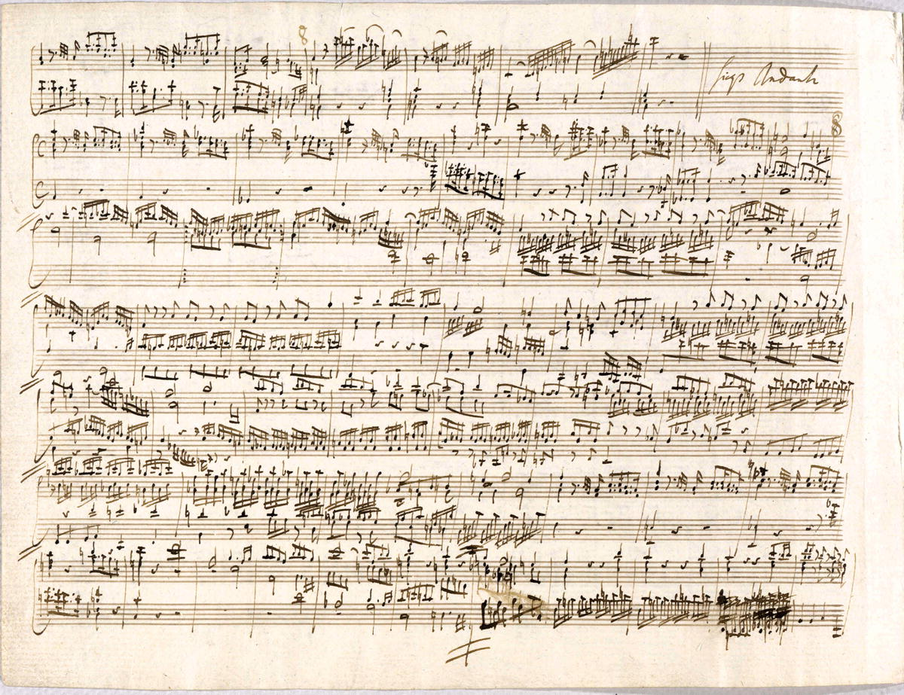
> W.A. Mozart

The harpsichord was replaced as the main keyboard instrument by the piano (or fortepiano). Unlike the harpsichord, which plucks strings with quills, pianos strike the strings with leather-covered hammers when the keys are pressed, which enables the performer to play louder or softer (hence the original name "fortepiano," literally "loud soft") and play with more expression; in contrast, the force with which a performer plays the harpsichord keys does not change the sound. Instrumental music was considered important by Classical period composers. The main kinds of instrumental music were the sonata, trio, string quartet, quintet, symphony (performed by an orchestra) and the solo concerto, which featured a virtuoso solo performer playing a solo work for violin, piano, flute, or another instrument, accompanied by an orchestra. Vocal music, such as songs for a singer and piano (notably the work of Schubert), choral works, and opera (a staged dramatic work for singers and orchestra) were also important during this period.

The best-known composers from this period are Joseph Haydn, Wolfgang Amadeus Mozart, Ludwig van Beethoven, and Franz Schubert; other notable names include Carl Philipp Emanuel Bach, Johann Christian Bach, Luigi Boccherini, Domenico Cimarosa, Joseph Martin Kraus, Muzio Clementi, Christoph Willibald Gluck, Carl Ditters von Dittersdorf, André Grétry, Pierre-Alexandre Monsigny, Leopold Mozart, Michael Haydn, Giovanni Paisiello, Johann Baptist Wanhal, François-André Danican Philidor, Niccolò Piccinni, Antonio Salieri, Georg Christoph Wagenseil, Georg Matthias Monn, Johann Georg Albrechtsberger, Mauro Giuliani, Christian Cannabich and the Chevalier de Saint-Georges. Beethoven is regarded either as a Romantic composer or a Classical period composer who was part of the transition to the Romantic era. Schubert is also a transitional figure, as were Johann Nepomuk Hummel, Luigi Cherubini, Gaspare Spontini, Gioachino Rossini, Carl Maria von Weber, Jan Ladislav Dussek and Niccolò Paganini. The period is sometimes referred to as the era of Viennese Classicism (German: Wiener Klassik), since Gluck, Haydn, Salieri, Mozart, Beethoven, and Schubert all worked in Vienna.

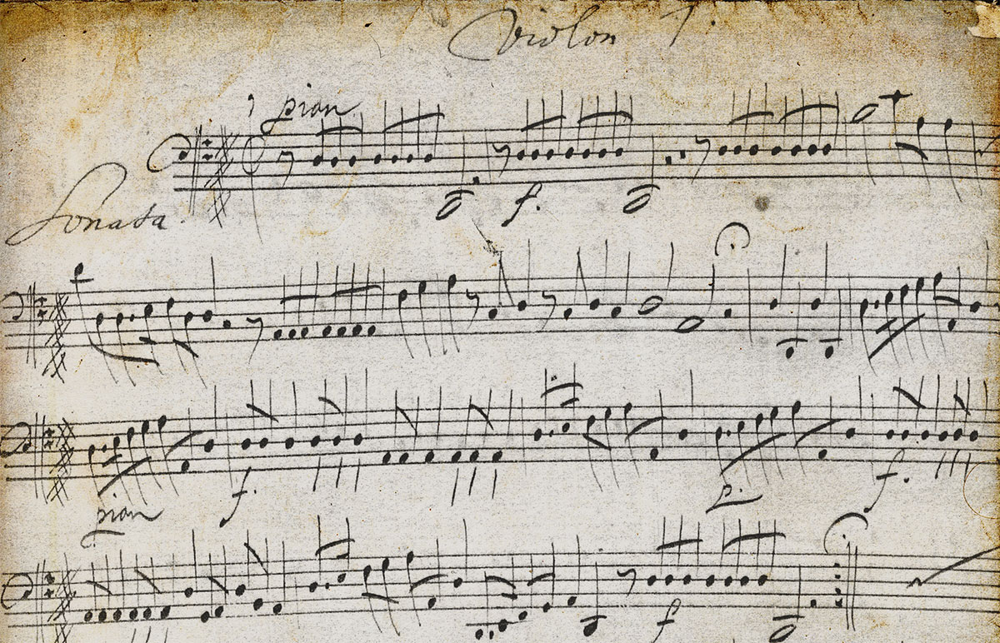

---

## Romantic period c. 1800–1910

Romantic music is a stylistic movement in Western Classical music associated with the period of the 19th century commonly referred to as the Romantic era (or Romantic period). It is closely related to the broader concept of Romanticism—the intellectual, artistic and literary movement that became prominent in Europe from approximately 1800 until 1910.

Romantic composers sought to create music that was individualistic, emotional, dramatic and often programmatic; reflecting broader trends within the movements of Romantic literature, poetry, art, and philosophy. Romantic music was often ostensibly inspired by (or else sought to evoke) non-musical stimuli, such as nature, literature, poetry, or the fine arts.

> 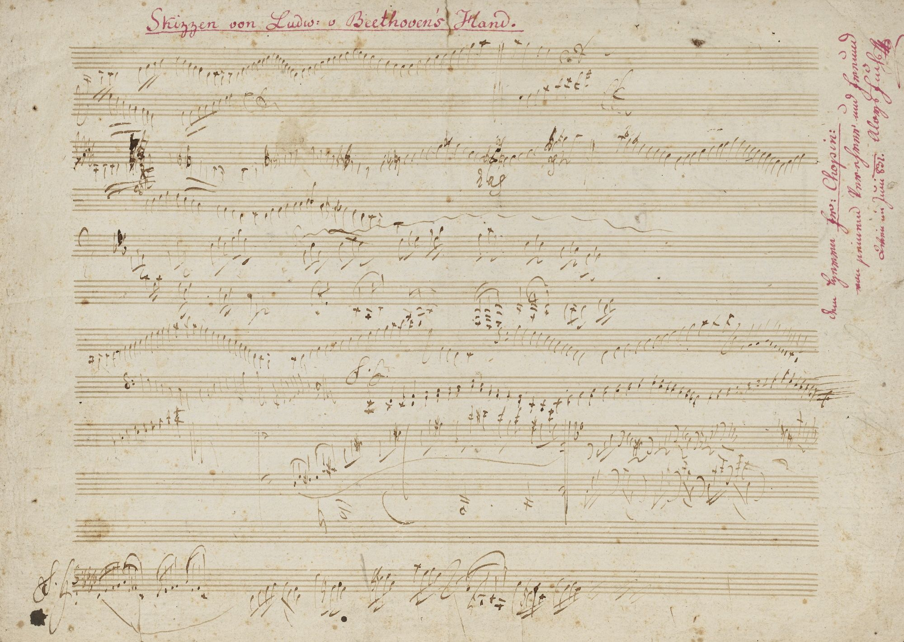
> L.V. Beethoven

Influential composers of the early Romantic era include Adolphe Adam, Daniel Auber, Ludwig van Beethoven, Hector Berlioz, François-Adrien Boieldieu, Frédéric Chopin, Sophia Dussek, Ferdinand Hérold, Mikhail Glinka, Fanny Mendelssohn, Felix Mendelssohn, John Field, Ignaz Moscheles, Otto Nicolai, Gioachino Rossini, Ferdinand Ries, Vincenzo Bellini, Franz Berwald, Luigi Cherubini, Carl Czerny, Gaetano Donizetti, Johann Nepomuk Hummel, Carl Loewe, Niccolò Paganini, Giacomo Meyerbeer, Anton Reicha, Franz Schubert, Clara Schumann, Robert Schumann, Louis Spohr, Gaspare Spontini, Ambroise Thomas and Carl Maria von Weber. Later nineteenth-century composers would appear to build upon certain early Romantic ideas and musical techniques, such as the use of extended chromatic harmony and expanded orchestration. Such later Romantic composers include Albéniz, Bruckner, Granados, Smetana, Brahms, MacDowell, Tchaikovsky, Parker, Mussorgsky, Dvořák, Borodin, Delius, Liszt, Wagner, Mahler, Goldmark, Richard Strauss, Verdi, Puccini, Bizet, Lalo, Rimsky-Korsakov, Schoenberg, Sibelius, Stanford, Parry, Scriabin, Elgar, Grieg, Saint-Saëns, Fauré, Rachmaninoff, Glazunov, Chausson and Franck.

> 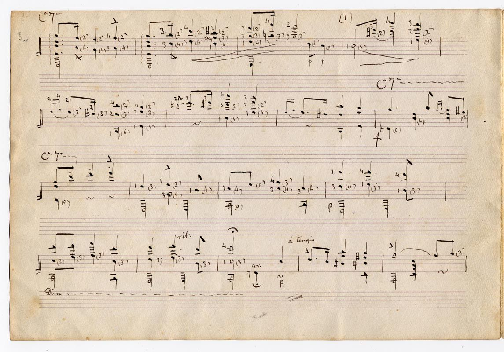
> F. Chopin

---

## Modernism c. 1890–1975

modernism is an aesthetic stance underlying the period of change and development in musical language that occurred around the turn of the 20th century, a period of diverse reactions in challenging and reinterpreting older categories of music, innovations that led to new ways of organizing and approaching harmonic, melodic, sonic, and rhythmic aspects of music, and changes in aesthetic worldviews in close relation to the larger identifiable period of modernism in the arts of the time. The operative word most associated with it is "innovation". Its leading feature is a "linguistic plurality", which is to say that no one music genre ever assumed a dominant position.

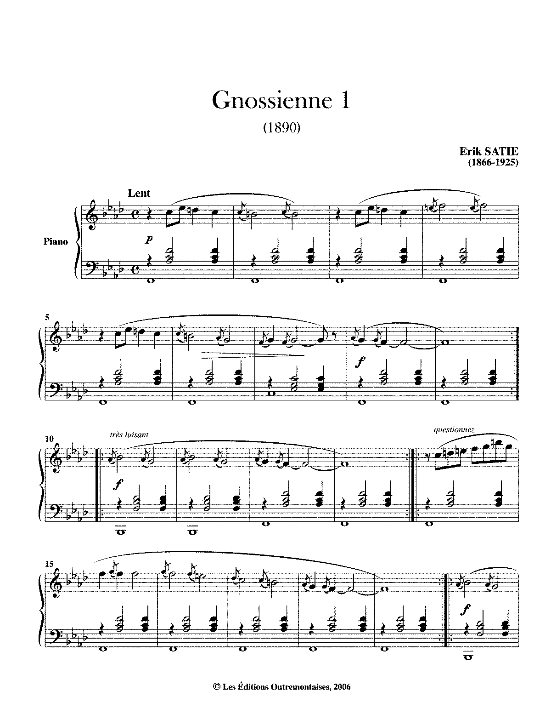

> Inherent within musical modernism is the conviction that music is not a static phenomenon defined by timeless truths and classical principles, but rather something which is intrinsically historical and developmental. While belief in musical progress or in the principle of innovation is not new or unique to modernism, such values are particularly important within modernist aesthetic stances.
> — Edward Campbell (2010, p. 37)

Examples include the celebration of Arnold Schoenberg's rejection of tonality in chromatic post-tonal and twelve-tone works and Igor Stravinsky's move away from metrical rhythm.

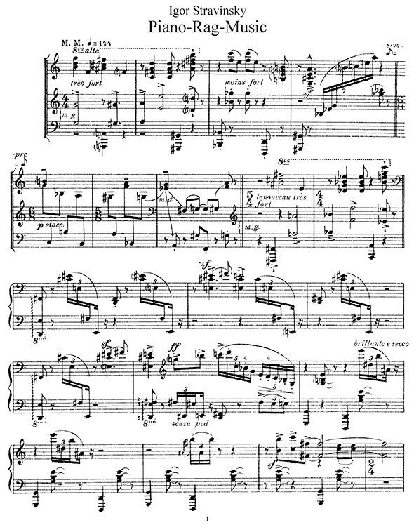

### Serialism and dodecaphony

In music, serialism is a method of composition using series of pitches, rhythms, dynamics, timbres or other musical elements. Serialism began primarily with Arnold Schoenberg's twelve-tone technique, though some of his contemporaries were also working to establish serialism as a form of post-tonal thinking.

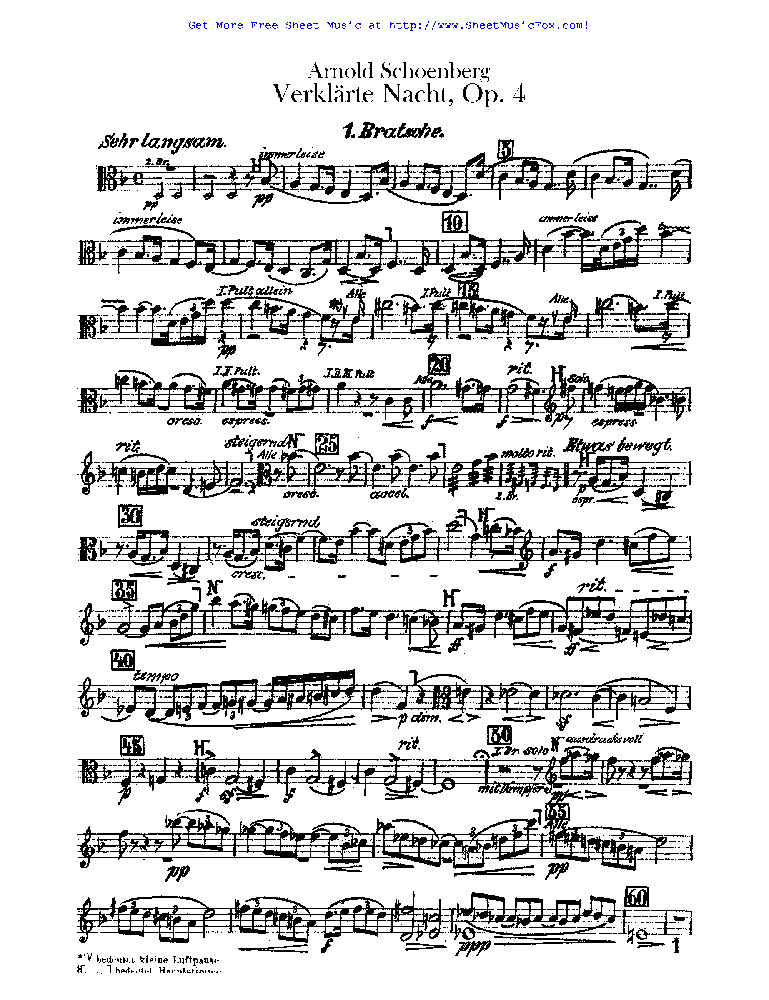

Twelve-tone technique orders the twelve notes of the chromatic scale, forming a row or series and providing a unifying basis for a composition's melody, harmony, structural progressions, and variations. Other types of serialism also work with sets, collections of objects, but not necessarily with fixed-order series, and extend the technique to other musical dimensions (often called "parameters"), such as duration, dynamics, and timbre.

> 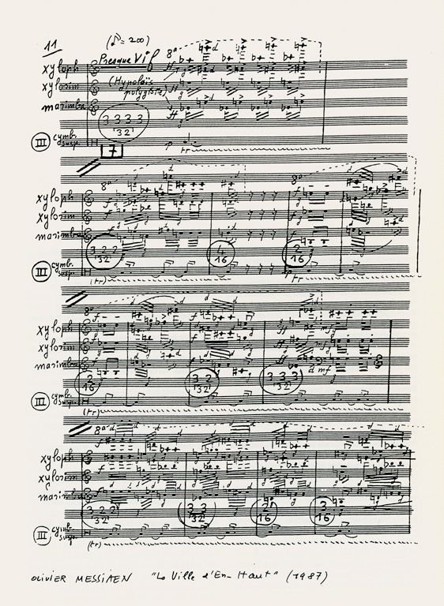
> Olivier Messiaen: „La Ville d'En-Haut“, für Klavier und kleines Orchester (1987), Manuskriptseite.

Serialism of the first type is most specifically defined as a structural principle according to which a recurring series of ordered elements (normally a set—or row—of pitches or pitch classes) is used in order or manipulated in particular ways to give a piece unity. "Serial" is often broadly used to describe all music written in what Schoenberg called "The Method of Composing with Twelve Notes related only to one another", or dodecaphony, and methods that evolved from his methods. It is sometimes used more specifically to apply only to music in which at least one element other than pitch is treated as a row or series.

> 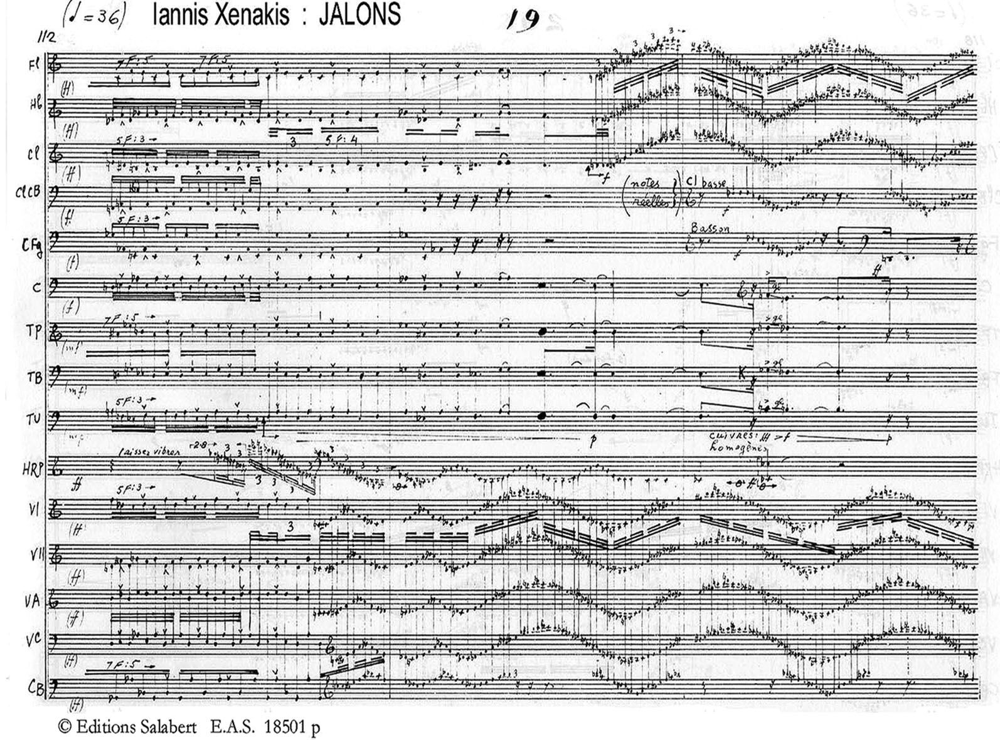
> I. Xenakis

The twelve-tone technique—also known as dodecaphony, twelve-tone serialism, is a method of musical composition first devised by Austrian composer Josef Matthias Hauer, who published his "law of the twelve tones" in 1919. In 1923, Arnold Schoenberg (1874–1951) developed his own, better-known version of 12-tone technique, which became associated with the "Second Viennese School" composers, who were the primary users of the technique in the first decades of its existence. The technique is a means of ensuring that all 12 notes of the chromatic scale are sounded as often as one another in a piece of music while preventing the emphasis of any one note through the use of tone rows, orderings of the 12 pitch classes. All 12 notes are thus given more or less equal importance, and the music avoids being in a key. Over time, the technique increased greatly in popularity and eventually became widely influential on 20th-century composers. Many important composers who had originally not subscribed to or actively opposed the technique, such as Aaron Copland and Igor Stravinsky, eventually adopted it in their music.

### Aleatoric music

Aleatoric music (also aleatory music or chance music; from the Latin word alea, meaning "dice") is music in which some element of the composition is left to chance, and/or some primary element of a composed work's realization is left to the determination of its performer(s). The term is most often associated with procedures in which the chance element involves a relatively limited number of possibilities.

> 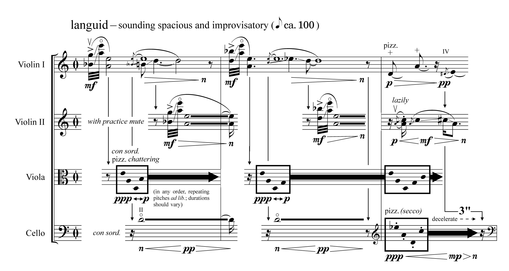
> L. Visconti

Some writers do not make a distinction between aleatory, chance, and indeterminancy in music, and use the terms interchangeably. From this point of view, indeterminate or chance music can be divided into three groups: (1) the use of random procedures to produce a determinate, fixed score, (2) mobile form, and (3) indeterminate notation, including graphic notation and texts.

> 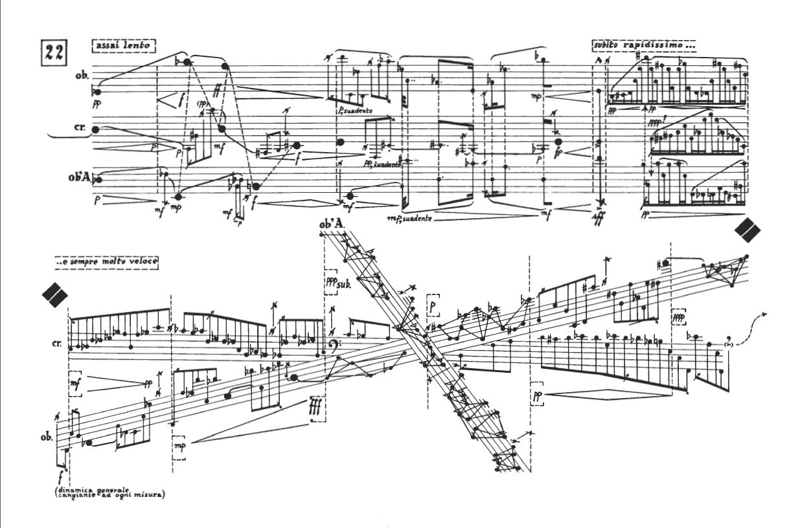
> Karlheinz Stockhausen’s Helicopter String Quartet. Watch an excerpt of the work performed live (in helicopters) from the 2003 Salzberg Festival.

The first group includes scores in which the chance element is involved only in the process of composition, so that every parameter is fixed before their performance. In John Cage's Music of Changes (1951), for example, the composer selected duration, tempo, and dynamics by using the I Ching, an ancient Chinese book which prescribes methods for arriving at random numbers. Because this work is absolutely fixed from performance to performance, Cage regarded it as an entirely determinate work made using chance procedures. On the level of detail, Iannis Xenakis used probability theories to define some microscopic aspects of Pithoprakta (1955–56), which is Greek for "actions by means of probability". This work contains four sections, characterized by textural and timbral attributes, such as glissandi and pizzicati. At the macroscopic level, the sections are designed and controlled by the composer while the single components of sound are controlled by mathematical theories.

> 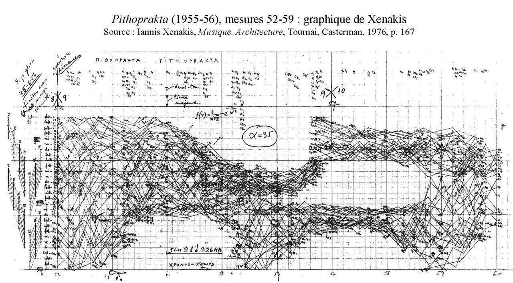
> Pithoprakta by I. Xenakis

In the second type of indeterminate music, chance elements involve the performance. Notated events are provided by the composer, but their arrangement is left to the determination of the performer. Karlheinz Stockhausen's Klavierstück XI (1956) presents nineteen events which are composed and notated in a traditional way, but the arrangement of these events is determined by the performer spontaneously during the performance. In Earle Brown's Available forms II (1962), the conductor is asked to decide the order of the events at the very moment of the performance.

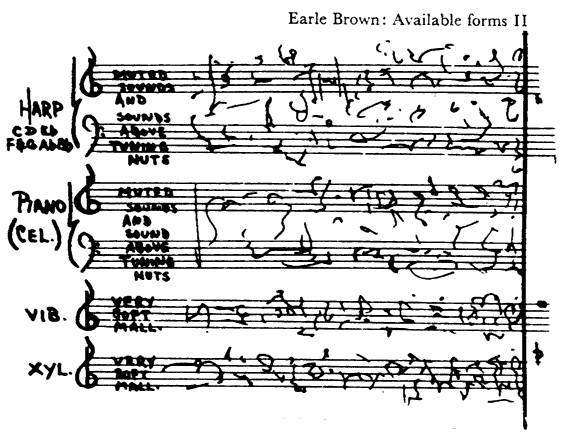

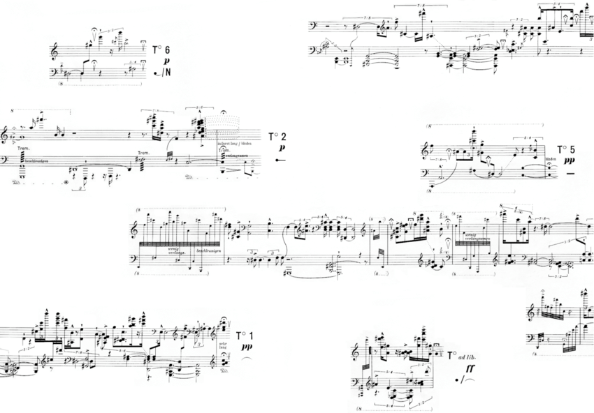

<youtube-embed video="NxLMtP8ejKA" />

> 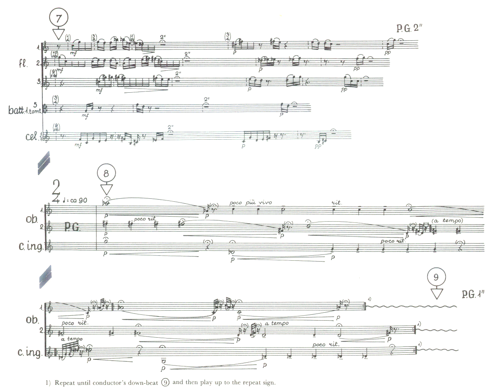
> Witold Roman Lutosławski (25 January 1913 – 7 February 1994) was a Polish composer and conductor.

The greatest degree of indeterminacy is reached by the third type of indeterminate music, where traditional musical notation is replaced by visual or verbal signs suggesting how a work can be performed, for example in graphic score pieces.

> 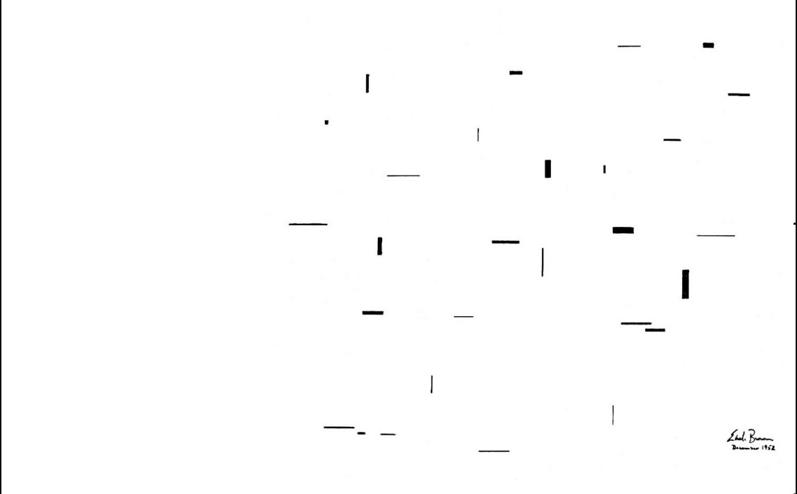
> Earle Brown's December 1952

Earle Brown's December 1952 (1952) shows lines and rectangles of various lengths and thicknesses that can read as loudness, duration, or pitch. The performer chooses how to read them. Another example is Morton Feldman's Intersection No. 2 (1951) for piano solo, written on coordinate paper.

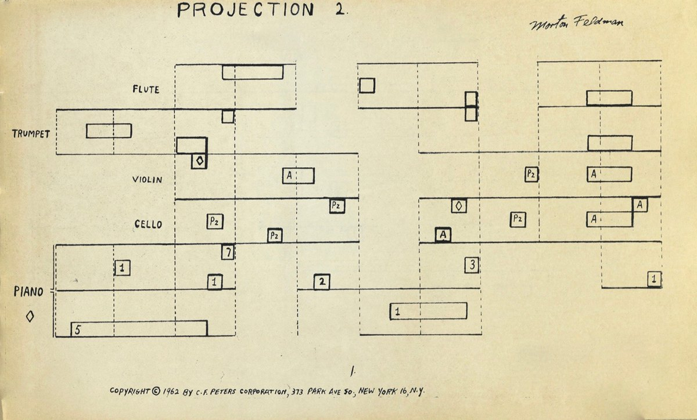

Time units are represented by the squares viewed horizontally, while relative pitch levels of high, middle, and low are indicated by three vertical squares in each row. The performer determines what particular pitches and rhythms to play.

> 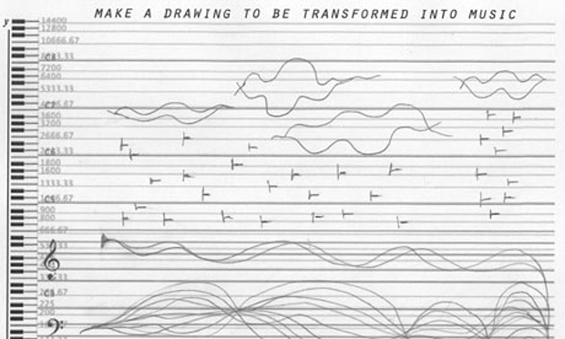
> I. Xenakis

### John Cage

John Milton Cage Jr. (September 5, 1912 – August 12, 1992) was an American composer, music theorist, artist, and philosopher. A pioneer of indeterminacy in music, electroacoustic music, and non-standard use of musical instruments, Cage was one of the leading figures of the post-war avant-garde.

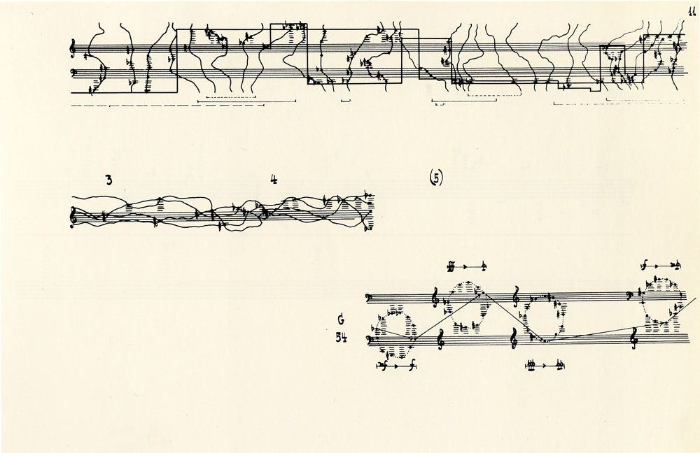

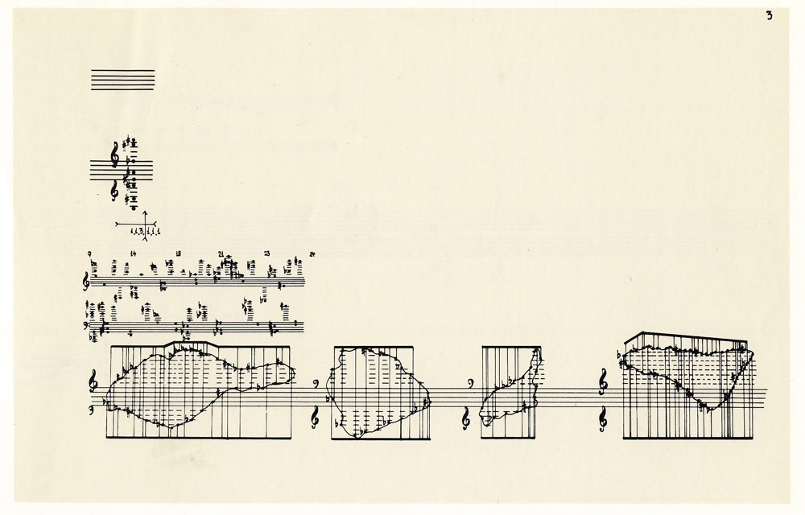

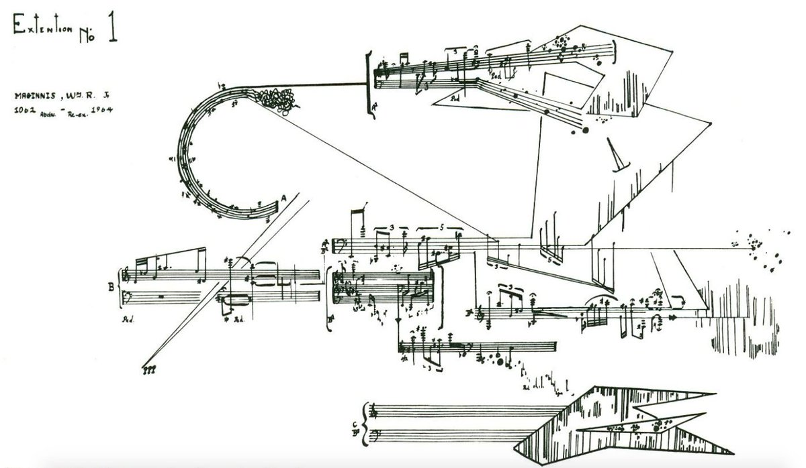

### Earle Brown

Earle Brown (December 26, 1926 – July 2, 2002) was an American composer who established his own formal and notational systems. Brown was the creator of "open form," a style of musical construction.

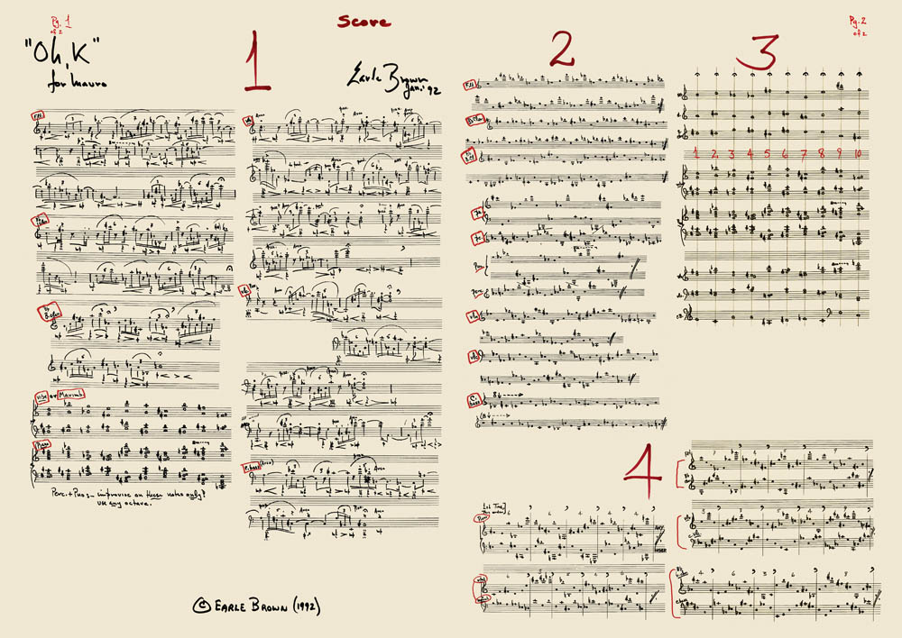

Although Brown precisely notated compositions throughout his career using traditional notation, he also was an inventor and early practitioner of various innovative notations.

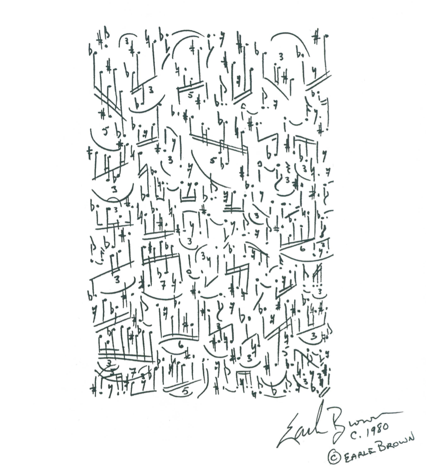

In Twenty-Five Pages, and in other works, Brown used what he called "time notation" or "proportional notation" where rhythms were indicated by their horizontal length and placement in relation to each other and were to be interpreted flexibly. However, by Modules I and II (1966), Brown more often used stemless note heads which could be interpreted with even greater flexibility.

In 1959, with Hodograph I, Brown sketched the contour and character abstractly in what he called "implicit areas" of the piece. This graphic style was more gestural and calligraphic than the geometric abstraction of December 1952. Beginning with Available Forms I, Brown used this graphic notation on the staff in some sections of the score.

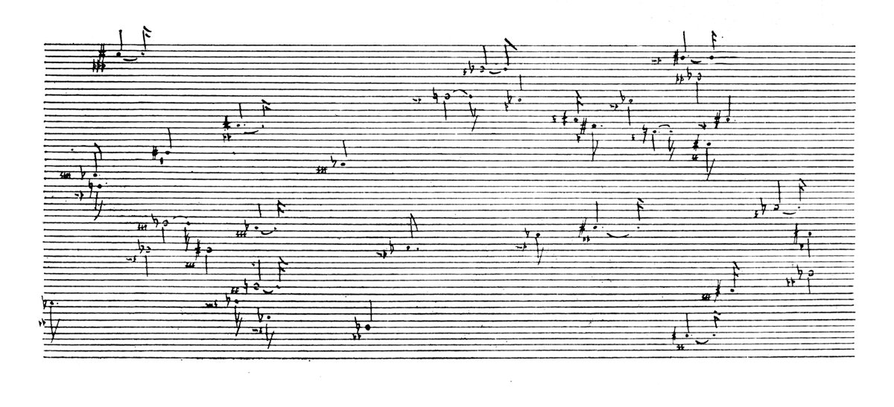
