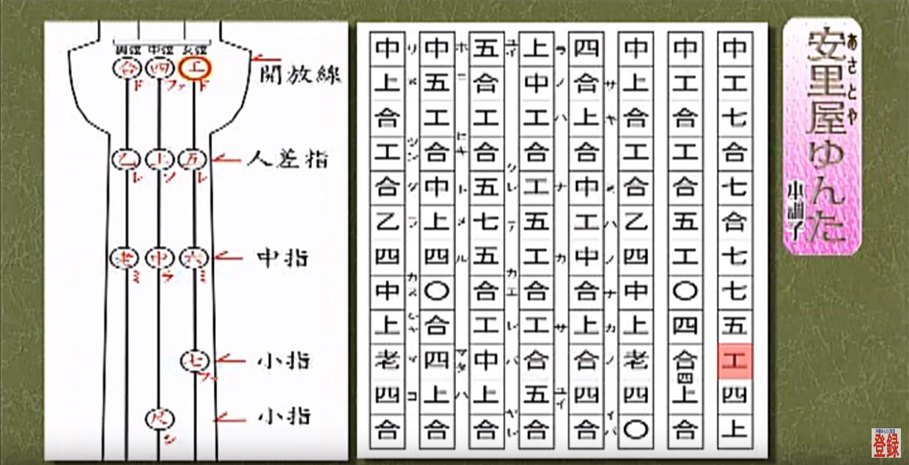

## Indian notation

### The seven varnas of a saptak.

The Samaveda text (1200 BC – 1000 BC) contains notated melodies, and these are probably the world's oldest surviving ones.

https://en.wikipedia.org/wiki/Vedic_accent

The musical notation is written usually immediately above, sometimes within, the line of Samaveda text, either in syllabic or a numerical form depending on the Samavedic Sakha (school). The Indian scholar and musical theorist Pingala (c. 200 BC), in his Chanda Sutra, used marks indicating long and short syllables.

## Saptak - सप्तक - 7 svaras - Octave

<table class="text-center text-sm">
<tr>
  <th>Solfege</th>
  <th>Syllable</th>
  <th>Name</th>
  <th>Meaning</th>
  <th>Variants</th>
  <th>Color</th>
  <th>Planet</th>
  <th>Chakra</th>
</tr>
<tr v-for="svara in $frontmatter.svaras" :key="svara.name">
  <td> {{svara.solfege}}</td>
  <td class="font-bold"> {{svara.mnem}}</td>
  <td> {{svara.name}}</td>
  <td> {{svara.trans}}</td>
  <td> {{svara.variants}}</td>
  <td :style="{backgroundColor: svara.color}"> {{svara.color}}</td>
  <td> {{svara.planet}}</td>
  <td> {{svara.chakra}}</td>
</tr>
</table>

https://en.wikipedia.org/wiki/Svara

http://sanskritdictionary.com/%E1%B9%A3a%E1%B8%8Dja/242242/1

## Hurrian songs - the worlds oldest music notation artefact

The Hurrian songs are a collection of music inscribed in cuneiform on clay tablets excavated from the ancient Amorite-Canaanite city of Ugarit, a headland in northern Syria, which date to approximately 1400 BCE. One of these tablets, which is nearly complete, contains the Hurrian Hymn to Nikkal (also known as the Hurrian cult hymn or A Zaluzi to the Gods, or simply h.6), making it the oldest surviving substantially complete work of notated music in the world.

The complete song is one of about 36 such hymns in cuneiform writing, found on fragments of clay tablets excavated in the 1950s from the Royal Palace at Ugarit (present-day Ras Shamra, Syria), in a stratum dating from the fourteenth century BC, but is the only one surviving in substantially complete form.

## Ancient Greece

Hymn to Applo in Delphi

## China

### Gongche - 'mi re'

1. 上 - [sɑ̄ːŋ] - shàng - do
2. 尺 - [tsʰɛ́ː] - chě - re
3. 工 - [kʊ́ŋ] - gōng - mi
4. 凡 - [fɑ́ːn] - fán - fa
5. 六 - [líːu] - liù - sol
6. 五 - [wúː] - wǔ - la
7. 乙 - [jìː] - yǐ - si

## Korea

**Jeongganbo** musical notation system

## Japan

**Kunkunshi** (工工四 (Okinawan) pronounced [kuŋkunɕiː]) is the traditional notation system by which music is recorded in the Ryukyu Islands. The term kunkunshi originally referred to the first three notes of a widely known Chinese melody, although today it is used almost exclusively in reference to the sheet music.

Kunkunshi is believed to have been first developed by Mongaku Terukina or by his student Choki Yakabi in the early to mid-1700s. However, it was not until the end of the 19th century that the form became standardized for writing sanshin music.

<youtube-embed video="O7DR4kjWG_c" />
