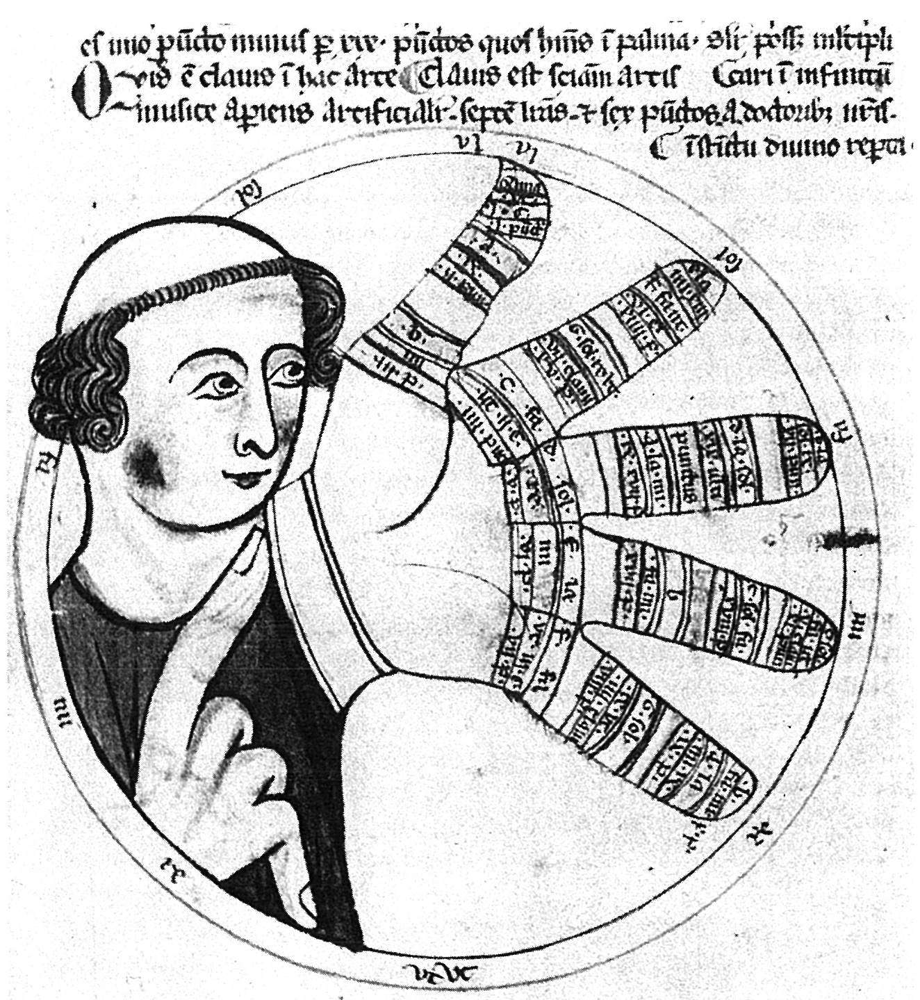
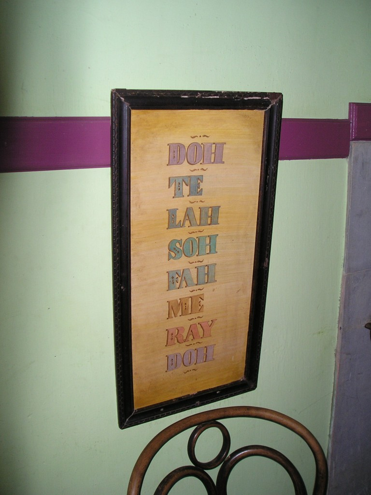
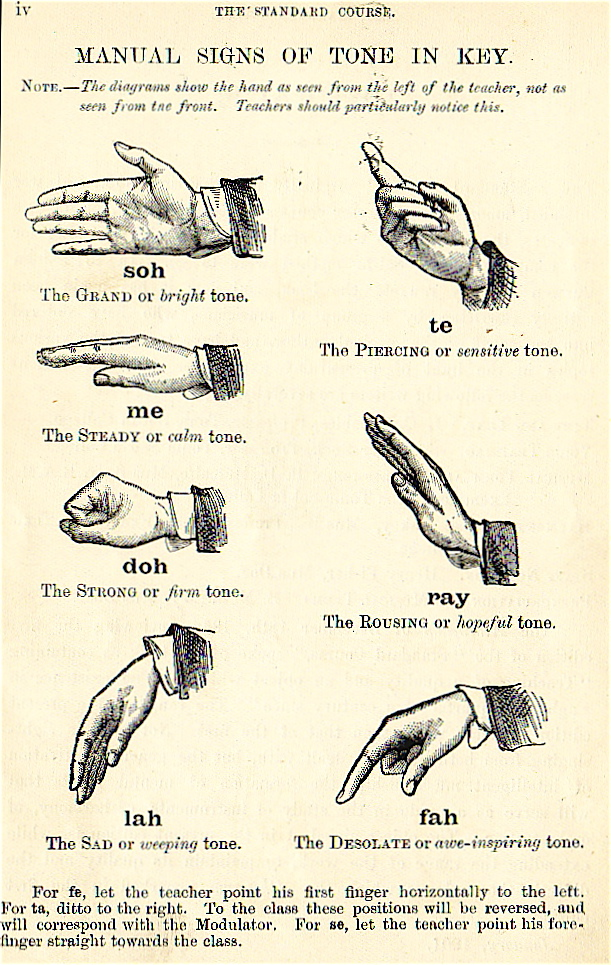

Solmization is a system of attributing a distinct syllable to each note of a musical scale. Various forms of solmization are in use and have been used throughout the world, but solfège is the most common convention in countries of Western culture.

## Solfège

Syllables are assigned to the notes of the scale and enable the musician to audiate, or mentally hear, the pitches of a piece of music being seen for the first time and then to sing them aloud. Through the Renaissance (and much later in some shapenote publications) various interlocking 4, 5 and 6-note systems were employed to cover the octave. The tonic sol-fa method popularized the seven syllables commonly used in English-speaking countries: do (or doh in tonic sol-fa), re, mi, fa, so(l), la, and ti (or si).

The seven syllables normally used for this practice in English-speaking countries are: do, re, mi, fa, sol, la, and ti (with sharpened notes of di, ri, fi, si, li and flattened notes of te, le, se, me, ra). The system for other Western countries is similar, though si is often used as the final syllable rather than ti.

There are two current ways of applying solfège:

1. **fixed do**, where the syllables are always tied to specific pitches (e.g. "do" is always "C-natural")
2. **movable do**, where the syllables are assigned to scale degrees, with "do" always the first degree of the major scale.

In eleventh-century Italy, the music theorist Guido of Arezzo in his work "Micrologus" invented a notational system that named the six notes of the hexachord after the first syllable of each line of the Latin hymn Ut queant laxis, the "Hymn to St. John the Baptist", yielding ut, re, mi, fa, sol, la. Each successive line of this hymn begins on the next scale degree, so each note's name was the syllable sung at that pitch in this hymn.

> **Ut** queant laxīs
> **re**sonāre fībrīs
> **Mī**ra gestōrum
> **fa**mulī tuōrum,
> **Sol**ve pollūtī
> **la**biī reātum,
> **S**ancte **I**ōhannēs.

The words were written by Paulus Diaconus in the 8th century. They translate as:

> So that your servants may, with loosened voices,
> Resound the wonders of your deeds,
> Clean the guilt from our stained lips,
> O St. John.

"Ut" was changed in the 1600s in Italy to the open syllable Do, at the suggestion of the musicologist Giovanni Battista Doni (based on the first syllable of his surname), and Si (from the initials for "Sancte Iohannes") was added to complete the diatonic scale. In Anglophone countries, "si" was changed to "ti" by Sarah Glover in the nineteenth century so that every syllable might begin with a different letter. "Ti" is used in tonic sol-fa (and in the famed American show tune "Do-Re-Mi").

## Movable do

In Movable do or tonic sol-fa, each syllable corresponds to a scale degree. This is analogous to the Guidonian practice of giving each degree of the hexachord a solfège name.

Movable do is frequently employed in Australia, China, Japan (with 5th being so, and 7th being si), Ireland, the United Kingdom, the United States, Hong Kong, and English-speaking Canada. The movable do system is a fundamental element of the Kodály method used primarily in Hungary, but with a dedicated following worldwide. In the movable do system, each solfège syllable corresponds not to a pitch, but to a scale degree: The first degree of a major scale is always sung as "do", the second as "re", etc. (For minor keys, see below.) In movable do, a given tune is therefore always sol-faed on the same syllables, no matter what key it is in.

Passages in a minor key may be sol-faed in one of two ways in movable do: either starting on do (using "me", "le", and "te" for the lowered third, sixth, and seventh degrees, and "la" and "ti" for the raised sixth and seventh degrees), which is referred to as "do-based minor", or starting on la (using "fi" and "si" for the raised sixth and seventh degrees). The latter (referred to as "la-based minor") is sometimes preferred in choral singing, especially with children.

### Tonic sol-fa

Tonic sol-fa (or tonic sol-fah) is a pedagogical technique for teaching sight-singing, invented by Sarah Ann Glover (1785–1867) of Norwich, England and popularised by John Curwen, who adapted it from a number of earlier musical systems. It uses a system of musical notation based on movable do solfège, whereby every note is given a name according to its relationship with other notes in the key: the usual staff notation is replaced with anglicized solfège syllables (e.g. do, re, mi, fa, sol, la, ti, do) or their abbreviations (d, r, m, f, s, l, t, d). "Do" is chosen to be the tonic of whatever key is being used (thus the terminology moveable Do in contrast to the fixed Do system used by John Pyke Hullah). The original solfège sequence started with "Ut" which later became "Do".

Solmization that represents the functions of pitches (such as tonic sol-fa) is called "functional" solmization. All musicians that use functional solmization use "do" to represent the tonic (also known as the "keynote") in the major mode. However, approaches to the minor mode fall into two camps. Some musicians use "do" to represent the tonic in minor (a parallel approach), whereas others prefer to label the tonic in minor as "la" (a relative approach) Both systems have their advantages: The former system more directly represents the scale-degree functions of the pitches in a key; the latter more directly represents the intervals between pitches in any given key signature.

## Fixed do

In Fixed do, each syllable corresponds to the name of a note. This is analogous to the Romance system naming pitches after the solfège syllables, and is used in Romance and Slavic countries, among others, including Spanish-speaking countries.

In the major Romance and Slavic languages, the syllables Do, Re, Mi, Fa, Sol, La, and Si are used to name notes the same way that the letters C, D, E, F, G, A, and B are used to name notes in English. For native speakers of these languages, solfège is simply singing the names of the notes, omitting any modifiers such as "sharp" or "flat" to preserve the rhythm.

### Chromatic variants

Several chromatic fixed-do Systems that have also been devised to account for chromatic notes, and even for double-sharp and double-flat variants. The Yehnian being the first 24-EDO solfège, proposed even quartertonal syllables while having no exceptions of its rules, and usability for both Si and Ti users.

<table class="m-auto text-center" dir="ltr"  cellspacing="0" cellpadding="0">
<tbody>
<tr >
<td colspan="2" rowspan="1" >Note name</td>
<td colspan="5" rowspan="1" >Syllable</td>
<td colspan="1" rowspan="2" >
Pitch class
</td>
</tr>
<tr >
<td >English</td>
<td >Romance</td>
<td >Traditional</td>
<td >Shearer</td>
<td >Siler</td>
<td >Sotorrio</td>
<td >Yehnian (chromatic)</td>
</tr>
<tr >
<td >C♭</td>
<td >Do♭</td>
<td>&nbsp;</td>
<td >de</td>
<td >do</td>
<td >(Tsi)</td>
<td >Də</td>
<td >11</td>
</tr>
<tr >
<td >C</td>
<td >Do</td>
<td >do</td>
<td >do</td>
<td >da</td>
<td >Do</td>
<td >Do</td>
<td >0</td>
</tr>
<tr >
<td >C♯</td>
<td >Do♯</td>
<td>&nbsp;</td>
<td >di</td>
<td >de</td>
<td >Ga</td>
<td >Du</td>
<td >1</td>
</tr>
<tr >
<td >D♭</td>
<td >Re♭</td>
<td>&nbsp;</td>
<td >ra</td>
<td >ro</td>
<td >Ga</td>
<td >Rə</td>
<td >1</td>
</tr>
<tr >
<td >D</td>
<td >Re</td>
<td >re</td>
<td >re</td>
<td >ra</td>
<td >Ray</td>
<td >Re</td>
<td >2</td>
</tr>
<tr >
<td >D♯</td>
<td >Re♯</td>
<td>&nbsp;</td>
<td >ri</td>
<td >re</td>
<td >Nu</td>
<td >Ru</td>
<td >3</td>
</tr>
<tr >
<td >E♭</td>
<td >Mi♭</td>
<td>&nbsp;</td>
<td >me</td>
<td >mo</td>
<td >Nu</td>
<td >Mə</td>
<td >3</td>
</tr>
<tr >
<td >E</td>
<td >Mi</td>
<td >mi</td>
<td >mi</td>
<td >ma</td>
<td >Mi</td>
<td >Mi</td>
<td >4</td>
</tr>
<tr >
<td >E♯</td>
<td >Mi♯</td>
<td>&nbsp;</td>
<td >mai</td>
<td >me</td>
<td >(Fa)</td>
<td >Mu</td>
<td >5</td>
</tr>
<tr >
<td >F♭</td>
<td >Fa♭</td>
<td>&nbsp;</td>
<td >fe</td>
<td >fo</td>
<td >(Mi)</td>
<td >Fə</td>
<td >4</td>
</tr>
<tr >
<td >F</td>
<td >Fa</td>
<td >fa</td>
<td >fa</td>
<td >fa</td>
<td >Fa</td>
<td >Fa</td>
<td >5</td>
</tr>
<tr >
<td >F♯</td>
<td >Fa♯</td>
<td>&nbsp;</td>
<td >fi</td>
<td >fe</td>
<td >Jur</td>
<td >Fu</td>
<td >6</td>
</tr>
<tr >
<td >G♭</td>
<td >Sol♭</td>
<td>&nbsp;</td>
<td >se</td>
<td >so</td>
<td >Jur</td>
<td >Səl / Sə</td>
<td >6</td>
</tr>
<tr >
<td >G</td>
<td >Sol</td>
<td >sol</td>
<td >so</td>
<td >sa</td>
<td >Sol</td>
<td >Sol</td>
<td >7</td>
</tr>
<tr >
<td >G♯</td>
<td >Sol♯</td>
<td>&nbsp;</td>
<td >si</td>
<td >se</td>
<td >Ki</td>
<td >Sul / Su</td>
<td >8</td>
</tr>
<tr >
<td >A♭</td>
<td >La♭</td>
<td>&nbsp;</td>
<td >le</td>
<td >lo</td>
<td >Ki</td>
<td >Lə</td>
<td >8</td>
</tr>
<tr >
<td >A</td>
<td >La</td>
<td >la</td>
<td >la</td>
<td >la</td>
<td >La</td>
<td >La</td>
<td >9</td>
</tr>
<tr >
<td >A♯</td>
<td >La♯</td>
<td>&nbsp;</td>
<td >li</td>
<td >le</td>
<td >Pe</td>
<td >Lu</td>
<td >10</td>
</tr>
<tr >
<td >B♭</td>
<td >Si♭</td>
<td>&nbsp;</td>
<td >te</td>
<td >to</td>
<td >Pe</td>
<td >Sə / Tə</td>
<td >10</td>
</tr>
<tr >
<td >B</td>
<td >Si</td>
<td >si</td>
<td >ti</td>
<td >ta</td>
<td >Tsi</td>
<td >Si / Ti</td>
<td >11</td>
</tr>
<tr >
<td >B♯</td>
<td >Si♯</td>
<td>&nbsp;</td>
<td >tai</td>
<td >te</td>
<td >(Do)</td>
<td >Su / Tu</td>
<td >0</td>
</tr>
</tbody>
</table>

### Comparison of the two systems

Movable Do corresponds to our psychological experience of normal tunes. If the song is sung a tone higher it is still perceived to be the same song, and the notes have the same relationship to each other, but in a fixed Do all the note names would be different. A movable Do emphasizes the musicality of the tune as the psychological perception of the notes is always relative to a key for the vast majority of people that do not have absolute pitch.

Jose Sotorrio argues that fixed-do is preferable for serious musicians, as music involving complex modulations and vague tonality is often too ambiguous with regard to key for any movable system. That is, without a prior analysis of the music, any movable-do system would inevitably need to be used like a fixed-do system anyway, thus causing confusion. With fixed-do, the musician learns to regard any syllable as the tonic, which does not force them to make an analysis as to which note is the tonic when ambiguity occurs. Instead, with fixed-do the musician will already be practiced in thinking in multiple/undetermined tonalities using the corresponding syllables.

In comparison to the movable do system, which draws on short-term relative pitch skills involving comparison to a pitch identified as the tonic of the particular piece being performed, fixed do develops long-term relative pitch skills involving comparison to a pitch defined independently of its role in the piece, a practice closer to the definition of each note in absolute terms as found in absolute pitch.

Instrumentalists who begin sight-singing for the first time in college as music majors find movable do to be the system more consistent with the way they learned to read music.

For choirs, sight-singing fixed do using chromatic movable do syllables is more suitable than sight-singing movable do for reading atonal music, polytonal music, pandiatonic music, music that modulates or changes key often, or music in which the composer simply did not write a key signature. It is not uncommon for this to be the case in modern or contemporary choral works.

## Tonic sol-fa notation

In Curwen's system, the notes of the major scale (of any key) are notated with the single letters d, r, m, f, s, l, and t. For notes above the principal octave, an apostrophe follows the letter; notes below the principal octave have a subscript mark. Chromatic alterations are marked by the following vowel, "e" for sharp (pronounced "ee") and "a" for flat (pronounced "aw"). Thus, the ascending and descending chromatic scale is notated:

> d de r re m f fe s se l le t d'
>
> d' t ta l la s sa f m ma r ra d

Such chromatic notes appear only as ornaments or as preparation for a modulation; once the music has modulated, then the names for the new key are used. The modulation itself is marked by superscript of the old note name preceding its new name; for example, in modulation to the dominant, the new tonic is notated as sd. The music then proceeds in the new key until another modulation is notated.

## Arabic system

An alternative theory argues that the solfège syllables (do, re, mi, fa, sol, la, ti) derive from the syllables of an Arabic solmization system درر مفصّلات Durar Mufaṣṣalāt ("Detailed Pearls") (**dāl, rā', mīm, fā', ṣād, lām, tā**), mentioned in the works of Francisci a Mesgnien Meninski in 1680 and later discussed by Jean-Benjamin de La Borde in 1780. However, there is no documentary evidence for this theory.

## Indian sargam

The Svara solmization of India has origins in Vedic texts like the Upanishads, which discuss a musical system of seven notes, realized ultimately in what is known as sargam. In Indian classical music, the notes in order are: **sa, re, ga, ma, pa, dha, and ni**, which correspond to the Western solfege system.

These seven degrees are shared by both major rāga system, that is the North Indian (Hindustani) and South Indian (Carnatic). The solfege (sargam) is learnt in abbreviated form: sa, ri (Carnatic) or re (Hindustani), ga, ma, pa, dha, ni, sa. Of these, the first that is "sa", and the fifth that is "pa", are considered anchors that are unalterable, while the remaining have flavors that differs between the two major systems.

## Byzantine system

Byzantine music uses syllables derived from the Greek alphabet to name notes: starting with A, the notes are **pa (alpha), vu (beta, pronounced v in modern greek), ga (gamma), di (delta), ke (epsilon), zo (zeta), ni (eta)**.

## Asian systems

For Han people's music in China, the words used to name notes are (from fa to mi): **上 (siong or shàng), 尺 (cei or chǐ), 工 (gōng), 凡 (huan or fán), 六 (liuo or liù), 五 (ngou or wǔ), 乙 (yik or yǐ)**. The system is used for teaching sight-singing.

For Japanese music, the first line of Iroha, an ancient poem used as a tutorial of traditional kana, is used for solmization. The syllables representing the notes A, B, C, D, E, F, G are **i, ro, ha, ni, ho, he, to** respectively. Shakuhachi musical notation uses another solmization system beginning "Fu Ho U".

Javanese musicians derive syllables from numbers: **ji-ro-lu-pat-ma-nem-pi**. These names derive from one-syllable simplification of the Javanese numerals siji, loro, telu, papat, lima, enem, pitu. ([Pa]pat and pi[tu], corresponding to 4 and 7, are skipped in the pentatonic slendro scale.)

## DODEKA system

The objective was to create 2-letter names that convey a relationship between the names of the notes and their position on the staff.

We did that using letters that are not present in the English (anglo-saxon) designation.

For example, the note Do# (C#) is called Ka (K) because it shares the same position as La (A) (ie. both notes are above a line).

Following this logic, the 12 notes can be written as:
Do / Ka / Ré / To(l) / Mi / Fa / Hu / So(l) / Pi / La / Vé / Si.

In English, we only use the first letters, which gives us the following sequence:
C / K / D / T / E / F / H / G / P / A / V / B.
