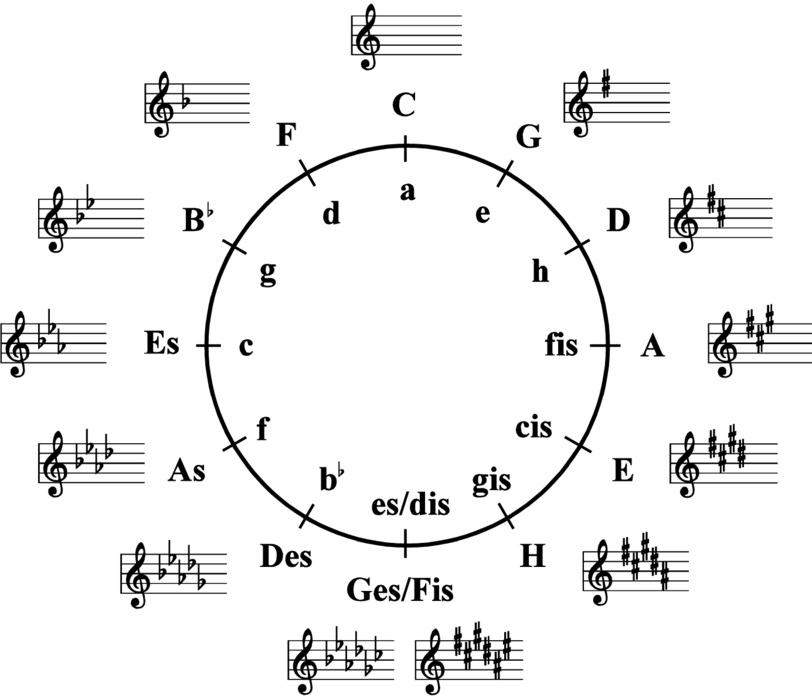
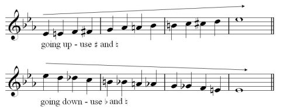
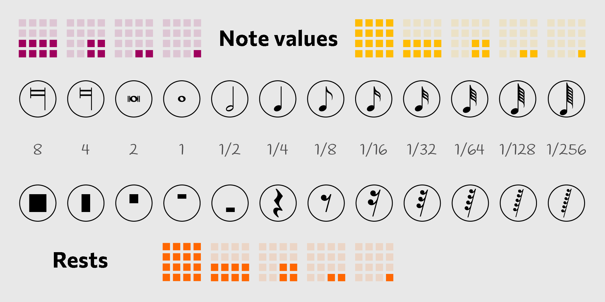

## Clefs

1. Treble (G) <abc-render :abc="'K:treble\nG8'" />
2. Bass (F) <abc-render :abc="'K:bass\nF,8'" />
3. Baritone (F) <abc-render :abc="'K:bass3\nF,8'" />
4. Tenor (C) <abc-render :abc="'K:tenor\nc,8'" />
5. Alto (C) <abc-render :abc="'K:alto\nc,8'" />
6. Mezzosoprano (C) <abc-render :abc="'K:alto2\nc,8'" />
7. Soprano (C) <abc-render :abc="'K:alto1\nc,8'" />

## Note pitch

### Natural (G)

<abc-render :abc="'G8'" />

<abc-render :abc="'K:Gb\n=G8'" />

### Sharp (G#)

<abc-render :abc="'^G8'" />

<abc-render :abc="'K:Gb\n^^G8'" />

### Flat (Gb)

<abc-render :abc="'_G8'" />

<abc-render :abc="'K:C#\n__G8'" />

### Ascending

A A# B C C# D D# E F F# G G# A

<abc-render responsive :abc="'A,^A,B,C^CD^DEF^FG^GA'" />

### Descending

A Ab G Gb F E Eb D Db C B Bb A

<abc-render responsive :abc="`a,_a,G_GFE_ED_DCB,_B,A,`" />

## Note values (durations)

Whole note = 2 half notes = 4 quarter notes = 8 eighth notes = 16 sixteenth notes

<abc-render responsive :abc="`M:4/4\n|G8|G4A4|G2A2B2c2|GDGDGDGD|G/D/G/D/G/D/G/D/G/D/G/D/G/D/G/D/|`" />

### Dotted notes

<abc-render responsive :abc="`M:4/4\n|(G12|G4)|G5G2|G3GG3G|G3/2G/2G3/2G/2G3/2G/2G3/2G/2|`" />

### Triplets

<abc-render responsive :abc="`M:4/4\n|(3G4A4B4|(3G2A2B2 (3G2A2B2| (3GAB (3GAB (3GAB (3GAB|`" />

### Other tuplets

<abc-render responsive :abc="`M:4/4\n|(5G2A2B2c2d2|(7CDEFGAB|`" />

### Rests

<abc-render responsive :abc="`M:4/4\n|z8|z4z4|z2z2z2z2|zzzzzzzz|z/z/z/z/z/z/z/z/z/z/z/z/z/z/z/z/|`" />

> 
> J.S.Bach Prelude

### Alexander Scriabin - Piano Concerto in F sharp minor, Op. 20

<youtube-embed video="F734PyD3NAw" />

[Sight reading](./sight-reading/index.md)