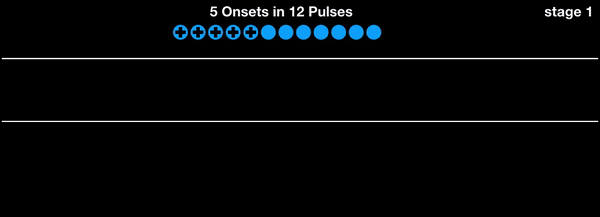
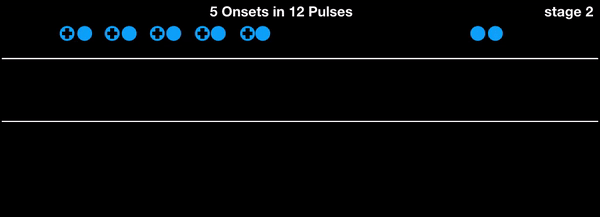
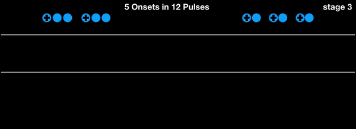
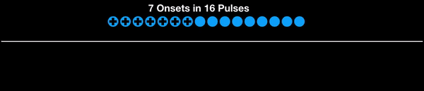
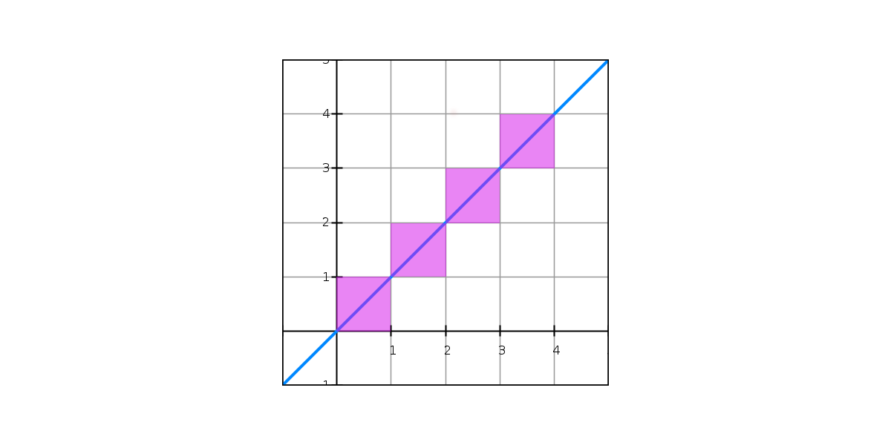
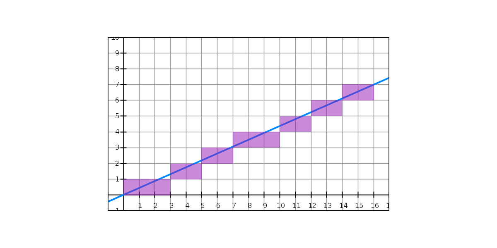
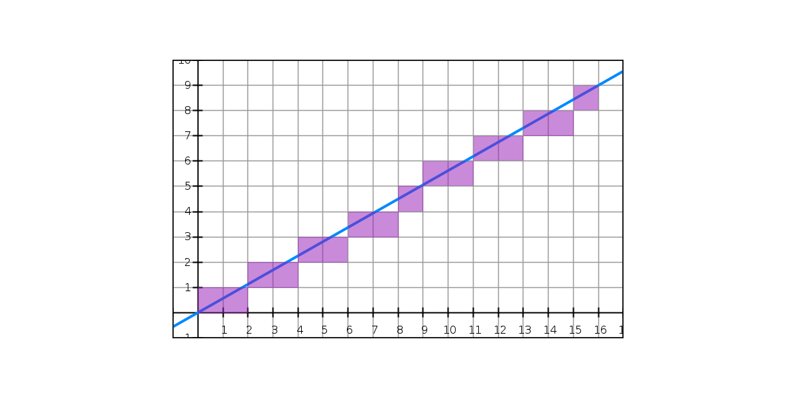

‘Euclidean’ rhythms are one of the few ideas for algorithmically generating musical material that has gained relative popularity over the last few years. We say ‘relative’ because we really don’t know how many composers/electronic producers really have heard of them in the grand scheme of things, but if you do a google search on this you’ll get far more hits than searching for, for example, music from L-systems. Many DAWs, iOS apps, MAX/MSP patches etc, allow music makers to generate Euclidean rhythms.

## What are Euclidean rhythms?

So what does it mean, and why has it become popular? What does Euclid have to do with this? Euclidean rhythms are essentially a way of spacing out **n** events (let's call them ‘onsets’) across **m** positions (essentially, pulses or beats) as evenly possible. If you space out, for example, 4 onsets across 16 positions, the result is just 4 evenly spaced onsets. But if the number of onsets is relatively prime with respect to the number of pulses, the resulting pattern is more interesting. The term ‘Euclidean rhythm’ comes from a paper by McGill University computer scientist Godfried T. Toussaint, and fortunately his paper is [available online](/media/pdf/banff.pdf).

In the paper, Toussaint starts by explaining an algorithm by E. Bjorklund used in certain components of spallation neutron source (SNS) accelerators that require spacing out pulses across a certain number of time events as equidistantly as possible. After giving an example of how Bjorklund’s algorithm works, he shows that it has a parallel structure to Euclid’s algorithm from the Elements which uses repeated subtraction to establish the **greatest common divisor** (GCD) for two numbers.

### Here is a simple example of Bjorklund’s algorithm spacing 5 onsets across 12 intervals (pulses).

We start with **five onsets** on the left (the ‘front’ group) and the **seven non-onsets** on the right (the ‘back’ group). We pair up one element from the front with one from the back until either the front or back group is exhausted. When we’re finished the newly combined elements will form the front group at the next iteration, and whatever is left over will form the new back group (in this case the two non-onsets):



We then repeat the process. Note that the combined elements from stage 1, are treated as single units here. At this stage, we start with five elements in the front and only two in the back. We combine them as before, but this time we will exhaust the back group first, with three elements left at the front — these will form the new back group, and the combined elements again are the new front group:




We just recursively repeat these steps until the back group has one (or zero) elements. At the start of third iteration, we have two elements in the front and three at the back and after combining them, the back group has a single element and so we are finished.




In conventional notation, the rhythm would look like this:


Euclidean rhythms are often understood as ‘rhythm necklaces’, that is, you could rotate this pattern so that each of the five onsets could be in the first position, and those five patterns would share the maximally equidistant property that this procedure generates. We could say that this algorithm generates five patterns (in this case) that belong to the same necklace.

By the way, if you want to get a better sense of what these patterns sound like, I’ve included a CodePen below that will sound out these patterns for you (and generate all of their rotations).

Here is an animation of 7 onsets in 16 pulses:




And again the resultant rhythm in standard notation:


Toussaint could have called them Bjorklund rhythms, but Euclidean rhythm has a more timeless feel. As I will discuss later, there are other ways of deriving the same set of patterns.

## Euclidean rhythm in code

This is fairly basic to code. As an input, we’ll use the number of onsets, and a total number of pulses. To keep things simple we’ll have our end result be an array of 1s (onset) and 0s (no onset). Conceptually, we need keep track of two groups: a front group and a back group. To start, the front group will be an array consisting of the onsets (each in their own array) and the back array will consist of one array for each non-onset pulse. Then recursively we create a new front array by concatenating pairs from the old front and back until we run out of elements in either the front or the back, and the new back array will be whatever elements are left over. We keep going until the back array has one (or zero) elements, then we flatten the resulting 2nd array. Our Swift code looks something like this:

```swift
func generateEuclidean(onsets: Int, pulses: Int) -> [Int] {
    let front:[[Int]] = Array(repeating: [1], count: onsets)
    let back:[[Int]] = Array(repeating: [0], count: pulses - onsets)
    return euclidRecursive(front: front, back: back).flatMap {$0}
}

private func euclidRecursive (front: [[Int]], back: [[Int]]) -> [[Int]] {
    var back = back
    var front = front
    
    guard back.count > 1 else { return front + back }
    
    var newFront = [[Int]]()
    while front.count > 0 && back.count > 0 {
        newFront.append(front.popLast()! + back.popLast()!)
    }
    return euclidRecursive(front: newFront, back: front + back)
}
```


## An alternate approach: Bresenham’s line algorithm

As we mentioned earlier, there are other ways to get at this set of patterns. In rather quirky little book called [Creating Rhythms by Stephan Hollis and J. Richard Hollis](https://www.amazon.co.jp/Creating-Rhythms-English-Stefan-Hollos-ebook/dp/B00IQWM8EA/ref=sr_1_1?ie=UTF8&qid=1505108854&sr=8-1&keywords=creating+rhythm), it is pointed out that Toussaint’s rhythms can also be derived using [Christoffel words](https://en.wikipedia.org/wiki/Christoffel_symbols). A related, but more direct approach, is to use [Bresenham’s line algorithm](https://en.wikipedia.org/wiki/Bresenham%27s_line_algorithm) which I will explain here.

Basically Bresenham’s algorithm is used for drawing a line in a raster graphics environment. In raster graphics we have essentially a bitmap, i.e., a two-dimensional grid of discrete points or pixels. If we want to draw a straight diagonal line with a slope of 1 in a bitmap, we colour a pixel, then colour the pixel that is up and to its right, then the next pixel that is up and to the right of that one, and so on.



While this is straight forward when the rise evenly divides into the run, when they are relatively prime the situation is more interesting. Some of the pixels will need to be directly adjacent to each other, while some will need to move up and to the right. For example, if our line has a slope of 7/16, it will need to go up 7 times per 16 squares. What principle can we use to determine when we need to go up? To make the line appear straight, we will need to space out those rises as evenly as possible. It becomes essentially the same problem that Bjorklund solved. And we don’t even need a fancy algorithm for it, we can get it directly from the slope of the line. We could just take the floor (or the ceiling) of the y-value at each integer x-point and use that as our y-coordinate.



And to get our rhythm, we can just say that if floor of the y-value at each x is the same as the previous value, then it is a continuation of the previous onset, and if it has a new y-value, it is the beginning of a new onset.



Here is the algorithm in Swift. Not that the Bjorklund approach was difficult, but the Bresenham approach is incredibly simple to code.

```swift
func bresenhamEuclidean(onsets: Int, pulses: Int) -> [Int] {
    let slope = Double(onsets) / Double(pulses)
    var result = [Int]()
    var previous: Int? = nil
    for i in 0..<pulses {
        let current = Int(floor(Double(i) * slope))
        result.append(current != previous ? 1 : 0)
        previous = current
    }
    return result
}
```


## And what does it sound like?

You can listen to any Euclidean pattern in the [Circular metronome app](./../../../../apps/rhythm/circle/index.md), the algorhithm is used to set a default position for mutes along the beat cycle. Just mute some notes in a cycle and press the reset button. It will create the rhythm for you. There're also ‘rotate buttons’ that will rotate the pattern by taking the final onset and moving it to the start of the pattern (recall that although the algorithms discussed here generate a single pattern, they stand for a ‘rhythm necklace’ that includes all the rotations of that pattern that start with an onset).


## A musical analysis

What are some of the properties of these rhythms? Well, most importantly, the locations of the onsets are spaced out as evenly as possible. If the number of time events is an integer multiple of the number of pulses, then they will be completely even (e.g., four groups of four), and the result is entirely trivial. But when number of onsets and pulses are relatively prime, the results will have some interesting characteristics. There are two properties that we can observe from this maximal spacing.

First, if we look at the distance (in pulses) between adjacent onsets, we can see that each rhythm generated by these algorithms will have at most two possible distances between adjacent onsets, and that these distances differ by at most one pulse. In the first example (5 of 12), some of the onsets are three pulses apart and other are two pulses apart. In the 9 of 16 example, the distances are two and one.

Whenever we have these two distances (i.e, when the two numbers are relatively prime) we will usually have a syncopated rhythm, because the two duration lengths in use will be interleaved as much as possible. That is, if we have some groups of two and some groups of three, they will alternate whenever they can, creating large chunks often with one having an odd number of pulses. So when the repetition of some rhythm pattern occurs (for example, the two instances of [x o o x o] in the 5 in 12 example), the first instance will start on the beat, and the second will start off the beat. This gives this set of rhythms a characteristic sound.

So what is the big deal about these rhythms? Are they special? I would say that from a composer’s point of view, they aren’t anything to write home about. A composer/songwriter/improvising musician can easily come up with many rhythms that will resonate with a listener, many of which will not be Euclidean.

It is true that these rhythms do occur frequently in world music (from Toussaint’s point of view, notably Afro-Cuban, and sub-Saharan music). The maximally distributed property of these rhythms might somehow have some appeal to the human perceptual system. And rhythms where there is some repeating odd length fragment are interesting, but there is nothing magical about them. They aren’t necessary, and I don’t think the average composers, discovering these rhythms would think them worth adding to their bag of tricks.

But from the point of view of someone generating a rhythm algorithmically, they are more significant. There are many many ways to arbitrarily generate a rhythm of some length — and most of them sound, well, arbitrary.  

The point here is that patterns that form the set of Euclidean rhythms are highly reliable. Many Euclidean rhythms are not at all interesting (e.g., all of them where the onset number is a factor of the total pulse number), but they will almost never sound bad. For someone trying to quickly make something out of nothing on a music creation app, they clearly have some value.

## Relationship to MOS (Well-Formed) Rhythms

Euclidean rhythms are a special case of MOS/well-formed rhythms, in which the generator is an integer division of the period, and the relationship between the large and small step sizes is a [superparticular number](https://en.xen.wiki/w/Superparticular).

Thus, Euclidean rhythms are the direct analogy of [maximally even MOS scales](https://en.xen.wiki/w/Maximal_evenness) in equal temperaments.

## Relationship to aksak

Aksak, a Turkic/Balkan rhythmic concept in which a meter (usually uneven) is divided into cells of two and three steps, is represented in any metric length, given a certain density. So not only are the majority of traditional aksak rhythms represented, Euclidean rhythms offer a way to extend the concept even further.

Euclidean rhythms consisting of only groups of two and three will be labeled aksak-compatible.

- [Original article by Jeff Holtzkener](https://medium.com/code-music-noise/euclidean-rhythms-391d879494df)
- [Euclidean rhythm by Godfried T. Toussaint](/media/pdf/banff.pdf) + [русский перевод](https://habr.com/ru/post/278265/)
- [Geometry of Musical Rhythm](https://en.wikipedia.org/wiki/The_Geometry_of_Musical_Rhythm)
- [Music and Euclid's algorithm](https://plus.maths.org/content/os/issue40/features/wardhaugh/index)
- [Maximum Evenness, Maximum Groove](https://www.lawtonhall.com/blog/euclidean-rhythms-pt1)