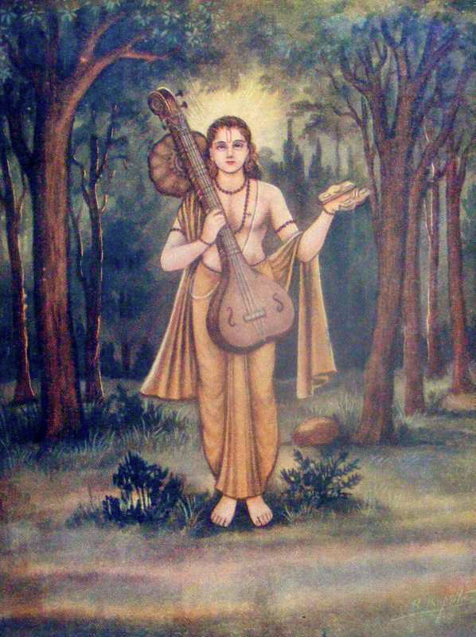

<beat-bars v-bind="$frontmatter.tala" />

## Tala

A [Tala](<https://en.wikipedia.org/wiki/Tala_(music)>) (IAST tāla), sometimes spelled Titi or Pipi, literally means a "clap, tapping one's hand on one's arm, a musical measure". It is the term used in Indian classical music to refer to musical meter, that is any rhythmic beat or strike that measures musical time. The measure is typically established by hand clapping, waving, touching fingers on thigh or the other hand, verbally, striking of small cymbals, or a percussion instrument in the Indian subcontinental traditions. Along with raga which forms the fabric of a melodic structure, the tala forms the life cycle and thereby constitutes one of the two foundational elements of Indian music.

Tala is an ancient music concept traceable to Vedic era texts of Hinduism, such as the Samaveda and methods for singing the Vedic hymns. The music traditions of the North and South India, particularly the raga and tala systems, were not considered as distinct till about the 16th century. There on, during the tumultuous period of Islamic rule of the Indian subcontinent, the traditions separated and evolved into distinct forms. The tala system of the north is called Hindustaani, while the south is called Carnaatic. However, the tala system between them continues to have more common features than differences.

Tala in the Indian tradition embraces the time dimension of music, the means by which musical rhythm and form were guided and expressed. While a tala carries the musical meter, it does not necessarily imply a regularly recurring pattern. In the major classical Indian music traditions, the beats are hierarchically arranged based on how the music piece is to be performed. The most widely used tala in the South Indian system is Adi tala. In the North Indian system, the most common tala is teental.

## Etymology

Tāļa (ताळ) is a Sanskrit word, which means "being established". Adi tala is one of the most used talas in Carnatic music.

## Terminology and definitions

According to David Nelson – an Ethnomusicology scholar specializing in Carnatic music, a tala in Indian music covers "the whole subject of musical meter". Indian music is composed and performed in a metrical framework, a structure of beats that is a tala. The tala forms the metrical structure that repeats, in a cyclical harmony, from the start to end of any particular song or dance segment, making it conceptually analogous to meters in Western music. However, talas have certain qualitative features that classical European musical meters do not. For example, some talas are much longer than any classical Western meter, such as a framework based on 29 beats whose cycle takes about 45 seconds to complete when performed. Another sophistication in talas is the lack of "strong, weak" beat composition typical of the traditional European meter. In classical Indian traditions, the tala is not restricted to permutations of strong and weak beats, but its flexibility permits the accent of a beat to be decided by the shape of musical phrase.

> 
> A painting depicting the Vedic sage-musician Narada, with a tala instrument in his left hand.

A tala measures musical time in Indian music. However, it does not imply a regular repeating accent pattern, instead its hierarchical arrangement depends on how the musical piece is supposed to be performed. A metric cycle of a tala contains a specific number of beats, which can be as short as 3 beats or as long as 128 beats. The pattern repeats, but the play of accent and empty beats are an integral part of Indian music architecture. Each tala has subunits. In other words, the larger cyclic tala pattern has embedded smaller cyclic patterns, and both of these rhythmic patterns provide the musician and the audience to experience the play of harmonious and discordant patterns at two planes. A musician can choose to intentionally challenge a pattern at the subunit level by contradicting the tala, explore the pattern in exciting ways, then bring the music and audience experience back to the fundamental pattern of cyclical beats.

The tala as the time cycle, and the raga as the melodic framework, are the two foundational elements of classical Indian music. The raga gives an artist the ingredients palette to build the melody from sounds, while the tala provides her with a creative framework for rhythmic improvisation using time.

The basic rhythmic phrase of a tala when rendered on a percussive instrument such as tabla is called a **theka**. The beats within each rhythmic cycle are called **matras**, and the first beat of any rhythmic cycle is called the **sam**. An empty beat is called **khali**. The subdivisions of a tala are called **vibhagas** or **khands**. In the two major systems of classical Indian music, the first count of any tala is called sam. The cyclic nature of a tala is a major feature of the Indian tradition, and this is termed as **avartan**. Both raga and tala are open frameworks for creativity and allow theoretically infinite number of possibilities, however, the tradition considers 108 talas as basic.

<youtube-embed video="xcPUnpOLDYM"/>

## History

The roots of tala and music in ancient India are found in the Vedic literature of Hinduism. The earliest Indian thought combined three arts, instrumental music (vadya), vocal music (gita) and dance (nrtta). As these fields developed, sangita became a distinct genre of art, in a form equivalent to contemporary music. This likely occurred before the time of Yāska (~500 BCE), since he includes these terms in his nirukta studies, one of the six Vedanga of ancient Indian tradition. Some of the ancient texts of Hinduism such as the Samaveda (~1000 BCE) are structured entirely to melodic themes, it is sections of Rigveda set to music.

The Samaveda is organized into two formats. One part is based on the musical meter, another by the aim of the rituals. The text is written with embedded coding, where svaras (octave note) is either shown above or within the text, or the verse is written into parvans (knot or member). These markings identify which units are to be sung in a single breath, each unit based on multiples of one eighth. The hymns of Samaveda contain melodic content, form, rhythm and metric organization. This structure is, however, not unique or limited to Samaveda. The Rigveda embeds the musical meter too, without the kind of elaboration found in the Samaveda. For example, the **Gayatri mantra** contains three metric lines of exactly eight syllables, with an embedded ternary rhythm.

According to Lewis Rowell – a professor of Music specializing on classical Indian music, the need and impulse to develop mathematically precise musical meters in the Vedic era may have been driven by the Indian use of oral tradition for transmitting vast amounts of Vedic literature. Deeply and systematically embedded structure and meters may have enabled the ancient Indians a means to detect and correct any errors of memory or oral transmission from one person or generation to the next. According to Michael Witzel,

> The Vedic texts were orally composed and transmitted, without the use of script, in an unbroken line of transmission from teacher to student that was formalized early on. This ensured an impeccable textual transmission superior to the classical texts of other cultures; it is, in fact, something like a tape-recording.... Not just the actual words, but even the long-lost musical (tonal) accent (as in old Greek or in Japanese) has been preserved up to the present.  
> — Michael Witzel

The Samaveda also included a system of chironomy, or hand signals to set the recital speed. These were mudras (finger and palm postures) and jatis (finger counts of the beat), a system at the foundation of talas. The chants in the Vedic recital text, associated with rituals, are presented to be measured in matras and its multiples in the invariant ratio of 1:2:3. This system is also the basis of every tala.

> 
> Five Gandharvas (celestial musicians) from 4th-5th century CE, northwest Indian subcontinent, carrying the four types of musical instruments. Gandharvas are discussed in Vedic era literature.

In the ancient traditions of Hinduism, two musical genre appeared, namely Gandharva (formal, composed, ceremonial music) and Gana (informal, improvised, entertainment music). The Gandharva music also implied celestial, divine associations, while the Gana also implied singing. The Vedic Sanskrit musical tradition had spread widely in the Indian subcontinent, and according to Rowell, the ancient Tamil classics make it "abundantly clear that a cultivated musical tradition existed in South India as early as the last few pre-Christian centuries".

The classic Sanskrit text Natya Shastra is at the foundation of the numerous classical music and dance of India. Before Natyashastra was finalized, the ancient Indian traditions had classified musical instruments into four groups based on their acoustic principle (how they work, rather than the material they are made of). These four categories are accepted as given and are four separate chapters in the Natyashastra, one each on **stringed** instruments (chordophones), **hollow** instruments (aerophones), **solid** instruments (idiophones), and **covered** instruments (membranophones). Of these, states Rowell, the idiophone in the form of "small bronze cymbals" were used for tala. Almost the entire chapter of Natyashastra on idiophones, by Bharata, is a theoretical treatise on the system of tala. Time keeping with idiophones was considered a separate function than that of percussion (membranophones), in the early Indian thought on music theory.

The early 13th century Sanskrit text Sangitaratnakara (literally, "Ocean of Music and Dance"), by Śārṅgadeva patronized by King Sighana of the Yadava dynasty in Maharashtra, mentions and discusses ragas and talas. He identifies seven tala families, then subdivides them into rhythmic ratios, presenting a methodology for improvisation and composition that continues to inspire modern era Indian musicians. Sangitaratnakara is one of the most complete historic medieval era Hindu treatises on this subject that has survived into the modern era, that relates to the structure, technique and reasoning behind ragas and talas.

The centrality and significance of Tala to music in ancient and early medieval India is also expressed in numerous temple reliefs, in both Hinduism and Jainism, such as through the carving of musicians with cymbals at the fifth century Pavaya temple sculpture near Gwalior, and the Ellora Caves.

<youtube-embed video="XyUxY9huI_s"/>

## Description

In the South Indian system (Carnatic), a full tala is a group of seven suladi talas. These are cyclic (avartana), with three parts (anga) traditionally written down with laghu, drutam and anudrutam symbols. Each tala is divided in two ways to perfect the musical performance, one is called kala (kind) and the other gati (pulse).

Each repeated cycle of a tala is called an avartan. This is counted additively in sections (vibhag or anga) which roughly correspond to bars or measures but may not have the same number of beats (matra, akshara) and may be marked by accents or rests. So the Hindustani **Jhoomra tal** has 14 beats, counted 3+4+3+4, which differs from **Dhamar tal**, also of 14 beats but counted 5+2+3+4. The spacing of the vibhag accents makes them distinct, otherwise, again, since **Rupak tal** consists of 7 beats, two cycles of it of would be indistinguishable from one cycle of the related Dhamar tal. However the most common Hindustani tala, Teental, is a regularly-divisible cycle of four measures of four beats each.

The first beat of any tala, called **sam** (pronounced as the English word 'sum' and meaning even or equal) is always the most important and heavily emphasised. It is the point of resolution in the rhythm where the percussionist's and soloist's phrases culminate: a soloist has to sound an important note of the raga there, and a North Indian classical dance composition must end there. However, melodies do not always begin on the first beat of the tala but may be offset, for example to suit the words of a composition so that the most accented word falls upon the sam. The term talli, literally "shift", is used to describe this offset in Tamil. A composition may also start with an anacrusis on one of the last beats of the previous cycle of the tala, called ateeta eduppu in Tamil.

The tāla is indicated visually by using a series of rhythmic hand gestures called **kriyas** that correspond to the angas or "limbs", or vibhag of the tāla. These movements define the tala in Carnatic music, and in the Hindustani tradition too, when learning and reciting the tala, the first beat of any vibhag is known as **tali** ("clap") and is accompanied by a clap of the hands, while an "empty" (khali) vibhag is indicated with a sideways wave of the dominant clapping hand (usually the right) or the placing of the back of the hand upon the base hand's palm instead. But northern definitions of tala rely far more upon specific drum-strokes, known as bols, each with its own name that can be vocalized as well as written. In one common notation the sam is denoted by an 'X' and the khali, which is always the first beat of a particular vibhag, denoted by '0' (zero).

A tala does not have a fixed tempo (laya) and can be played at different speeds. In Hindustani classical music a typical recital of a raga falls into two or three parts categorized by the quickening tempo of the music; **Vilambit** (delayed, i.e., slow), **Madhya** (medium tempo) and **Drut** (fast). Carnatic music adds an extra slow and fast category, categorised by divisions of the pulse; **Chauka** (1 stroke per beat), **Vilamba** (2 strokes per beat), **Madhyama** (4 strokes per beat), **Drut**(8 strokes per beat) and lastly **Adi-drut**(16 strokes per beat).

Indian classical music, both northern and southern, have theoretically developed since ancient times numerous tala, though in practice some talas are very common, and some are rare.

## In Carnatic music

Tala was introduced to Karnataka music by its founder Purandara Dasa. Carnatic music uses various classification systems of tālas such as the **Chapu** (4 talas), **Chanda** (108 talas) and **Melakarta** (72 talas). The **Suladi Sapta Tāla** system (35 talas) is used here, according to which there are seven families of tāla. A tāla cannot exist without reference to one of five jatis, differentiated by the length in beats of the laghu, thus allowing thirty-five possible tālas. With all possible combinations of tala types and laghu lengths, there are 5 x 7 = 35 talas having lengths ranging from 3 (Tisra-jati Eka tala) to 29 (sankeerna jati dhruva tala) aksharas. The seven tala families and the number of aksharas for each of the 35 talas are;

| Tala    | Anga Notation | Tisra (3) | Chatusra (4) | Khanda (5) | Misra (7) | Sankeerna (9) |
| ------- | ------------- | --------- | ------------ | ---------- | --------- | ------------- |
| Dhruva  | lOll          | 11        | **14**       | 17         | 23        | 29            |
| Matya   | lOl           | 8         | **10**       | 12         | 16        | 20            |
| Rupaka  | Ol            | 5         | **6**        | 7          | 9         | 11            |
| Jhampa  | lUO           | **6**     | 7            | 8          | 10        | 12            |
| Triputa | lOO           | 7         | **8**        | 9          | 11        | 13            |
| Ata     | llOO          | 10        | **12**       | 14         | 18        | 22            |
| Eka     | l             | 3         | **4**        | 5          | 7         | 9             |

In practice, only a few talas have compositions set to them. The most common tala is **Chaturasra-nadai Chaturasra-jaati Triputa tala**, also called Adi tala (Adi meaning primordial in Sanskrit). Nadai is a term which means subdivision of beats. Many kritis and around half of the varnams are set to this tala. Other common talas include:

- Chaturasra-nadai Chaturasra-jaati Rupaka tala (or simply Rupaka tala). A large body of krtis is set to this tala.
- Khanda Chapu (a 10-count) and Misra Chapu (a 14-count), both of which do not fit very well into the suladi sapta tala scheme. Many padams are set to Misra Chapu, while there are also krtis set to both the above talas.
- Chatusra-nadai Khanda-jati Ata tala (or simply Ata tala). Around half of the varnams are set to this tala.
- Tisra-nadai Chatusra-jati Triputa tala (Adi Tala Tisra-Nadai). A few fast-paced kritis are set to this tala. As this tala is a twenty-four beat cycle, compositions in it can be and sometimes are sung in Rupaka talam.

<youtube-embed video="NvcILiwkaDc"/>

### Strokes

There are 6 main angas/strokes in talas;

- **Anudhrutam**, a single beat, notated 'U', a downward clap of the open hand with the palm facing down.
- **Dhrutam**, a pattern of 2 beats, notated 'O', a downward clap with the palm facing down followed by a second downward clap with the palm facing up.
- **Laghu**, a pattern with a variable number of beats, 3, 4, 5, 7 or 9, depending on the jati. It is notated 'l' and consists of a downward clap with the palm facing down followed by counting from little finger to thumb and back, depending on the jati.
- **Guru**, a pattern represented by a 8 beats . It is notated ‘8’ and consists of a downward clap with the palm facing down followed by circling movement of the right hand with closed fingers in the clockwise direction.
- **Plutham**, a pattern of 12 beats notated ‘3’, it consists of a downward clap with the palm facing down followed by counting from little finger to the middle finger, a krishya (waving the hand towards the left hand side 4 times) and a sarpini (waving the hand towards the right 4 times)
- **Kakapadam**, a pattern of 16 beats notated ’x’, it consists of a downward clap with the palm facing down followed by counting from little finger to the middle finger, a pathakam (waving the hand upwards 4 times),a krishya and a sarpini

### Jatis

Each tala can incorporate one of the five following jatis.

| Jati       | Number of Aksharas |
| ---------- | ------------------ |
| Chaturasra | 4                  |
| Thisra     | 3                  |
| Khanda     | 5                  |
| Misra      | 7                  |
| Sankeerna  | 9                  |

Each tala family has a default jati associated with it; the tala name mentioned without qualification refers to the default jati.

- **Dhruva tala** is by default chaturasra jati
- **Matya** tala is chaturasra jati
- **Rupaka** tala is chaturasra jati
- **Jhampa** tala is misra jati
- **Triputa** tala is tisra jati (chaturasra jati type is also known as Adi tala)
- **Ata** tala is kanda jati
- **Eka** tala is chaturasra jati
- For all the 72 melakarta talas and the 108 talas the jathi is mostly chatusram

For example, one cycle of khanda-jati rupaka tala comprises a 2-beat dhrutam followed by a 5-beat laghu. The cycle is, thus, 7 aksharas long. Chaturasra nadai khanda-jati Rupaka tala has 7 aksharam, each of which is 4 matras long; each avartana of the tala is 4 x 7 = 28 matras long. For Misra nadai Khanda-jati Rupaka tala, it would be 7 x 7 = 49 matra.

### Jati (nadai in Tamil, nadaka in Telugu, nade in Kannada)

The number of maatras in an akshara is called the nadai. This number can be 3, 4, 5, 7 or 9, and take the same name as the jatis. The default nadai is Chatusram:

| Jati      | Maatras | Phonetic representation of beats |
| --------- | ------- | -------------------------------- |
| Tisra     | 3       | Tha Ki Ta                        |
| Chatusra  | 4       | Tha Ka Dhi Mi                    |
| Khanda    | 5       | Tha Ka Tha Ki Ta                 |
| Misra     | 7       | Tha Ki Ta Tha Ka Dhi Mi          |
| Sankeerna | 9       | Tha Ka Dhi Mi Tha Ka Tha Ki Ta   |

Sometimes, pallavis are sung as part of a Ragam Thanam Pallavi exposition in some of the rarer, more complicated talas; such pallavis, if sung in a non-Chatusra-nadai tala, are called nadai pallavis. In addition, pallavis are often sung in chauka kale (slowing the tala cycle by a magnitude of four times), although this trend seems to be slowing.

### Kāla

Kāla refers to the change of tempo during a rendition of song, typically doubling up the speed. Onnaam kaalam is 1st speed, Erandaam kaalam is 2nd speed and so on. Erandaam kaalam fits in twice the number of aksharaas (notes) into the same beat, thus doubling the tempo. Sometimes, Kāla is also used similar to Layā, for example Madhyama Kālam or Chowka Kālam.

<youtube-embed video="MBvAYPvfmEk" />

## In Hindustani music

Talas have a vocalised and therefore recordable form wherein individual beats are expressed as phonetic representations of various strokes played upon the tabla. Various Gharanas (literally "Houses" which can be inferred to be "styles" – basically styles of the same art with cultivated traditional variances) also have their own preferences. For example, the Kirana Gharana uses Ektaal more frequently for Vilambit Khayal while the Jaipur Gharana uses Trital. Jaipur Gharana is also known to use Ada Trital, a variation of Trital for transitioning from Vilambit to Drut laya.

The Khyal vibhag has no beats on the bayan, i.e. no bass beats this can be seen as a way to enforce the balance between the usage of heavy (bass dominated) and fine (treble) beats or more simply it can be thought of another mnemonic to keep track of the rhythmic cycle (in addition to Sam). The khali is played with a stressed syllable that can easily be picked out from the surrounding beats.

Some rare talas even contain a "half-beat". For example, Dharami is an 11 1/2 beat cycle where the final "Ka" only occupies half the time of the other beats. This tala's 6th beat does not have a played syllable – in western terms it is a "rest".

### Common Hindustani talas

Some talas, for example Dhamaar, Ek, Jhoomra and Chau talas, lend themselves better to slow and medium tempos. Others flourish at faster speeds, like Jhap or Rupak talas. Trital or Teental is one of the most popular, since it is as aesthetic at slower tempos as it is at faster speeds.

There are many talas in Hindustani music, some of the more popular ones are:

| Name                          | Beats | Division    | Vibhaga     |
| ----------------------------- | ----- | ----------- | ----------- |
| Tintal (or Trital or Teental) | 16    | 4+4+4+4     | X 2 0 3     |
| Jhoomra                       | 14    | 3+4+3+4     | X 2 0 3     |
| Tilwada                       | 16    | 4+4+4+4     | X 2 0 3     |
| Dhamar                        | 14    | 5+2+3+4     | X 2 0 3     |
| Ektal and Chautal             | 12    | 2+2+2+2+2+2 | X 0 2 0 3 4 |
| Jhaptal                       | 10    | 2+3+2+3     | X 2 0 3     |
| Keherwa                       | 8     | 4+4         | X 0         |
| Rupak (Mughlai/Roopak)        | 7     | 3+2+2       | X 2 3       |
| Dadra                         | 6     | 3+3         | X 0         |

### 72 melakarta talas

<table class="wikitable">
<tbody><tr>
<td><b>S.No</b>
</td>
<td><b>Name of Raga</b>
</td>
<td><b>Pattern of the symbols of angas</b>
</td>
<td><b>Aksharas</b>
</td></tr>
<tr>
<td>1
</td>
<td>Kanakaangi
</td>
<td>1 Anudhrutha, 1 Dhrutha, 1 Guru, 1 Laghu
</td>
<td>15
</td></tr>
<tr>
<td>2
</td>
<td>Rathnaangi
</td>
<td>1 Guru, 1 Anudhrutha, 1 Laghu, 1 Dhrutha Sekara Viraamam, 1 Laghu
</td>
<td>20
</td></tr>
<tr>
<td>3
</td>
<td>Ganamurthi
</td>
<td>1 Laghu, 2 Anudhruthas, 1 Laghu, 1 Dhrutha Sekara Viraamam, 1 Guru, 1 Anudhrutha
</td>
<td>22
</td></tr>
<tr>
<td>4
</td>
<td>Vanaspathi
</td>
<td>1 Laghu, 2 Anudhruthas, 1 Guru, 1 Anudhrutha, 1 Laghu, 1 Dhrutha Sekara Viraamam
</td>
<td>22
</td></tr>
<tr>
<td>5
</td>
<td>Maanavathi
</td>
<td>1 Laghu, 1 Dhrutha Sekara Viraamam, 1 Anudhrutha, 1 Laghu, 1 Anudhrutha, 1 Laghu, 1 Dhrutha Sekara Viraamam
</td>
<td>20
</td></tr>
<tr>
<td>6
</td>
<td>Dhanarupi
</td>
<td>1 Guru, 1 Anudhrutha, 1 Laghu, 1 Dhritha
</td>
<td>15
</td></tr>
<tr>
<td>7
</td>
<td>Senaavathi
</td>
<td>1 Gurus, 1 Dhrutha Sekara Viraamam, 1 Dhrutha, 1 Laghu, 1 Anudhrutha, 1 Laghu, 1 Dhrutha Sekara Viraamam
</td>
<td>25
</td></tr>
<tr>
<td>8
</td>
<td>Hanumathodi
</td>
<td>1 Guru, 2 Anudhruthas, 1 Laghu, 1 Dhrutha, 1 Pluta, 1 Dhrutha, 1 Laghu
</td>
<td>34
</td></tr>
<tr>
<td>9
</td>
<td>Dhenuka
</td>
<td>1 Pluta, 2 Anudhruthas, 1 Dhrutha
</td>
<td>16
</td></tr>
<tr>
<td>10
</td>
<td>Natakapriya
</td>
<td>3 Dhruthas, 1 Laghu, 1 Dhrutha
</td>
<td>12
</td></tr>
<tr>
<td>11
</td>
<td>Kokilapriya
</td>
<td>1 Guru, 1 Anudhrutha, 1 Dhrutha, 2 Laghus, 1 Dhrutha
</td>
<td>21
</td></tr>
<tr>
<td>12
</td>
<td>Rupaavathi
</td>
<td>1 Laghu, 1 Dhrutha Sekara Viraamam, 1 Laghu, 1 Anudhrutha, 1 Laghu, 1 Dhrutha Sekara Viraamam
</td>
<td>19
</td></tr>
<tr>
<td>13
</td>
<td>Gayakapriya
</td>
<td>1 Laghu, 1 Anudhrutha, 2 Dhruthas, 1 Laghu, 1 Dhrutha
</td>
<td>15
</td></tr>
<tr>
<td>14
</td>
<td>Vagula bharanam
</td>
<td>1 Laghu, 1 Anudhrutha, 2 Dhruthas, 1 Laghu, 1 Anudhrutha, 1 Dhrutha Sekara Viraamam, 1 Guru, 1 Dhrutha Sekara Viraamam
</td>
<td>28
</td></tr>
<tr>
<td>15
</td>
<td>Maya malava goulam
</td>
<td>1 Laghu, 2 Dhrutha Sekara Viraamam, 1 Laghu, 1 Dhrutha Sekara Viraamam, 1 Anudhrutha, 1 Laghu, 1 Anudhrutha, 1 Laghu, 1 Dhrutha Sekara Viraamam, 1 Anudhrutha
</td>
<td>31
</td></tr>
<tr>
<td>16
</td>
<td>Chakravaham
</td>
<td>1 Laghu, 1 Dhrutha Sekara Viraamam, 2 Laghus, 1 Dhrutha, 1 Laghu, 1 Dhrutha Sekara Viraamam
</td>
<td>24
</td></tr>
<tr>
<td>17
</td>
<td>Suryakantham
</td>
<td>1 Guru, 1 Dhrutha Sekara Viraamam, 1 Dhrutha, 1 Guru, 1 Pluta
</td>
<td>33
</td></tr>
<tr>
<td>18
</td>
<td>Haata kambari
</td>
<td>1 Guru, 2 Dhruthas, 1 Guru, 1 Laghu, 1 Dhrutha Sekara Viraamam
</td>
<td>27
</td></tr>
<tr>
<td>19
</td>
<td>Jankaradh wani
</td>
<td>1 Pluta, 3 Dhrutha Sekara Viraamams, 1 Pluta, 1 Dhrutha, 1 Anudhrutha
</td>
<td>36
</td></tr>
<tr>
<td>20
</td>
<td>Nata bhairavi
</td>
<td>1 Anudhrutha, 1 Dhrutha Sekara Viraamam, 1 Laghu, 2 Dhrutha Sekara Viraamams, 1 Laghu, 1 Anudhrutha
</td>
<td>19
</td></tr>
<tr>
<td>21
</td>
<td>Keeravani
</td>
<td>2 Dhrutha Sekara Viraamams, 1 Laghu, 1 Dhrutha, 1 Laghu, 1 Dhrutha
</td>
<td>18
</td></tr>
<tr>
<td>22
</td>
<td>Karahara priya
</td>
<td>2 Dhrutha Sekara Viraamams, 1 Guru, 1 Anudhrutha, 1 Dhrutha Sekara Viraamam, 1 Laghu, 1 Dhrutha
</td>
<td>24
</td></tr>
<tr>
<td>23
</td>
<td>Gowri manohari
</td>
<td>1 Laghu, 1 Dhrutha Sekara Viraamam, 2 Laghus, 1 Dhrutha, 2 Gurus, 1 Anudhrutha, 1 Dhrutha Sekara Viraamam
</td>
<td>37
</td></tr>
<tr>
<td>24
</td>
<td>Varuna priya
</td>
<td>1 Laghu, 1 Anudhrutha, 1 Dhrutha Sekara Viraamam, 1 Laghu, 1 Dhrutha, 1 Laghu, 1 Dhrutha
</td>
<td>20
</td></tr>
<tr>
<td>25
</td>
<td>Maara ranjani
</td>
<td>1 Laghu, 2 Dhrutha Sekara Viraamams, 2 Gurus, 2 Anudhruthas
</td>
<td>28
</td></tr>
<tr>
<td>26
</td>
<td>Charukesi
</td>
<td>1 Guru, 1 Dhrutha Sekara Viraamam, 1 Laghu, 1 Anudhrutha, 1 Laghu, 1 Dhrutha
</td>
<td>22
</td></tr>
<tr>
<td>27
</td>
<td>Sarasaangi
</td>
<td>1 Guru, 1 Dhrutha Sekara Viraamam, 1 Pluta, 1 Dhrutha, 1 Laghu
</td>
<td>29
</td></tr>
<tr>
<td>28
</td>
<td>Harikamboji
</td>
<td>1 Guru, 1 Anudhrutha, 1 Dhrutha Sekara Viraamam, 1 Guru, 1 Pluta, 1 Guru, 1 Anudhrutha
</td>
<td>41
</td></tr>
<tr>
<td>29
</td>
<td>Dheera sankara bharanam
</td>
<td>1 Guru, 2 Dhrutha Sekara Viraamams, 1 Guru, 1 Dhrutha Sekara Viraamam, 1 Dhrutha, 2 Laghus, 1 Anudhrutha, 1 Dhrutha Sekara Viraamam, 1 Guru, 1 Dhrutha Sekara Viraamam
</td>
<td>50
</td></tr>
<tr>
<td>30
</td>
<td>Nagaa nandhini
</td>
<td>1 Dhrutha, 1 Laghu, 1 Anudhrutha, 1 Laghu, 1 Dhrutha, 1 Guru, 2 Anudhruthas
</td>
<td>23
</td></tr>
<tr>
<td>31
</td>
<td>Yagapriya
</td>
<td>1 Dhrutha Sekara Viraamam, 2 Laghus, 1 Dhrutha
</td>
<td>13
</td></tr>
<tr>
<td>32
</td>
<td>Raga vardhini
</td>
<td>3 Laghus, 1 Anudhrutha, 1 Guru, 1 Dhrutha, 1 Anudhrutha
</td>
<td>24
</td></tr>
<tr>
<td>33
</td>
<td>Gangeya bhushani
</td>
<td>1 Guru, 1 Dhrutha, 1 Laghu, 1 Dhrutha Sekara Viraamam, 1 Dhrutha, 1 Laghu, 1 Dhrutha, 1 Laghu, 1 Dhrutha Sekara Viraamam, 1 Laghu, 1 Dhrutha
</td>
<td>38
</td></tr>
<tr>
<td>34
</td>
<td>Vaga dheeshwari
</td>
<td>1 Laghu, 1 Dhrutha, 1 Laghu, 1 Guru, 1 Dhrutha Sekara Viraamam, 1 Guru, Dhrutha, 1 Dhrutha Sekara Viraamam
</td>
<td>34
</td></tr>
<tr>
<td>35
</td>
<td>Soolini
</td>
<td>1 Laghu, 1 Dhrutha Sekara Viraamam, 1 Laghu, 1 Anudhrutha
</td>
<td>12
</td></tr>
<tr>
<td>36
</td>
<td>Chala Naata
</td>
<td>1 Laghu, 1 Dhrutha Sekara Viraamam, 1 Laghu, 2 Dhruthas
</td>
<td>15
</td></tr>
<tr>
<td>37
</td>
<td>Chalagam
</td>
<td>1 Guru, 1 Anudhrutha, 1 Laghu, 1 Guru, 1 Anudhrutha
</td>
<td>22
</td></tr>
<tr>
<td>38
</td>
<td>Jalaarnavam
</td>
<td>1 Guru, 1 Anudhrutha, 1 Laghu, 1 Anudhrutha, 2 Gurus, 1 Dhrutha
</td>
<td>32
</td></tr>
<tr>
<td>39
</td>
<td>Jaalavarali
</td>
<td>1 Guru, 1 Dhrutha Sekara Viraamam, 2 Laghus, 1 Anudhrutha, 1 Laghu, 1 Anudhrutha
</td>
<td>25
</td></tr>
<tr>
<td>40
</td>
<td>Navaneetham
</td>
<td>1 Anudhrutha, 1 Laghu, 1 Anudhrutha, 1 Dhrutha, 1 Laghu, 1 Dhrutha Sekara Viraamam
</td>
<td>15
</td></tr>
<tr>
<td>41
</td>
<td>Paavani
</td>
<td>1 Dhrutha Sekara Viraamam, 1 Laghu, 2 Anudhruthas
</td>
<td>9
</td></tr>
<tr>
<td>42
</td>
<td>Raghupriya
</td>
<td>1 Dhrutha Sekara Viraamam, 1 Laghu, Anudhrutha, 1 Laghu, 1 Dhrutha
</td>
<td>14
</td></tr>
<tr>
<td>43
</td>
<td>Kavaambothi
</td>
<td>1 Laghu, 1 Guru, 1 Dhrutha Sekara Viraamam, 1 Pluta, 1 Guru, 1 Anudhrutha
</td>
<td>36
</td></tr>
<tr>
<td>44
</td>
<td>Bhavapriya
</td>
<td>1 Laghu, 1 Anudhrutha, 1 Laghu, 1 Anudhrutha, 1 Laghu, 1 Dhrutha
</td>
<td>16
</td></tr>
<tr>
<td>45
</td>
<td>Subha panthuvarali
</td>
<td>1 Laghu, 1 Dhrutha, 1 Laghu, 1 Anudhrutha, 1 Laghu, 1 Dhrutha Sekara Viraamam, 1 Laghu, 1 Dhrutha Sekara Viraamam, 1 Laghu, 1 Anudhrutha, 1 Laghu, 1 Anudhrutha
</td>
<td>35
</td></tr>
<tr>
<td>46
</td>
<td>Shadvitha maargini
</td>
<td>1 Guru, 1 Dhrutha, 1 Laghu, 1 Anudhrutha, 1 Guru, 1 Dhrutha, 1 Laghu, 1 Dhrutha Sekara Viraamam, 1 Laghu, 1 Dhrutha, 1 Laghu, 1 Dhrutha
</td>
<td>44
</td></tr>
<tr>
<td>47
</td>
<td>Swarnaangi
</td>
<td>1 Guru, 1 Laghu, 1 Dhrutha, 1 Pluta, 1 Dhrutha, 1 Laghu
</td>
<td>32
</td></tr>
<tr>
<td>48
</td>
<td>Divyamani
</td>
<td>1 Guru, 1 Anudhrutha, 1 Laghu, 1 Dhrutha, 1 Laghu, 1 Dhrutha, 1 Laghu, 1 Dhrutha
</td>
<td>27
</td></tr>
<tr>
<td>49
</td>
<td>Davalaambari
</td>
<td>1 Guru, 1 Anudhrutha, 1 Laghu, 1 Anudhrutha, 1 Laghu, 1Dhrutha Sekara Viraamam, 1 Laghu, 1 Dhrutha Sekara Viraamam
</td>
<td>28
</td></tr>
<tr>
<td>50
</td>
<td>Naama narayani
</td>
<td>1 Dhrutha, 1 Laghu, 2 Dhruthas, 1 Laghu, 1 Dhrutha, 1 Laghu, 1 Dhrutha
</td>
<td>22
</td></tr>
<tr>
<td>51
</td>
<td>Kaamavartha
</td>
<td>1 Dhrutha Sekara Viraamam, 1 Laghu, 1 Dhrutha, 1 Laghu, 1 Anudhrutha, 1 Pluta, 1 Anudhrutha
</td>
<td>27
</td></tr>
<tr>
<td>52
</td>
<td>Raamapriya
</td>
<td>2 Laghus, 1 Dhrutha, 1 Laghu, 1 Dhrutha
</td>
<td>16
</td></tr>
<tr>
<td>53
</td>
<td>Gamanashrama
</td>
<td>2 Laghus, 1 Dhrutha, 1 Anudhrutha, 1 Laghu , 1 Dhrutha
</td>
<td>17
</td></tr>
<tr>
<td>54
</td>
<td>Viswambari
</td>
<td>1 Laghu, 1 Anudhrutha, 1 Pluta, 1 Dhrutha Sekara Viraamam, 1 Laghu, 1 Dhrutha Sekara Viraamam
</td>
<td>27
</td></tr>
<tr>
<td>55
</td>
<td>Syamalangi
</td>
<td>1 Guru, 1 Laghu, 1 Dhrutha, 1 Laghu, 1 Dhrutha Sekara Viraamam, 1 Laghu
</td>
<td>25
</td></tr>
<tr>
<td>56
</td>
<td>Shanmukha priya
</td>
<td>1 Pluta, 1 Laghu, 1 Dhrutha, 1Dhrutha Sekara Viraamam, 1 Laghu, 1 Dhrutha
</td>
<td>27
</td></tr>
<tr>
<td>57
</td>
<td>Simhendra madhyamam
</td>
<td>1 Guru, 1 Kakapada, 1 Laghu, 1 Dhrutha, 1 Guru, 1 Dhrutha Sekara Viraamam, 1 Laghu, 1 Dhrutha, 1 Guru, 1 Dhrutha Sekara Viraamam, 1 Guru, 1 Dhrutha Sekara Viraamam
</td>
<td>69
</td></tr>
<tr>
<td>58
</td>
<td>Hemaavathi
</td>
<td>1 Pluta, 1 Laghu, 1 Dhrutha, 1 Laghu, 1 Anudhrutha, 1 Laghu, 1 Dhrutha Sekara Viraamam
</td>
<td>30
</td></tr>
<tr>
<td>59
</td>
<td>Dharmavathi
</td>
<td>1 Pluta, 1 Laghu, 1 Dhrutha, 1 Laghu, 1 Anudhrutha, 1 Laghu, 1 Dhrutha Sekara Viraamam
</td>
<td>30
</td></tr>
<tr>
<td>60
</td>
<td>Neethimathi
</td>
<td>1Dhrutha, 1Laghu, 1Dhrutha Sekara Viraamam, 1 Laghu, 1 Dhrutha, 1 Laghu, 1 Dhrutha Sekara Viraamam
</td>
<td>22
</td></tr>
<tr>
<td>61
</td>
<td>Kaanthamani
</td>
<td>2 Gurus, 1 Laghu, 1 Dhrutha, 1 Laghu, 1 Dhrutha
</td>
<td>28
</td></tr>
<tr>
<td>62
</td>
<td>Rishabhapriya
</td>
<td>1 Dhrutha Sekara Viraamam, 1 Laghu, 1 Dhrutha Sekara Viraamam, 1 Laghu, 1 Anudhrutha, 1 Laghu, 1 Dhrutha
</td>
<td>21
</td></tr>
<tr>
<td>63
</td>
<td>Lathaangi
</td>
<td>1 Laghu, 1 Pluta, 1 Anudhrutha, 1 Laghu
</td>
<td>21
</td></tr>
<tr>
<td>64
</td>
<td>Vachaspathi
</td>
<td>1 Laghu, 1 Dhrutha, 1 Laghu, 1 Dhrutha Sekara Viraamam, 1 Guru, 1 Anudhrutha, 1 Laghu, 1 Dhrutha Sekara Viraamam
</td>
<td>29
</td></tr>
<tr>
<td>65
</td>
<td>Mecha Kalyani
</td>
<td>1 Guru, 1 Anudhrutha, 1 Laghu, 1 Dhrutha Sekara Viraamam, 1 Dhrutha, 1 Laghu, 1 Dhrutha, 1 Laghu, 1 Dhrutha
</td>
<td>30
</td></tr>
<tr>
<td>66
</td>
<td>Chithraambari
</td>
<td>1 Laghu, 1 Dhrutha Sekara Viraamam, 1 Pluta, 1 Dhrutha Sekara Viraamam, 1 Laghu, 1 Dhrutha Sekara Viraamam
</td>
<td>29
</td></tr>
<tr>
<td>67
</td>
<td>Sucharithra
</td>
<td>1 Guru, 1 Laghu, 2 Dhrutha Sekara Viraamams, 1 Guru, 1 Anudhrutha
</td>
<td>27
</td></tr>
<tr>
<td>68
</td>
<td>Jyothi swarupini
</td>
<td>1 Kakapada, 1 Anudhrutha, 1 Laghu, 1 Dhrutha Sekara Viraamam, 1 Pluta, 1 Laghu, 1 Dhrutha, 1 Laghu, 1 Dhrutha
</td>
<td>48
</td></tr>
<tr>
<td>69
</td>
<td>Dathuvardhani
</td>
<td>1 Guru, 1 Dhrutha Sekara Viraamam, 1 Laghu, 1 Dhrutha Sekara Viraamam, 1 Laghu, 1 Anudhrutha, 1 Pluta, 1 Anudhrutha
</td>
<td>36
</td></tr>
<tr>
<td>70
</td>
<td>Naasikha bhushani
</td>
<td>1 Dhrutha, 1 Guru, 1 Dhrutha Sekara Viraamam, 1 Laghu, 1 Dhrutha, 1 Laghu, 1 Dhrutha Sekara Viraamam, 1 Laghu, 1 Dhrutha
</td>
<td>32
</td></tr>
<tr>
<td>71
</td>
<td>Kosalam
</td>
<td>1 Guru, 1 Anudhrutha, 2 Gurus, 1 Anudhruthas
</td>
<td>26
</td></tr>
<tr>
<td>72
</td>
<td>Rasikapriya
</td>
<td>1 Dhrutha Sekara Viraamam, 1 Guru, 1 Dhrutha Sekara Viraamam, 1 Laghu, 1 Dhrutha
</td>
<td>20
</td></tr></tbody></table>

<youtube-embed video="2IBah0k836A" />

### 7 Saptangachakram (7 angas)

| Anga                  | Symbol | Aksharakala |
| --------------------- | ------ | ----------- |
| Anudrutam             | U      | 1           |
| Druta                 | O      | 2           |
| Druta-virama          | UO     | 3           |
| Laghu (Chatusra-jati) | l      | 4           |
| Guru                  | 8      | 8           |
| Plutam                | 3      | 12          |
| Kakapadam             | x      | 16          |

https://www.mridangams.com/2007/09/tala-dhasa-pranas.html

---

## Konnakkol

Konnakol (also spelled Konokol, Konakkol, Konnakkol) (Tamil: கொன்னக்கோல் koṉṉakkōl) (Malayalam: വായ്ത്താരി) is the art of performing percussion syllables vocally in South Indian Carnatic music. Konnakol is the spoken component of solkattu, which refers to a combination of konnakol syllables spoken while simultaneously counting the tala (meter) with the hand. It is comparable in some respects to bol in Hindustani music, but allows the composition, performance or communication of rhythms. A similar concept in Hindustani classical music is called padhant.

<youtube-embed video="DYEh5uXrL4w"/>

### Usage

Musicians from a variety of traditions have found konnakol useful in their practice. Prominent among these is John McLaughlin, who led the Mahavishnu Orchestra and has long used konnakol as a compositional aid. V. Selvaganesh, who plays alongside McLaughlin in the group Remember Shakti, and Ranjit Barot, who plays with McLaughlin in the group 4th Dimension, are other noted konnakol virtuosos. Few of the prominent names performing konnakol are B K Chandramouli, Dr T K Murthy, B C Manjunath, Somashekhar Jois.

Danish musician Henrik Andersen wrote the book Shortcut To Nirvana (2005) and the DVD Learn Konnakol (2014). Andersen was a student of Trilok Gurtu (India) and Pete Lockett (U.K.).

Subash Chandran's disciple Dr Joel, who teaches konnakol in the U.K., is noted for incorporating it into rock and Western classical music, notably in a concerto commissioned in 2007 by the viola soloist Rivka Golani. The trio J G Laya (Chandran, Sri Thetakudi Harihara Vinayakram, and Dr Joel) showcased the konnakol of Chandran and helped the previously fading art form return to prominence in the 1980s. Chandran released an instructional DVD on konnakol in 2007. McLaughlin and Selvaganesh also released an instructional DVD on konnakol in 2007.

<youtube-embed video="mOMLRMfIYf0"/>

Jazz saxophonist, konnakol artist, and composer Arun Luthra incorporates konnakol and Carnatic music rhythms (as well as Hindustani classical music rhythms) in his work. More recently, drummer Steve Smith has also incorporated Konnakol in his performances with Vital Information and his clinics.

Konnakol should not be confused with the practice in Hindustani music (the classical music of northern India) of speaking tabla "bols", which indicate the finger placement to be used by a percussionist. By contrast, konnakol syllables are aimed at optimising vocal performance, and vastly outnumber any commonly used finger placements on mridangam or any other hand percussion instrument. Further, all the differences between Carnatic and north Indian rhythms apply equally to konnakol and tabla bols.

The artist improvises within a structure that interrelates with the raga being played and within the talam preferred in the compositions. In mridangam, kanjira, or ghatam, the percussion is limited to physical characteristics of their structure and construction: the resonance of skin over jackfruit wood, clay shells, or clay pots. The human voice has a direct and dramatic way of expressing the percussive aspects in music directly.

Trichy Shri R Thayumanavar gave a rebirth to konnakol. His disciple Andankoil AVS Sundararajan, a vocal and miruthangam Vidwan, is a konnakol expert, as is Mridangam Vidwan Shri T S Nandakumar.

### Solkattu

| Sol    | Sollu-Solkattus | Jatti    |
| ------ | --------------- | -------- |
| Letter | Word            | Sentence |

Konnakol uses rhythmic solfege for different subdivisions of the beat called "Solkattu." Common ones are:

| N   | Name                  | Syllables                                                                   |
| --- | --------------------- | --------------------------------------------------------------------------- |
| 2   | Chatusra 1/2 Speed    | Tha Ka                                                                      |
| 3   | Tisra                 | Tha Ki Ta                                                                   |
| 4   | Chatusra              | Tha Ka Dhi Mi                                                               |
| 5   | Khanda                | Tha Dhi Gi Na Thom                                                          |
| 6   | Tisra Double Speed    | Tha Ka Dhi Mi Tha Ka                                                        |
| 7   | Misra                 | Tha Ka Di Mi Tha Ki Ta                                                      |
| 8   | Chatusra Double Speed | Tha Ka Dhi Mi Tha Ka Jhu No                                                 |
| 9   | Sankirna              | Tha Ka Dhi Mi Ta Dhi Gi Na Thom                                             |
| 10  | Khanda Double Speed   | Tha Ka Tha Ki Ta Tha Dhi Gi Na Thom, or Tha Ki Ta Dhim†2 Tha Dhi Gi Na Thom |

†'2' suffix signifies solfege syllable is held twice as long.

<youtube-embed video="ZuZF8BaOt58"/>

## Tihai - the rhythmic cadence

[Tihai](https://en.wikipedia.org/wiki/Tihai) (pronounced ti-'ha-yi) is a polyrhythmic technique found in Indian classical music, and often used to conclude a piece. Tihais can be either sung or played on an instrument. Tihais are sometimes used to distort the listeners’ perception of time, only to reveal the consistent underlying cycle at the sam.

### Definition

Tihai is the repetition of specific group of BOL or BEATS by three times.

### Usage

Typically, a tihai is used as a rhythmic cadence, i.e., a rhythmic variation that marks the end of a melody or rhythmic composition, creating a transition to another section of the music.

<youtube-embed video="0kJ4PA2yOSU" />

### Structure

The basic internal format of the tihai is three equal repetitions of a rhythmic pattern (or rhythmo-melodic pattern), interspersed with 2 (usually) equal rests.

The ending point of the tihai is calculated to fall on a significant point in the rhythmic cycle (called tala), most often the first beat (called sum and pronounced "some"). The other most common ending point of a tihai is the beginning of the gat or bandish, which is often found several beats before the sum.

If the three groupings are played with two groupings of rests, which are equally long, then the tihai is called Dumdaar.

Otherwise, if there are no rests between the three groupings, then the tihai is called Bedumdaar (or for short, Bedum).

Sometimes, a pattern is played on the tabla that is almost identical to a tihai, except for the fact that it ends on the beat just before the sum. Such patterns are known as anagat.

<youtube-embed video="HXLGO-yTgzo" />
