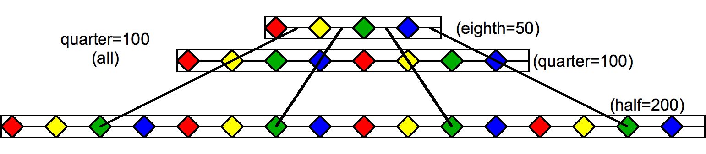
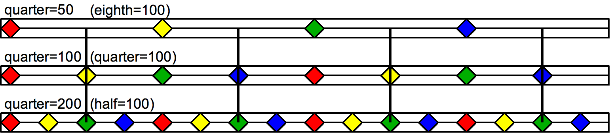

## Common-time

Rhythm pattern characteristic of much popular music including rock, quarter note (crotchet) or "regular" time: "bass drum on beats 1 and 3 and snare drum on beats 2 and 4 of the measure [bar]...add eighth notes [quavers] on the hi-hat".

Time signatures are defined by how they divide the measure (in 9/8, complex triple time, each measure is divided in three, each of which is divided into three eighth notes: 3×3=9). In "common" time, often considered 4/4, each level is divided in two (simple duple time: 2×2=4). In a common-time rock drum pattern each measure (a whole note) is divided in two by the bass drum (half note), each half is divided in two by the snare drum (quarter note, collectively the bass and snare divide the measure into four), and each quarter note is divided in two by a ride pattern (eighth note). "Half"-time refers to halving this division (divide each measure into quarter notes with the ride pattern), while "double"-time refers to doubling this division (divide each measure into sixteenth notes with the ride pattern). 

## Half-time

In popular music, half-time is a type of meter and tempo that alters the rhythmic feel by essentially doubling the tempo resolution or metric division/level in comparison to common-time. Thus, two measures of 4
4 approximate a single measure of 8
8, while a single measure of 4/4 emulates 2/2. Half-time is not to be confused with alla breve or odd time. Though notes usually get the same value relative to the tempo, the way the beats are divided is altered. While much music typically has a backbeat on quarter note (crotchet) beats two and four, half time would increase the interval between backbeats to double, thus making it hit on beats three and seven, or the third beat of each measure (count out of an 8 beat measure [bar], common practice in half time):

    1   2   3   4   1   2   3   4
    1   2   3   4   5   6   7   8
    1       2       3       4

Essentially, a half time 'groove' is one that expands one measure over the course of two. The length of each note is doubled while its frequency is halved.

A classic example is the half-time shuffle, a variation of a shuffle rhythm, which is used extensively in hip-hop and some blues music. Some of the variations of the basic groove are notoriously difficult to play on drum set. It is also a favorite in some pop and rock tunes. Some classic examples are the Purdie Shuffle by Bernard Purdie which appears in "Home At Last" and "Babylon Sisters", both of which are Steely Dan songs. "Fool in the Rain" by Led Zeppelin uses a derivation of the Purdie Shuffle, and Jeff Porcaro of Toto created a hybridization of the Zeppelin and Purdie shuffles called the Rosanna shuffle for the track "Rosanna".

<youtube-embed video="g41Ab8iDaD0" />

In half time, the feel of notes are chopped in half, but the actual time value remains the same. For example, at the same tempo, 8th notes (quavers) would sound like 16ths (semiquavers). In the case of the half time shuffle, triplets sound like 16th note (semiquaver) triplets, etc. By preserving the tempo, the beat is stretched by a factor of 2.

>
>Double-, common, and half- time offbeats at the same tempo.

>
>Double-, common, and half- time offbeats at equivalent tempos.

## Double time

In music and dance, double-time is a type of meter and tempo or rhythmic feel by essentially halving the tempo resolution or metric division/level. It is also associated with specific time signatures such as 2/2. Contrast with half time.

In jazz the term means using note values twice as fast as previously but without changing the pace of the chord progressions. It is often used during improvised solos.

"Double time [is] doubling a rhythm pattern within its original bar structure.":

    1   2   3   4
    1 2 3 4 1 2 3 4

It may help to picture the way musicians count each metric level in 4/4:

    quarter:    1           2           3           4
    eighth:     1     &     2     &     3     &     4     &
    sixteenth:  1  e  &  a  2  e  &  a  3  e  &  a  4  e  &  a
