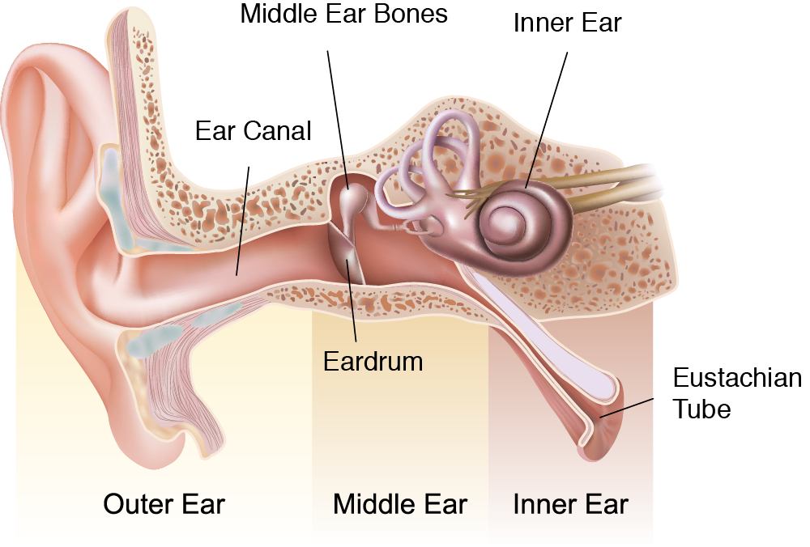

## Tonal perception

Sound is amplified and transformed into nerve signals by mechanically activated hair cells emitting glutamate neurotransmitter in a basilar membrane in the cochlea of the human inner ear. It happens in a spiral organ with 2.5 coils of tonotopically organized bone tissue resonating with different frequencies in its different locations.

<youtube-embed video="XsXIOBx6cwI" />
