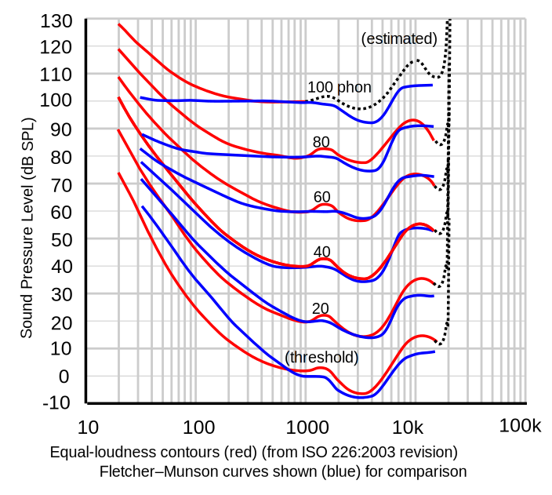
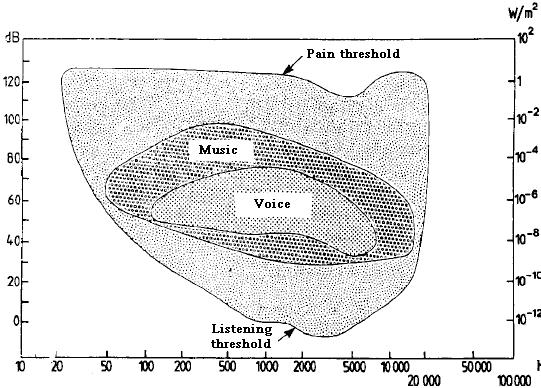

## Equal-loudness contour

The human auditory system is sensitive to frequencies from about 20 Hz to a maximum of around 20,000 Hz, although the upper hearing limit decreases with age. Within this range, the human ear is most sensitive between 2 and 5 kHz, largely due to the resonance of the ear canal and the transfer function of the ossicles of the middle ear.

Fletcher and Munson first measured equal-loudness contours using headphones (1933). In their study, test subjects listened to pure tones at various frequencies and over 10 dB increments in stimulus intensity. For each frequency and intensity, the listener also listened to a reference tone at 1000 Hz. Fletcher and Munson adjusted the reference tone until the listener perceived that it was the same loudness as the test tone. Loudness, being a psychological quantity, is difficult to measure, so Fletcher and Munson averaged their results over many test subjects to derive reasonable averages. The lowest equal-loudness contour represents the quietest audible tone—the absolute threshold of hearing. The highest contour is the threshold of pain.

In 1956 Robinson and Dadson produced a new experimental determination that they believed was more accurate. It became the basis for a standard (ISO 226) that was considered definitive until 2003 when ISO revised the standard on the basis of recent assessments by research groups worldwide.
