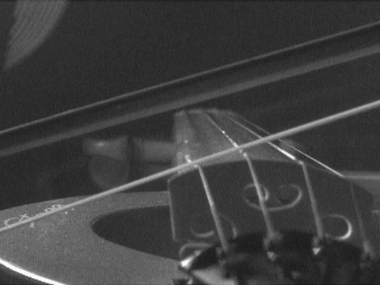

## Timbre

In music, timbre, also known as tone color or tone quality (from psychoacoustics), is the perceived sound quality of a musical note, sound or tone. Timbre distinguishes different types of sound production, such as choir voices and musical instruments. It also enables listeners to distinguish different instruments in the same category (e.g., an oboe and a clarinet, both woodwind instruments). 

The physical characteristics of sound that determine the perception of timbre include frequency spectrum and envelope. Singers and instrumental musicians can change the timbre of the music they are singing/playing by using different singing or playing techniques. For example, a violinist can use different bowing styles or play on different parts of the string to obtain different timbres (e.g., playing sul tasto produces a light, airy timbre, whereas playing sul ponticello produces a harsh, even and aggressive tone).

## Attributes of timbre

Many commentators have attempted to decompose timbre into component attributes. For example, J. F. Schouten (1968, 42) describes the "elusive attributes of timbre" as "determined by at least five major acoustic parameters", which Robert Erickson finds, "scaled to the concerns of much contemporary music":

- Range between tonal and noiselike character
- Spectral envelope
- Time envelope in terms of rise, duration, and decay (ADSR, which stands for "attack, decay, sustain, release")
- Changes both of spectral envelope (formant-glide) and fundamental frequency (micro-intonation)
- Prefix, or onset of a sound, quite dissimilar to the ensuing lasting vibration

## Amplitude envelope

- **Attack**: time from silence to the loudest level
- **Decay**: time from loudest level to sustain level
- **Sustain**: level of volume while the sound is holded
- **Release**: time to return to silence after releasing the hold

## Helmholz resonance

Helmholtz resonance or wind throb is the phenomenon of air resonance in a cavity, such as when one blows across the top of an empty bottle. The name comes from a device created in the 1850s by Hermann von Helmholtz, the Helmholtz resonator, which he used to identify the various frequencies or musical pitches present in music and other complex sounds.

When air is forced into a cavity, the pressure inside increases. When the external force pushing the air into the cavity is removed, the higher-pressure air inside will flow out. Due to the inertia of the moving air the cavity will be left at a pressure slightly lower than the outside, causing air to be drawn back in. This process repeats, with the magnitude of the pressure oscillations increasing and decreasing asymptotically after the sound starts and stops. 

When the resonator's 'nipple' is placed inside one's ear, a specific frequency of the complex sound can be picked out and heard clearly. In his book Helmholtz’ explains: When we "apply a resonator to the ear, most of the tones produced in the surrounding air will be considerably damped; but if the proper tone of the resonator is sounded, it brays into the ear most powerfully…. The proper tone of the resonator may even be sometimes heard cropping up in the whistling of the wind, the rattling of carriage wheels, the splashing of water." 

## Harmonics – the natural resonances

<youtube-embed video="9O3VEXzuOKI" />

A note isn't just a wave, it's a mix of resonating modes of oscillations.

## String overtones interactive model

A string fixed from both ends produces a harmonic set of incremental frequency partials, also called harmonics. 

<string-overtones />

### Tristimulus timbre model

The concept of tristimulus originates in the world of color, describing the way three primary colors can be mixed together to create a given color. By analogy, the musical tristimulus measures the mixture of harmonics in a given sound, grouped into three sections. It is basically a proposal of reducing a huge number of sound partials, that can amount to dozens or hundreds in some cases, down to only three values. The first tristimulus measures the relative weight of the first harmonic; the second tristimulus measures the relative weight of the second, third, and fourth harmonics taken together; and the third tristimulus measures the relative weight of all the remaining harmonics.

<youtube-embed video="Wpt3lmSFW3k" />